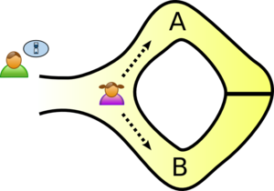
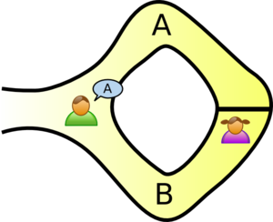

Zero Knowledge Proof - 영지식증명

암호학에서, 영지식증명 (Zero-knowledge proof/protocol)은 증명인(페기)이 검증인(빅터)에게 x라는 지식을 증명할 때, 증명인이 알고 있는 x라는 지식 이외에는 어떠한 것도 알려주지 않으면서 증명하는 것을 말한다.

어떠한 사실을 증명하기 위해, 증명자의 일부 비밀 정보에 대한 지식이 필요하다는 것이 검증되면, 검증자는 이러한 비밀 정보를 소유하지 않기 때문에, 검증자는 다른 사람들에게 이러한 사실을 다른 사람에게 증명할 수 없다는 것을 의미한다. 증명할 수 있는 사실은 증명인이 이러한 지식을 가지고 있어야만 한다. 그렇지 않으면 이러한 사실이 증명되지 않기 때문이다.

아래 그림을 예로 들어 보자.

증명인 페기는 어떤 동굴안에 있는 비밀 열쇠를 가지고 있다. 동굴은 고리 모양으로 되어 있고, 그 가운데가 문으로 되어 있다. 이러한 문은 동굴입구에서 보이지 않는다. 페기는 이제 빅터에게 자신이 비밀 문을 열수 있는 말을 알고 있다는 것을 증명하고 싶어하지만(사실) 그 말이 무엇인지는 알리고 싶어 하지 않는다. (비밀) 이제 빅터가 밖에서 기다리는 동안, 페기는 아무 방향으로나 들어간다.

빅터는 아무 출구를 골라서 이 쪽으로 나오라고 외친다. 페기가 비밀 문을 열 수 없다면, 50% 확률로 증명할 수 없게 된다. 이 실험을 여러번 반복한다면, 페기가 빅터가 시킨대로 나올 수 있는 확률은 매우 낮다. 20번 만 해도, 그 확률은 $$\frac{1}{2^{20}}$$이 된다. 반면에 비밀문을 열수 있다면, 빅터의 요구대로 매번 나올 수 있게 될 것이다. (증명)

이 실험을 계속 반복해도, 페기는 빅터 외에 다른 사람에게 어떠한 정보도 주지 않는 셈이 된다. 예를 들어 빅터가 이 과정을 모두 녹화해서 다른 사람에게 보여주어도, 다른 사람들은 이를 짜고친 연극이라 판단하고 믿지 않기 때문이다. 이는 빅터에게만 유효한 증명이 된다.

영지식 증명을 만족시키기 위해서는 아래를 준수해야 한다.

1. 완전성: 진술이 참이라면, 정직한 증명자는 정직한 검증자에게 이사실을 납득 시켜야 한다.
2. 건실성: 진술이 거짓이라면, 어떠한 부적징한 증명자라도 정직한 검증자에게 이 사실을 납득 시킬 수 없어야 한다.
3. 영지식성: 진술이 참이라면, 검증자는 참거짓이외에 (문을 나왔다) 아무런 정보도(문을 열 암호) 얻을 수 없어야 한다.

이러한 기술을 블록체인에 사용하기도 한다.

블록체인에 사용한다면, 발신자, 수신자 등 트랜잭션 관련 내용이 보이지 않더라도, 거래를 신뢰하는 수단으로 ZKP를 사용할 수 있다.

[A Mind-Bending Cryptographic Trick Promises to Take Blockchains Mainstream](https://www.technologyreview.com/s/609448/a-mind-bending-cryptographic-trick-promises-to-take-blockchains-mainstream/)

이러한 영지식증명에 대한 아이디어는 20년간 암호전문가들에게 알려져 왔지만, 최근에서야 이 기술을 활용한 서비스가 나오기 시작했다. 이러한 ZKP를 최초로 사용한 것은 바로 ZCash다. ZCash는 발신인, 수취인 및 거래 금액 등에 대한 모든 정보가 숨겨져 있음에도, 트랜잭션을 검증 할 수 있다. 이러한 아이디어는 다른 메이저 은행의 관심을 끌었으며, JPMorgan은 ZCash의 영지식증명 기능을 자사의 프라이빗 이더리움 기반 블록체인에 적용하기도 했다. 그리고 최근 이더리움에도 이 기능이 추가되었다.

궁극적으로, 이 기술이 우리에게 얼마나 더 많은 것을 가져올 수 있을지는 알 수 없다. 그러나 언젠가 우리 온라인 생활의 거의 모든 면에 확대될 가능성이 있다. 이는 개인정보를 다루는 방법에 있어서 가장 혁신적인 시작을 목격하고 있는 것일지도 모른다.
