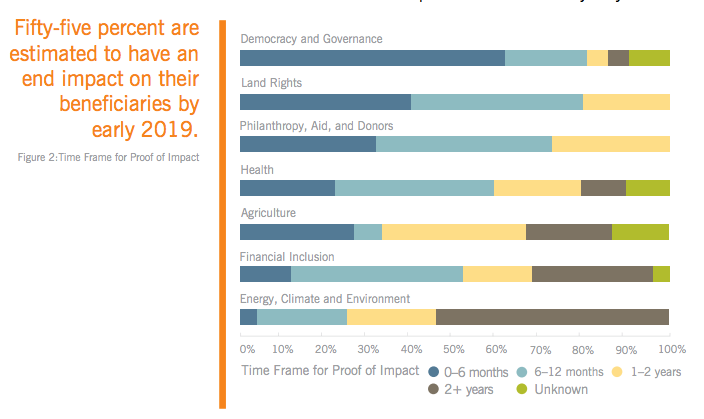
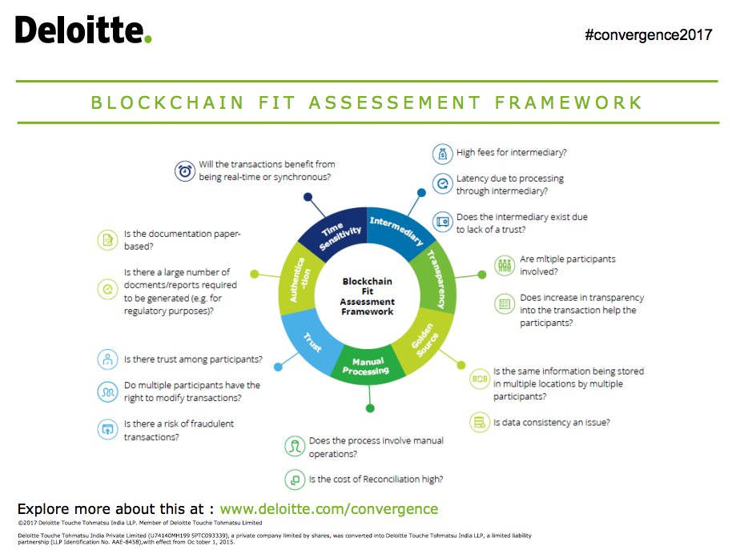

Blockchain for Social Impact

[원문](https://www.gsb.stanford.edu/sites/gsb/files/publication-pdf/study-blockchain-impact-moving-beyond-hype_0.pdf)

소셜임팩트를 가져올 블록체인의 잠재력은 엄청나지만, 얼마나 과장되어 있고, 얼마나 현실적일까?

블록체인 지지자들은 모든 주요 산업을 혼란을 야기하지 않는 범위내에서 영향을 미칠 것이고, 심지어 사람들과 사회가 상소학용하는 방식도 바꿀 것이라고 주장한다. 효율성도 높이고, 비용을 절감하며, 투명성을 증신시키는 이 기술은 사회적인 영향을 미치는 분야에 중요한 영향을 미칠 수 있을 것이다. 시스템을 바꾸고, 인프라를 도약할 수 있는 잠재력은, 이전에 블가능하다고 생각했던 솔루션을 가능하게 할 수 있다.

그러나 여전히 문제는 남아있다. 과연 블록체인은 사회적으로 막대한 영향을 미칠 역사적인 기술의 정점에 있는가, 혹은 그냥 단순한 최신 기술의 유행어 일 뿐인가?

### 아직은 초기 단계이지만, 충격은 가까이에 있다.

소셜임팩트를 위한 블록 체인 이니셔티브는 아직 초기단계다. 34%는 2017년, 혹은 그 이후 부터 시작되었고, 74%는 여전히 파일럿/아이디어 단계에 머물러 있다. 그러나 블록체인 이니셔티브의 55%는 2018년 말까지 수혜자에게 영향을 미칠 수 있을 것으로 추정된다.

### 블록체인은 이전에는 불가능했던 문제를 가능하게 해준다.

연구된 193개의 블록체인 이니셔티브 20%는 블록체인 없이는 솔루션을 제공할 수 없었으며, 86%는 기존 솔루션보다 실질적인 향상이 있었다.

### 보건 분야는 다른 분야보다 더 많은 블록체인을 사용할 유인이 존재한다.

보건 분야는 두번째로 많은 경제분야(Financial) 보다 두배 더 많은 활동이 이루어 지고 있었다. (각 각 25%, 13%) 자선 사업과 원조, 민주주의와 거버넌스 분야가 그 뒤를 11%로 잇고 있었다.

### 블록체인은 지불을 촉진하고 기록을 확인하는데 가장 자주 사용된다.

블록체인의 주요 사용 사례는 기록 및 검증 (26%) 과 지불 및 송금 (25%)다. 블록체인의 가장 보편적인 혜택은 위험과 사기(38%)를 줄이고, 효율성을 높이는 것(24%) 이다.

소셜임팩트를 위한 블록체인 응용프로그램의 앞으로의 성장성과 채용가능성을 알기에는 아직 이를 수도 있지만, 잠재적으로 변화 가능성이 있는 소셜임팩트를 위한 블록체인 애플리케이션이 이미 등장하고 있는 것으로 나타났다.

이러한 블록체인 애플리케이션은 성숙함에 따라, 아래 두 가지를 최종적으로 제안한다.

### 소셜임팩트를 위해 개발되고 있는 블록체인 애플리케이션의 진행과정에 주의를 기울여라

조사결과 블록체인이 세계에서 가장 어려운 도전을 해결하려는 사람들에게 점진적 (65%) 또는 혁신적인 해결책 (25%)을 주고 있다는 것을 시사하고 있다. 초기 파일럿 프로그램에서 실제 동작하는 프로그램으로 점점 더 많은 이니셔티브가 옮겨 감에 따라서, 진행상황을 면밀히 모니터링 한다면, 과대광고를 넘어서 이를 통해 입증된 사용사례가 더욱 나타나 결국 추가적인 지원 및 채택을 얻을 수 있다.

이미 블록체인은 민주주의와 거버넌스에 영향을 미치기 시작했는데, 향 후 6개월 내로 이 분야에서 67% 정도가 블록체인에 의해 영향을 받을 것으로 예상된다. 블록체인 애플리케이션이 점차 채택되고 영향력이 커짐에 따라서, 향 후 블록체인이 실제로 불가능해 보이는 솔루션에 해결책을 줄 수 있을지, 아니면 적어도 기존 솔루션 개선에 도움이 될 지는 지켜봐야 할 문제다.

새로운 블록체인을 만들기 위해, 다른 사람들의 작업을 따라서 배울뿐 만 아니라 파트너가 될 기회를 모색해야 된다. 이 연구에서는 블록체인 솔루션을 제공하기 위해 여러분야에서 협력이 필요한 것을 강조하였다. 특히 정부와 비영리단체가 기본적인 서비스의 발전을 위해 추진하는 민간 부문 섹터와 협력하여 프로젝트를 실행할 수 있는 잠재력이 있다고 생각한다.

### 해결하려고 하는 문제가 무엇인지 이해하고, 그 것이 얼마나 블록체인을 통해 해결할 수 있는지 살펴봐라.

블록체인은 여러 당사자간의 신뢰를 심어주고, 비용을 절감하며, 효율성을 높이고, 보안을 향상 시킬 수 있는 잠재력을 제공한다. 블록체인의 일반적인 과제는 지불, 송금, 기록 및 신원확인이다. 블록체인을 사용한다면 불가능한 솔루션에 해결책을 줄 수 있다.

 [The Deloitte Blockchain Framework](https://www2.deloitte.com/content/dam/Deloitte/in/Documents/industries/in-convergence-blockchain-fitment-noexp.pdf)는 블록체인이 가장 적합할 수 있는 네가지 전제 조건에 대한 지침을 적용한다.

 - 공유된 레파지토리에서 정보를 변경하는 트랜잭션을 생성하는 당사자가 여럿일 경우
 - 거래가 타당하다고 믿어야 하는 당사자가 필요한 경우
 - 중개인이 비효율적이거나 진실된 중재자로 신뢰받지 못하는경우
 - 보한 강화가 필요한 경우

 

사람들이 새로운 것을 하기 위해 신기술을 사용할때, 종종 과장광고가 증폭되는 경우가 있다. 애플리케이션에 사용할 기술을 먼저 찾는 것이 아니라, 당신이 해결하려고 하는 문제가 블록체인이 제공하는 가치와 맞는지 먼저 생각해보라. 블록체인이 어떻게 가치를 가장 잘 전달 할 수 있는지에 더 중점을 둔다면, 과장광고에서 벗어나 더욱 현실에 가까워 질 것이다.
