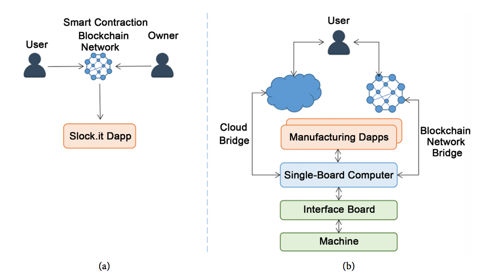
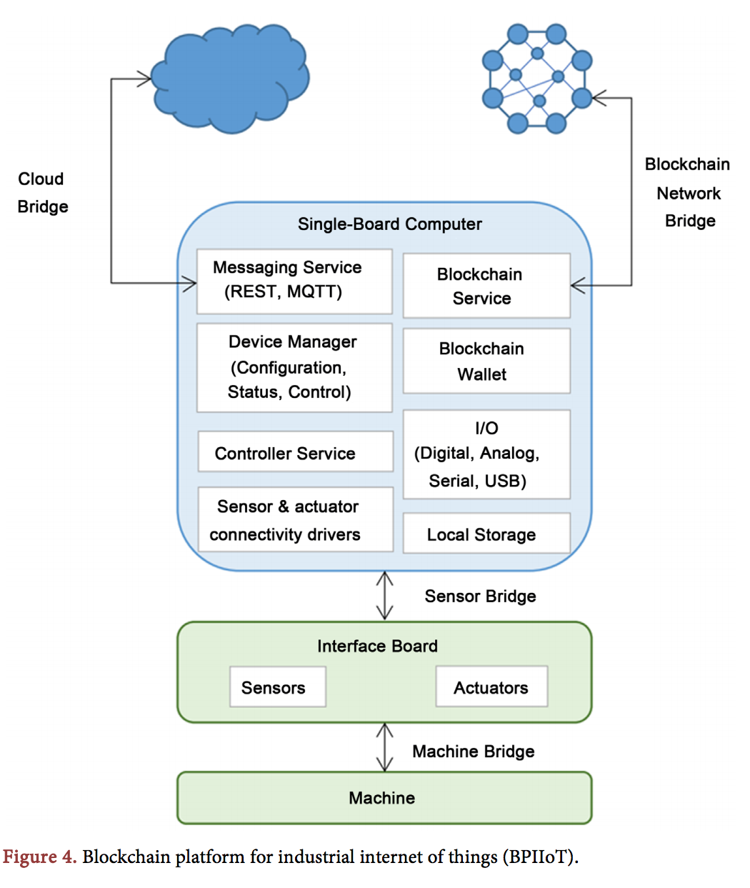

Blockchain Platform for Industrial Internet of Things

[원문](https://file.scirp.org/pdf/JSEA_2016102814012798.pdf)

사물인터넷은 원격 감지/작동 기능을 갖춘 사물로 구성되며, 다른 연결된 장치 및 응용프로그램과 직 간접적으로 데이터를 교환할 수 있다. IoT장치는 데이터를 수집하고, 더이터를 로컬에서 처리하거나, 중앙집중식 서버 또는 클라우드 기반 응용 프로그램 백엔드에 보내 처리 할 수 있다. 이런 IoT 기술은 산업 및 제조 시스템에서 유망할 것으로 보인다. 전문가들은 이 기술이 산업과 제조분야에 미치는 영향을 약 1조달러로 분석하기도 했다.

이 논문에서는 암호화폐 비트코인에서 사용되고 있는 블록체인 기술을 산업용 IOT에 활용한, BPIIoT라고 불리우는 분산화된 P2P 플랫폼을 제안한다. BPIIoT플랫폼은 클라우드 기반 제조를 위한 핵심 지원역할을 수행하며, 기존 CBM(Cloud Based Manufacturing)의 기능을 향상 시키고, 특히 기존 장비를 클라우드 환경에 통합하는데 있어 클라우드 기반 제조의 핵심으로 작용한다. 클라우드 기반 제조는, 제조에 필요한 자원에 대한 주문형 액세스가 가능하지만, 제조 서비스를 이용하려는 사용자 간의 거래에는 신뢰할 수 있는 중개자가 필요하다. 블록체인 기술을 사용하여 BPIIoT플랫폼을 사용하면 분산화되고, 신뢰할 수 있는 P2P의 중개자가 필요없이 서로 상호작용할 수 있다.

제조업을 위해 다양한 분산 앱(Dapps)을 개발 할 수 있는 산업용 인터넷을 위한 블록체인 플랫폼(BPIIoT)를 제안한다.

|  |
| :-------------------------------------------------: |

|a. Slock.it Dapp은 유저와 실제 물리적인 소유물을 소유하고 있는 주인 간에 스마트 컨트랙트를 할수 있게 해준다. 예를 들어 유저가 잠긴 문을 열수 있게 임차료를 지급하면, 자동으로 스마트 계약이 실행되어 문을 열수 있게 되는 것이다. b. BPIIoT는 기존 솔루션보다 훨씬 더 많은 기능을 제공한다. 이는 다양한 P2P 제조 응용프로그램을 개발할 수 있기 때문이다.

위 그림은 기존 `Slock.it` [플랫폼](https://iot.slock.it/iotlayer.html#page-why)과 차이점을 보여준다. 예를 들어 기존 솔루션은 특정작업 (잠긴 문을 여는 것)을 수행하기 위해 전문화된 Dapps로 볼 수 있지만, BPIIoT는 다양한 분산 및 P2P 제조 응용프로그램을 제작 할 수 있기 때문에 훨씬더 광범위한 범위를 제공하고 있다.

> Slok.it, 슬로킷은 airbnb와 매우 유사한 서비스 입니다. 호스트가 방이나 주택에 슬로킷 도어락을 설치하고, 숙박금액과 보증금액을 이더를 통해 설정할 수 있게 해줍니다. 숙박객은 이더리움 블록체인을 통해 해당 금액을 지불하면, 그 기간 동안 잠금 장치를 열거나 닫으면서 숙박할 수 있게 됩니다.

이 Dapp을 사용하면,

1. 신뢰할 수 있는 중개자 없이 소비자 대 기계, 혹은 기계 간 기계간의 트랜잭션을 가능하게 한다.
2. 기존 레거시를 클라우드 환경에 통합
3. 유지 보수 및 진단 작업을 자동화
4. 모든 거래, 자산 및 재고 기록에 대한 분산되고 안전하며 공유된 원장을 제공

등이 가능해진다.

|  |
| :-----------------------------------------------------------------------------------------------------------: |
|                                       블록체인과 스마트 컨트랙트의 구조                                       |

#### 스마트 컨트랙트

스마트 컨트랙트는 블록체인 내에 있는, 고유한 주소로 식별되는 코드다. 실행 가능한 함수와 상태변수가 포함되어 있다. 이는 이러한 기능에 대한 트랜잭션이 수행될 때 실행된다. 트랜잭션에는 계약의 함수에서 요구하는 입력 매개 변수가 포함된다. 컨트랙트는 다양한 언어 (solidity, python)등올 작성할 수 있다. 컴파일 되면 계약에 고유한 주소를 할당하는 블록체인 네트워크에 컨트랙트가 업로드된다. 블록체인 네트워크의 모든 사용자는 컨트랙트에 트랜잭션을 전송하여 컨트랙트의 기능을 트리거할 수 있다. 컨트랙트 코드는 새로운 블록의 검증의 일환으로 네트워크를 참여하는 각 노드에서 실행된다.

#### Dapp

분산 응용 프로그램 (Dapp)은 스마트 컨트랙트를 사용하는 응용프로그램이다. Dapp은 스마트컨트랙트를 사용자에게 익숙한 인터페이스로 제공한다. 암호화폐는 Dapp의 일종이며, 블록체인 네트워크에서 실행된다.

|                   |
| :--------------------------------------------------------------------: |
| a) CBM(Cloud Based Manufacturing) model, b) 산업용 IOT를 위한 블록체인 |

CBM은 서비스를 이용하는 소비자가 제조 자원을 구성, 선택 및 활용할 수 있는 서비스 지향 제조 모델이다. CBM은 IaaS, PaaS, Haas, SaaS의 네가지 주요 클라우드 컴퓨팅 모델을 활용한다. BPIIoT는 스마트 컨트랙트가 포함되어 있는 블록체인 네트워크를 기반으로 한다. 이 플랫폼에서는 스마트 컨트랙트를 주문형 제조 서비스를 제공하기 위해, 서비스 소비자와 제조자원 간의 계약으로 활용된다. BPIIoT는 기존 레거시 장비를 클라우드 환경에 통합할 수 있으며, 분산 및 P2P 제조 응용프로그램을 개발 할 수 있다.

|  |
| :---------------------------------------------------: |
|                     BPIIoT의 구조                     |

IoT장치는 기존 시스템이 클라우드와 통신할 수 있을 뿐만 아니라, 블록체인의 작업도 실행 가능하게 한다. 이 IoT장치는 기기가 운영중인 데이터를 클라우드 내에서 서로 교환하고, 관련된 스마트 컨트랙트 트랜잭션을 보내며, 네트워크의 피어로부터 트랜잭션을 받을 수 있는 'Plug and Play'솔루션이다.

이 IoT 장치에는 인터페이스 보드 (아두이노 기반)와 단일 보드 컴퓨터 (라즈베리 파이 또는 비글본 블랙)가 포함되어 있다. 인터페이스 보드에는 디지털 입출력 및 아날로그 입력 기능이 있다. 센서 및 [엑추에이터](https://ko.wikipedia.org/wiki/%EC%95%A1%EC%B6%94%EC%97%90%EC%9D%B4%ED%84%B0)는 인터페이스 보드의 디지털 또는 아날로그 핀과 인터페이스 한다. 인터페이스 보드는 단일 보드 컴퓨터에 직렬 인터페이스를 가지고 있다. 인터페이스 보드와 단일 컴퓨터 사이의 센서브리지를 통해 단일 보드 컴퓨터는 데이터를 캡처하고, 제어신호를 엑추에이터로 전송할 수 있다. 단일 보드 컴퓨터 관리자는 사용자가 웹 인터페이스를 통하여 이를 구성하고, 장치 상태 및 통계를 볼수 있게 한다. 이 단일 보드 컴퓨터의 블록체인 서비스는, 블록체인 네트워크와 통신하고, 네트워크를 통해 트랜잭션을 전송/수신 한다. 각 IoT장치는 블록체인 네트워크에 자체 어카운트를 갖고 있으며, 자체 블록체인 월렛을 유지 하고 관리한다. 컨트롤러 서비스는 장치 관리 인터페이스를 통해 구성할 수 있는 다양한 작업을 수행한다. 예를 들어, 센서 브리지에서 데이터를 받아 클라우드 브리지를 통해 게시하는 작업 등이 가능하다. 또 기계 상태 및 운영환경을 모니터링 하고, 블록체인 네트워크의 관련 스마트 컨트랙트를 보낼 수도 있다.

> BPIIoT를 이루는 것은 Interface Board(아두이노 등으로 만들어진 실제 Machine 과 브릿지 역할을 하는 것)와 단일 보드 컴퓨터 (라즈베리파이로 이루어진 소프트웨어를 실행하는 레이어)라고 할 수 있습니다. Interface Board가 직접 Machine가 interface하여 입출력 데이터를 받습니다. 단일 보드 컴퓨터는 이러한 데이터를 받아 처리하는 부분으로, 클라우드와 연결하여 (클라우드 브릿지) 데이터를 전송하거나, 블록체인 네트워크와 연결하여 (블록체인 브릿지) 고객과 장치관리자 사이의 스마트 컨트랙트를 실행하는 등의 역할을 합니다.

### 활용가능한 범위

- 온디맨드 생산: 기계가 자체적으로 블록체인 계정을 보유하고, 사용자가 CBM과 같은 주문형 모델에서 제조 서비스를 이용할 수 있도록 기계를 직접 공급하고 거래할 수 있는 제소 서비스 시장이 가능하다. 사용자가 기계에 트랜잭션을 전송하여 제조서비스를 이용할 수 있는 P2P 네트워크 제조 응용프로그램이 가능하다.
- 스마트 진단 & 기계 관리: 기계가 상태를 모니터링하고, 문제를 진단하며 자율적으로 서비스, 소모품 또는 기계 유지 보수 업체에 교체 요청을 할 수 있는 기계용 스마트 진단 및 자가 진단 어플리케이션을 만드는데 사용 될 수 있다. 공금 조달 및 기계 서비스 유지를 위한 제조업체와 공급업체간의 스마트 컨트랙트는 기계 유지 보수 작업을 자동화하는데 도움이 될 수 있다.
- 추적가능성: 제조된 제품을 추적할 수 있는 응용 프로그램을 개발하는데 사용할 수 있다. 소비자와 제조업체간의 스마트 컨트랙트를 예로 들면, 공장 내의 어떤 기계가 특정 제품을 제조하는데 사용되었는지와 같은 생산기록을 유지하는데 사용할 수 있다. 제품이 배달 된 후 리콜의 경우, 이 기능은 영향 받은 제품을 식별하는데 도움이 될 수 있다.
- 공급망 추적: 블록체인 및 스마트 컨트랙트는 제품을 등록하고 유지하여 공급망의 다른 지점에서도 소유물을 추적할 수 있다. 이러한 프로그램은 배송 확인에 대한 자동화된 금융결제를 가능하게 할 수도 있다.
- 제품 인증: 제품의 제조정보를 블록체인에 기록하여, 조작이 쉬운 물리적이 인증서의 필요성을 제거하고, 제품의 진위성을 입증하는데 도움을 줄 수 있다.
- 소비자-기계, 기계-기계 간 거래: 예를 들어 소비자가 암호화폐 (이더)를 지불함과 동시에 스마트 컨트랙트에 거래를 보내 제품 제조 요청을 보낼 수 있다. 다른 기계와의 서비스가 필요한 경우 기계간 마이크로 트랜잭션을 보낼 수도 있다.
- 공급자 신원 및 평판 추적: 공급자의 다양한 매개 변수 (배달시간, 고객 리뷰, 판매자 등급)를 추적하는 공급 업체 신원 및 평판 관리 응용 프로그램을 개발하는데 사용할 수 있다. 이러한 응용 프로그램은 소비자가 제조 요구 사항을 충족시킬 수 있는 판매자와 소모품 공급업체를 찾는 제조업체를 찾는데 사용할 수 있다. 스마트 컨트랙트는 판매자의 평판을 기반으로 실시간으로 소모품 및 이에 대한 최고가격을 자동으로 협상하는데 도움이 될 수도 있다.
- 자산 및 재고 등록: 자산 식별 정보의 기록과 공급망에 대한 자산 이동을 보관하여 수동으로 레코드를 기록할 필요성을 없앨 수 있다.

### 결론

이 플랫폼을 통해, 기계가 자체 블록체인 어카운트를 보유하고, 사용자가 제조 서비스를 이용하기 위해 기계를 직접 제공하고, 거래할 수 있는 제소 서비스 시장을 가능하게 했다. 블록체인을 활용하여 산업용 IoT에 적용한다면 아래와 같은 이점이 있다.

- 탈중앙화 & 신뢰가 필요없음: 블록 체인은 서로 다른 분산 노드에 의해 유지되는 네트워크상의 모든 트랜잭션에 대한 공개 원장입니다. 블록체인 기술은 분산되고 신뢰가 필요없는 P2P 네트워크를 가능하게 하는데, 피어들은 서로 상호 작용하기 위해 신뢰할 수 있는 중개자가 필요하지 않습니다. 블록 체인 네트워크는 중앙 당국에 의해 제어되지 않으며 모든 거래는 shem 간의 합의에 의해 검증되고 검증되므로 피어는 서로를 신뢰할 필요가 없습니다.
- 유연함: 블록체인은 실패로 부터 유연하며, 분산화 되어 있기 때문에 단일점 장애로 부터도 자유롭다. 블록체인은 불변의 원장이며, 피어간의 합의가 변경되거나 삭제 될 수 없다.
- 확장가능성: 블록체인 네트워크는 그 특성상 확장이 매우 용이하다.
- 보안 및 감사가능성: 블록체인 네트워크의 모든 트랜잭션은 강력한 암호화로 보안된다. 또한 블록체인은 공개 원장을 투명하게 관리하기 때문에, 네트워크의 모든 사람들이 거래에 대해 알고 있기 때문에 논재응로 부터 자유롭고 안전하다.

하지만 널리 보급되기 위해선 아래와 같은 문제를 해결해야 한다.

- CAP & 블록체인: 분산형 데이터 시스템의 경우, 일관성과 가용성 사이에 trade-off가 있다. 블록체인은 가용성과 분단가용성을 위해 일관성을 포기했다.(AP만 존재. 이는 아파치 카산드라, 카우치 디비와 유사한 속성) 블록체인은 결국 일관성 있는 분산화된 원장이다. 모든 노드는 결국 동일한 원장을 보게 된다. 이더리움에서는 블록타임 (새 블록이 채굴되는 데 걸리는 시간)이 댜력 17초이며, 이는 10분인 비트코인보다 빠르다. 빠른 블록타입은 보안이 감소하게 되므로, 많은 블록체인 어플리케이션은 이 중지출을 막기 위해 새로 채굴된 블록에 대해 여러가지 확인을 거친다. 블록 타임이 빨라지면, [stale block](https://bitcoin.org/en/glossary/stale-block) (성공적으로 채굴은 했지만, 다른 빠른 블록 때문에 블록체인에 연결되지 못한 블록)이 점점더 많아 지게 된다. 이런 블록이 많아지게 되면, 메인 체인의 보안이 감소하게 된다. (블록생성 시간이 짧아질 수록, 공격자들은 더 많은 블록을 생성해서 전체 네트워크에 공격을 가할 수 있다. 자세한 것은 이더리움 블로그에서 발간한 글 [On Slow and Fast Block Times](https://blog.ethereum.org/2015/09/14/on-slow-and-fast-block-times/)를 참조) 이 문제를 대응하기 위해 [GHOST Protocol](https://pdfs.semanticscholar.org/4016/80ef12c04c247c50737b9114c169c660aab9.pdf)이 제안되었다.

> [CAP](https://en.wikipedia.org/wiki/CAP_theorem)는 분산형 데이터 저장방식으로는 CAP 모두를 만족시킬 수 없다는 이론이다. 여기서 CAP은 Consistency (일관성: 모든 사용자가 같은 데이터를 볼 수 있다.) Availability(가용성: 모든 사용자가 항상 읽고 쓸 수 있다. (몇몇 노드가 죽어도 다른 시스템에 영향이 가선 안된다.)) Partition Tolerance(분단가용성: 물리적으로 분리된 분산환경에서 동작한다. 일부 메시지를 잃더라도 시스템은 정상동작해야 한다.)

- 스마트 컨트랙트 자체의 취약성: [2016년 6월 해커들은 `slock.it`의 기반인 DAO(Decentralized Autonomous Organization)에서 360만개의 이더를 해킹해서 가져갔다.](https://blog.slock.it/the-history-of-the-dao-and-lessons-learned-d06740f8cfa5) [한글](http://www.seunghwanhan.com/2016/07/the-dao.html) [공격과정](http://hackingdistributed.com/2016/06/18/analysis-of-the-dao-exploit/) 이는 스마트 컨트랙트를 구현하는 DAO 자체의 코드 결함으로 밝혀졌다. 스마트 컨트랙트는 당사자 간의 계약이며, 네트워크 외부에서 합법적으로 실행될 수 없기 때문에, 이러한 공격은 조직, 채굴자, 심지어는 블록체인 네트워크가 위험에 쳐할 수 있다.
- 인식: 블록체인은 초기 기술이며, 대부분 금융 분야에서 사용되고 있다. 다른 분야에 블록체인을 도입하는 것에 대한 인식 부족은 블록체인이 널리 확장되는데 영향을 미치고 있다.
- 규제: 블록체인의 특성상 규제 장애물은 피할 수가 없다. 이런 시스템은 새로운 정부 및 산업 규정이 필요하다. 또한, 분쟁을 피하기 위해 스마트 컨트랙트의 법적 집행 가능성을 거래 당사자들 사이에서 보장할 필요가 있다.
- 프라이버시: 블록체인은 공개원장이며 네트워크 참여자 누구나 거래를 볼 수 있기 때문에, 거래 당사자에 대한 개인정보 보호 문제가 남아 있을 수 있다.
- 효율성: 블록체인은 다음 블록을 채굴하기 위해 모든 노드가 동일한 컴퓨팅 계산을 수행해야 하므로, 효율적이지 못하다. 이렇게 어려운 계산을 여러노드가 실행해도, 결국 전체 네트워크에 대한 개별 노드의 기여도는 매우 적다.
