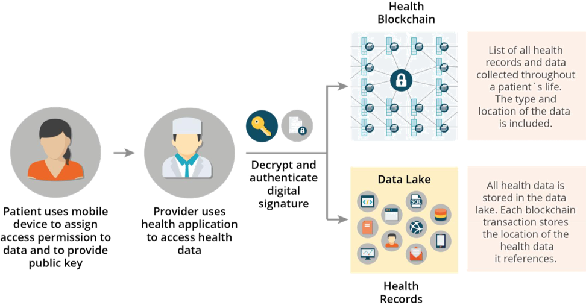

Blockchain For Health Data and Its Potential Use in Health IT and Health Care Related Research

[원문](https://www.healthit.gov/sites/default/files/11-74-ablockchainforhealthcare.pdf)

유전 연구가 증가하고 정밀 의학발전으로 인해, 건강 관리는 개인의 유전적 구성, 생활 방식 및 환경을 통합한 질병 예방 및 치료에 대한 혁신적인 접근 방식을 목격하고 있다. 동시에 IT 기술의 발전으로 헬스 케어 정보의 대규모 데이터 베이스가 생성되고, 건강 데이터를 추적하는 도구가 제공되며, 개인이 자신의 건강관리에 더 많이 관여할 수 있게 되었다. 이러한 의료 및 정보기술의 발전을 결합하면, 헬스케어 IT 분야에 혁신적인 변화를 촉진할 수 있다.

미국 'The American Recovery and Reinvestment Act'에서는 모든 공공 및 민간 의료 제공자가 2014년 1월 1일 까지 전자 의료기록 (EMR)을 채택하도록 요구했다. 이는 EMR의 가용성과 활용도를 크게 증가 시켰다. 그러나 이러한 시스템 대부분은 보건 정보를 서로 공유할 수 있는 능력이 없다.

그러나 블록체인 기술은 현재 보건 IT 시스템에 존재하는 상호 운용성 문제를 해결하고, 개인, 보건 정보 제공자, 건강 관리 기관 및 의료 연구원이 개인의 건강 데이터를 안전하게 공유할 수 있게 해주는 기술 표준이 될 수 있다.

## 헬스 케어를 위한 블록체인 모델

### 확장가능성

의료 기록, 문서, 이미지가 포함된 분산 블록체인에는 데이터 저장공간과 처리량에 제한이 있다. 비트코인 블록체인을 모델로 한 경우, 의료 블록체인의 분산 네트워크에 속한 모든 구성원은 미국의 모든 개인에 대한 의료 기록 사본을 저장하게 되는데, 이는 데이터 저장 관점에서는 실용적이지 못하다. 의료 데이터는 동적이고, 굉장히 방대하기 때문에 네트워크의 모든 구성원에게 모든 기록을 복제하는 것은 많은 대역폭을 사양하게 되고, 네트워크 리소스를 낭비하며 데이터 처리량 문제가 제기 된다. 의료 정보 관리가 블록체인의 이점을 실현하기 위해서는, 블록체인이 의료 기록 및 데이터에 대한 액세스 제어 관리자로 기능해야 한다.

때문에 블록체인에 저장되는 정보는 사용자 의료 기록에 대한 색인이다. 색인은 라이브러리의 카탈로그와 유사하다. 카탈로그에는 책에 관련한 메타 데이터와 책을 찾을 수 있는 위치가 포함되어 있다. 의료 블록체인도 같은 방식으로 작동해야 한다. 블록의 트랜잭션에는 사용자의 고유 식별자, 건강 기록에 연결된 암호화 코드 및, 트랜잭션이 생성된 타임스탬프가 포함된다. 데이터 액세스의 효율성을 향상 시키기 위해 트랜잭션에는 건강기록에 포함된 데이터 유형과, 자주 사용되는 쿼리를 용이하게 하는 메타 데이터가 포함된다. 여기에 추가로 공식적인 의료 기록 뿐만 아니라, 모바일 응용 프로그램 및 웨어러블 디바이스의 의료 데이터가 포함된, 완전히 색인된 기록을 포함할 수 있으며, 이는 계속해서 개발 사용자를 따라 다닐 것이다.

블록체인에서 접근하려고 하는 모든 데이터는 'Data Lake' 라고 불리우는 데이터 저장소에 저장된다. 이 'Data Lake'는 확장 가능성이 뛰어나고, 이미지, 문서, 키값 저장소에 이르기까지 다양한 데이터를 저장할 수 있다. 이는 의료 연구를 위한 도구이며, 데이터 분석 등에도 사용 가능하다. 또한 SQL Query, 텍스트 마이닝, 머신러닝을 지원한다. 모든 정보는 암호화 되고, 개인정보보호 및 진위성을 보장하기 위해 디지털로 서명된다.

의료 정보 제공자가 의료 기록을 작성하면, 이 문서와 이미지의 진위 여부를 확인하기 위해 디지털 서명이 만들어진다. 그리고 이러한 데이터는 암호화 되어 'Data Lake'에 보내진다. 정보가 저장될 때마다, 의료 기록에 대한 포인터가 사용자의 고유 식별자와 함께 블록체인에 저장된다. 그리고 환자에게 의료 데이터가 블록체인에 추가되었음을 알린다. 같은 방식으로 환자는 모바일 응용 프로그램 및 웨어러블 디바이스 센서의 디지털 서명 및 암호화로 의료 데이터를 추가할 수 있다.

## 보안 및 개인정보 보호

사용자는 자신의 데이터에 대한 완전한 액세스 권한을 가지며, 공유도 제어한다. 또한 블록체인에 데이터를 쿼리하고 쓸 수 있는 사용자를 지정할 수 있다. 모바일 대시보드 응용프로그램을 사용하면, 블록체인에 액세스 할 권한을 가진 사용자를 확인할 수도 있다. 또한 사용자는 언제 누가 어떤 데이터에 액세스했는지가 포함된 로그도 확인 가능하다.이런 제어 권한은 유연하며, 'All or nothing' 방식으로 권한을 제어할 수 있다. 액세스 제어 정책은 블록체인에 안전하게 저장되며, 정보의 소유자 많이 이러한 데이터를 변경할 수 있다. 의료 서비스 제공자가 사용자 의료 정보에 대한 권한을 부여받으면, 블록체인에 사용자 데이터를 쿼리하고 디지털 서명을 통하여 인증을 한다. 

신원 인증은, 금융 기관이나 규제 기관이 수립한 방법을 따르면 될 것이다. 생체인식 시스템을 활용한다면 비밀 번호와 토큰 기반의 보안 방식을 더욱 강화 시킬 것이다. 이러한 모델에서는 사용자는 데이터를 인증된 건강 관리 제공자 또는 건강관리 기관에 대해 액세스를 제어할 권한을 독점적으로 가지게 된다. 디지털 서명된 트랜잭션과 결합된 블록체인의 분산된 특성은, 공격자들이 디지털 서명을 위조하거나 네트워크 자원의 대부분을 통제하여 네트워크를 손상시킬 수 없게 한다. 또한, 암호화된 트랜잭션만 포함되어 있으므로 공개 원장에서는 아무 정보도 찾을 수 없을 것이다.

## 헬스케어 블록체인의 기술적 이점

블록체인은 다양한 오픈소스 소프트웨어, 오픈 API를 기반으로 하므로, 시스템간의 상호운영성을 용이하게 하며, 더 많은 양의 데이터와 사용자를 처리하기 위해 효율적을로 확장 할 수 있다. 그러므로 헬스케어 블록체인은 오픈소스 소프트웨어로 개발되어야 한다. 이를 통해 다양한 응용 프로그램을 선택하여 혜택을 누릴 수 있으며, 특정 요구사항과 옵션에 부합하는 다양한 선택지를 고를 수 있다.
 
또한 의료 IT 생태계 내에서 상호 운용성 문제를 해결한다. OpenAPI를 사용하여, 서로 다른 시스템간의 복잡한 노드 통합 개발을 필요로 하지 안ㅎ는다. 그리고 환자 의료 커뮤니티, 연구자는 정확하고 포괄적인 환자의 의료 데이터를 얻기 위해 하나의 공유 데이터 소스 (Data Lake)에 액세스 할 수 있다. Data Lake와 연결된 블록체인 데이터 구조는 환자의 모바일 응용프로그램, 센서, EMR, 문서 및 이미지 데이터를 포함하여 다양한 의료 데이터 소스를 제공할 수 있다. 데이터 구조는 유연하고 확장가능하며, 예기치 않은 데이터 또한 수용할 수 있다.

## 헬스케어 블록체인의 장점

모든 의료 데이터에 대한 단일 저장소 위치를 만들고, 실시간으로 개인화된 데이터를 추적하고, 세분화하여 데이터 액세스 권한을 설정할 수 있는 보안은 연구 및 가인 맞츰 의료 서비스 제공에 도움이 된다.

연구자들은 질병에 대한 이해를 높이고, 생물 의학적 발견 속도를 가속화하고, 약물 개발 속도를 향상 시키며 개인 맞춤 별 치료 계획을 설계하기 위해 광범위하고 포괄적인 데이터 세트를 필요로 한다. 블록체인이 제공하는 공유 데이터 환경은 민족, 사회경제적, 지리적인 정보를 포함한 다양한 데이터를 제공한다. 그리고 이러한 정보는 환자의 평생동안 수집되므로 종단 연구에 이상적인 데이터를 제공한다.

또한 기존에 정보에 접근하기 어려웠던 인구의 접근을 촉진시키고 일반 대중을 대표하는 결과 (대표성있는 결과)를 쉽게 만들어낼 수 있게 된다.

블록체인은 실시간 데이터에 대한 지속적인 가용성과 액세스를 보장한다. 임상 치료를 개선하고, 응급의료 상황에서 보다 유연하게 대처할 수 있게 된다. 또 한 공중보건에 영향을 미치는 변화를 신속하게 감지하고 격리할 수 있게 해준다. 이는 전염병을 더 일찍 발견하고 해결할 수있게 도와줄 수 있다.

## 결론

상호 운영성 목표를 발전시키기 위한 가장 효율적이고 효과적인 방법은, 의료 IT를 위한 국가 기술 인프라를 구축하는 것이다. 개방형 API는 상호 운용성을 해결하기 위한 필수적인 과제다. 그리고 일생동안 개인의 의료 데이터를 포괄적으로 볼 수 있는 분산형 공유 인프라도 필요할 것이다.

블록체인을 이러한 방식으로 의료 시스템에 활용한다면, 수백만명의 개인, 의료 정보 관리자, 의료 기관 및 연구원이 방대한 양의 유전, 식이, 생활방식, 건강 데이터를 안전하고, 개인정보보호가 보장된 환경에서 제공해줄 수 있다. 데이터 확득, 저장 및 공유는 의학 연구 및 정밀 의학 발전을 위한 과학적인 기반을 마련하고, 질병을 치료하고 예방하는 새로운 방법을 개발하며, 모바일 장치에서 개인이 자신의 건강관리를 향상시키고 질병을 막을 수 있는 기회를 제공한다.

블록 체인 기술은 의료 IT 시스템 구축에 자리잡고 있으며, 블록체인에 대한 상호 운용성을 기반으로 사용하여 의학의 발전을 촉진시키는 것을 강력하게 고려해보아야 한다.