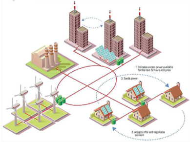

Smarter City: Smart Energy Grid based on Blockchain Technology

[원문](https://www.researchgate.net/profile/Pieroni_Alessandra/publication/323463147_Smarter_City_Smart_Energy_Grid_based_on_Blockchain_Technology/links/5a990b8b0f7e9ba429777665/Smarter-City-Smart-Energy-Grid-based-on-Blockchain-Technology.pdf)

스마트 시티에서 사용할 블록체인이 적용된 스마트 에너지 그리드 솔루션은, 분산 자원의 에너지 투자쪽으로 지출 균형을 크게 전환할 수 있는 분산형 에너지 시장의 창출을 가능하게 한다. 현재 전력이 분배되고 규제되는 방식과는 다르게, 새로운 에너지 시장 이해 관계자들에게 전력이 재분배 될 가능성 이 있다. (하단 그림 참조)

1. 생산: 전력은 발전소에서 전력생산자에 의해 생성된다. 생산된 전력은 전압을 제어하는 변전소로 향한다.
2. 전송: 전력선은 고압전류를 먼거리에 있는 다양한 지역으로 보낸다
3. 분배: 전력선을 타고 분배된 전력은 전압을 낮추고, 가정이나 회사에 분배된다.

스마트 에너지 그리드에서 블록체인 기술을 활용함으로 써 발생하는 영향은 엄청나다. 비즈니스 관점세어 볼때, 스마트 에너지 그리드는 분산된 에너지 시장을 창출하는데 도움이 될 것이다. 즉 블록체인 기술과 통신기술을 결합하여 수백만명의 사용자 사이에서 안전한 거래 및 지불을 용이하게 하는, 전력시장에서 가장 파괴적인 시나리오다. 이 시나리오 상에서 블록체인 시스템의 고유한 특성은 분산된 사용자가 이웃 소비자에게 문제없이 에너지를 판매할 수 있게 한다.

뉴욕에서는 스타트업 TransActive Grid이 블록체인 기술을 기반으로 이러한 유형의 P2P 에너지 판매 네트워크를 만든 바 있다. 이 네트워크에서는 지붕 태양 전지판이 있는 주택이 같은 지역에 있는 이웃에세 판매할 수 있다.

이에 따라 고려해야 할 것 중 하나가 바로 네트워크 구조 그 자체다. 시스템의 모든 Peer에 대해 에너지 시장에서 트랜잭션을 수행할 수 있는 이러한 가능성은, 분산 네트워크를 허용하는 기술로 보다 많은 변화를 가져올 것이다. 여기에는 스마트 장치 뿐만 아니라 IoT, 전기 자동차, 태양렬 지붕, 에너지 저장 및 연료 전지와 같은 에너지 자원이 포함된다. 이러한 변화는 네트워크 자체의 신뢰성과 효율성을 향상 시키고, 전기 수요와 공급을 일치 시키고, 실시간으로 에너지 가격을 규제하며 전송 및 유통 인프라 비용을 줄임으로써 긍정적인 영향을 미칠 것이다.

### 기술적인 구조

블록체인 기술과 IoT를 결합한다면, 분산 에너지 거래가 가능해진다. 또한 메쉬 네트워크를 통해 배포되는 유/무선 데이터 링크를 사용하면 초과 에너지 소비에 대한 정보와 같이 소비자에게 유용한 실시간 서비스를 사용할 수 있다. 소비자들은 그들의 전력 수요에 자동으로 반응할 수 있을 것이다. 블록체인 기반 원장을 사용하는 이점은 공급업체와 소비자의 에너지 거래를 가능하게 해주는 반면, 거래 당사자의 신원은 알 수 없게 해줄 수 있다.

위에서 언급한 가정을 나타내는 하단 그림에서 볼 수 있듯이, 지역 또는 지역 기준으로 활성화된 다양한 '블록체인 스마트 그리드'를 설계할 수 있다.

이 시나리오를 위해 아래 그림과 같은 아키텍처를 설계하였다. 그림과 같이 주거용 건물에 WIFI 라우터를 통해 건물 외부의 데이터를 전송할 수 있는 태양 에너지 카운터가 광전지 패널에 장착되어 있다. 태양열 에너지 미터기는 아래에 설명된 대로 '블록체인 스마트 에너지 그리드 앱' 이라는 특수 구현된 앱을 통해 원격으로 관리 될 수 있는 전용 에너지 축적기 (Energy Accumulator)에 연결된다.

이러한 구조 중간에 양방향 에너지 카운터 (Bidirectional Energy Counter, BEC)가 위치하여 동일한 앱에서 관리하고 에너지 축적기에 연결된다. BEC는 EA에 저장된 에너지를 사용하여 가정용 가전 제품에 에너지를 제공할 때 즉시 활용할 수 있다. 또한 사용자는 공유 거래 플랫폼을 통해 등록된 에너지 회사 중 하나를 선택하여 EA에 저장된 에너지를 판매할 수 있다.

### 블록체인 스마트 에너지 그리드 어플리케이션

또한 블록체인 기술을 사용하여 에너지를 거래할 수 있도록 앱을 개발할 수 있는데, 이는 아래와 같은 기능을 가지고 잇을 것이다.

- 기능1) 활동모니터: 사용자는 자신의 장비의 에너지 소비와 같은 데이터를 실시간으로 볼 수 있다. 
- 기능2) 활동플랜트: 이 기능을 통해 마이크로 그리드 내에서 자체 시스템을 관리할 수 있으며, 기술 특성을 파악하고 동시에 결함을 감지할 수 있다.
- 기능3) 블록체인: 거래 플랫폼에서 사용 가능한 에너지 공급업체 중 하나를 선택해 판매할 수 있다.
- 기능4) 아카이브: 시스템에서 발생된 에너지를 판매하고 거래 관련 데이터를 모아서 볼 수 있다.

