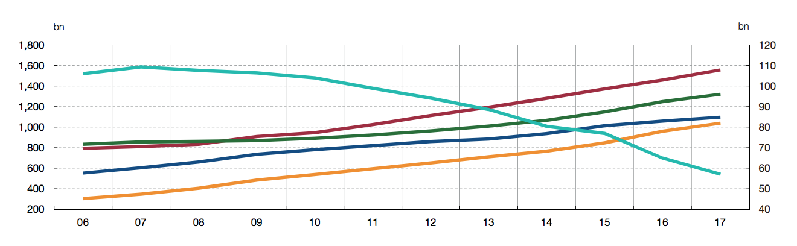

MONETARY POLICY IMPLICATIONS OF CENTRAL BANK-ISSUED DIGITAL CURRENCY

[원문](https://www.bde.es/f/webbde/SES/Secciones/Publicaciones/InformesBoletinesRevistas/ArticulosAnaliticos/2018/T3/Fich/beaa1803-art21.pdf)

디지털 지불 수단 (카드, 모바일 결제 등)의 증가로 인한 현금 사용의 감소와 더불어 소위 '암호화폐'라고 불리우는 디지털 기술의 혁신과 발전으로 인해 중앙은행이 디지털 화폐를 발행해야 하는지에 대한 논의가 활발해지고 있다. 영국은행, 중국 인민은행, 스웨덴 은행과 같은 일부 중앙은행은 이론적인 관점에서 그 가능성을 고려 했다.

디지털 화폐를 발행한다는 것은 중앙 은행의 예금을 다른 모든 경제 주체, 즉 비은행, 비 금융 회사 및 일반 가구에게 까지 확대한다는 것을 의미한다. 이 가능성은 다음과 같은 몇가지 기술적 대안을 제시한다. 디지털 화폐에 대해 예금 처럼 이자를 통해 보상을 해야하는가? 디지털 화폐가 은행 예금과 같은 등록된 형태를 유지하거나 혹은 익명성을 유지해야 하는가?

중앙 은행 디지털 통화 (CDBC) 옹호자들은 지불 시스템의 기능과 잠재적으로 통화 정책의 일부 측면을 개선할 것이라고 주장한다. 그러나 비판론자들은 CDBC와 관련된 통화정책 전달방식에서 이점이 적으며, 기술적 위험이 있으며 재정적인 안정성에 있어서도 위험성이 있어 주의를 요한다고 말한다. CDBC의 가능한 이점과 단점은 앞서 언급한 두 가지 측면, 잠재적인 익명성과 보상에 측면에서 좌우 된다.

## CDBC (Central Bank Digital Currency) 란 무엇인가?

중앙은행의 지급준비금과 은행권(지폐)는 아래 표와 같이 '돈'으로 분류될 수 있는 두가지 주요 유형의 책임을 발행하게 된다. 은행 준비금은 규제및 통화 정책상의 이유, 또는 유동성 관리 목적을 위해 금융기관에서 의무적으로 중앙은행에 예치하는 것을 의미한다. 여기에는 물리적인 형태가 없지만, 이는 중앙은행과 상업은행간의 회계항목으로 남아 있다. 이는 제한된 엑세스와 등록, 잠재적으로 보상을 받을 수 있는 디지털 자산이다. 유로 시스템에서 은행 보유금은 예금 금리가 지급되며, 이는 유럽 중앙은행의 주요 통화정책 수단 중 하나다.

|        | 지급 준비금 |    지폐    |   CDBC    |
| :----- | :---------: | :--------: | :-------: |
| 형태   |   디지털    |    물리    |  디지털   |
| 접근   |   제한적    |  유니버셜  | 유니버셜  |
| 익명성 | 익명성없음  | 익명성보장 | 둘다 가능 |
| 보상   |    지불     |    없음    | 둘다 가능 |

지폐는 물리적인 자산으로, 등록을 필요로 하지 않으며 합법적으로 간주되는 지역에서 시민의 여부와 관계없이 익명으로 지불을 할 수 있다. 당연히 지폐는 보상을 받지 않는다. 따라서 지폐는 물리적, 보편적, 익명, 비보상 자산이다.

CDBC는 일반적으로 가계와 기업이 이용할 수 있는 중앙은행에서 예금으로 간주된다. 결과적으로 CDBC는 지폐와 은행 준비금의 특성을 공유한다. 익명성과 보수에 대해서는 다양한 가능성이 예상된다. 익명일수도, 아닐수도, 보상을 줄수도, 아닐 수도 있다.

CDBC는 또한 은행 송금이나 직불 카드를 통해 지폐를 사용할 필요 없이 동원 될 수 있는 개인의 디지털 화폐와 특징을 공유한다. 가장 큰 차이점은 CDBC는 중앙은행에서 발행한 공개 디지털 통화라는 점이다.

## 왜 CDBC를 발행하려 하는가?

최근 문헌에서는 일부 중앙 은행이 CDBC의 향후 도입을 고려할 수 있는 세가지 이유를 제시했다.

1. 일부 지역에서 현금 수요가 줄어들고 있다.
2. 지불 시스템의 일부 측면에서 가능한 개선
3. 통화정책 전달 측면에서의 개선

또한 CDBC 도입이 고려되고 있는 많은 국가에서 세금 사기, 돈세탁 퇴치 등 경제정책의 보다 일반적인 측면도 고려하고 있다.

CDBC를 발행할 수 있는 이유 중 하나는 현금이 디지털 방식으로 대체될 가능성이 있는 경우, 즉 중앙은행이 발행하는데 드는 작은 금액인 지폐 발행에 대해 얻는 이익과 같은 작은 금액에 대한 영향일 수 있다. 중앙은행의 이익이 재무부로 이전되는 한, 공공부문 수입 감소로 인해 잠재적으로 조세인상이나 공공지출의 감소를 초래할 수 있다. 그러나 유로지역을 포함하여 대부분 국가에서 유통중인 지폐의 양은 증가하고 있다.따라서 이러한 이유, 즉 지폐 발행 비용을 절약한다는 이유는 타당해 보이지 않는다.

|                                                  |
| :---------------------------------------------------------------------------------------------------------------- |
| 각 국가별 현금 발행량. 파란색 유로, 빨간색 미국, 노란색 영국, 초록색 일본, 그리고 우하향하는 유일한 국가는 스웨덴 |

두번째로, CDBC의 도입이 지불 시스템의 특정 측면을 향상 시킬 수 있다고 결론 지었다. 최근 분석에서는 CDBC를 도입할 경우 생산성과 관련하여 상당한 이익이 있을 것이라고 추정한다. 그러나 이러한 개선이 공공 디지털 통화의 도입과 현재 사용되는 개인 디지털 통화의 확장및 개선이 아닌 공공 디지털 통화의 도입이 반드시 발생해야 하는 이유와 연관관계는 불분명하다.

세번째 이유는 통화정책을 전달하는데 있어서의 개선이다. 첫번째로, CDBC가 보상을 주게 되면 이자율은 가계 및 기업 저축과 투자 결정에 직접적인 영향을 미치기 때문에 기존 통화정책을 이행하는데 중요한 도구가 될 수 있다. 이는 통화 정책 전달을 부분적으로 은행의 재정상황과 분리시킬 수 있을 것이고, 특히 금융 위기 동안에 중요하게 작용할 수도 있다.

더욱이 현금이 없어지면, Zero-lower-bound 문제를 해결할 수 있다. 물리적 지폐가 사라지게 되면, CDBC는 이자율을 바닥으로 나타낼 수 있다. Zero Lower Bound의 존재를 통해 존재하는 통화정책의 현재의 비대칭을 깨고, 원칙적으로 필요한 경우 명목금리를 더 내릴 수 있다.

또한 CDBC는 금융을 이용하지 못하는 문제, 세금 사기 해결과 같은 다른 경제 정책 목표에 도움이 될 수 있다. 세금 사기와 돈세탁 문제는 CDBC가 익명이 아닌 경우에만 역할을 할 수 있다는 점을 명시해야 한다. 이는 중앙은행이 경제의 모든 거래에 대해 적극적으로 기록을 유지할 때만 가능하다. 또한 목표를 달성하기 위해서는 현금 사용 또한 없애 야 한다. 그렇다고 해서 익명의 CDBC가 이러한 활동들을 완전히 없앨 수 잇는 것은 아니다. 여전히, 다른 나라 통화, 금, 또는 암호 화폐와 같은 것을 사용하여 대체자산을 보유하려 할 것이다.

암호 화폐의 출현으로 인해 디지털 화폐가 받아들여지면서 애널리스트 사이에서는 여러가지 우려가 나타났다. 이 경우 중앙은행은 통화정책이 실물 경제를 통제할 수가 없어질 수도 있으므로 물가안정과 관련하여 문제가 발생할 수도 있다.

현재 암호화폐 시장 가치가 유로나 미국 통화에 비해 상당히 작기 때문에 공공 디지털 통화 발행을 정당화하기에는 많인 부족하다. 또한 교환수단으로서의 사용도 제한적이다. 암호화폐는 완래 교환을 하기 위한 수단으로 고려되었지만, 암호화폐 시장에 만연한 강력한 변동성은 통화 단위 또는 가치 저장용도로 사용하기에 부적절하게 만든다.

## 익명 혹은 기명의 돈

기명으로 CDBC를 활용할 경우 사회에 특정 이점 (돈 세탁, 세금 회피등)에서 이점을 제공 할 수 있지만, 개인의 사생활을 침여할 것이다.

이러한 사회학적인 고려외에도, 공공의 익명 디지털 통화를 도입하기로 한다면, 중앙은행이 현재 전자 지불 운영자가 돌리고 있는 인프라보다 최소한 동등하거나 더 나은 인프라를 만들 수 있도록 투자해야 한다는 사실을 명심해야 한다. 특히 중앙은행은 거래를 검증해야 하며, 다각적인 위협에 대비하여 시스템의 안전을 보장해야 한다.

익명의 공적통화의 경우 인프라에 대한 투자가 적을 수 있지만 다른 기술적 문제가 발생한다. 익명의 CDBC는 암호통화에서 사용되는 현재 분산 유효성 검사 기술을 법적 통화에 사용할 수 있어야 한다. 이는 두가지 문제가 있다. 첫째, 보정이 불확실한 이 시스템 (블록에 한번 작성이 되고나면 수정이 불가능한)과 관련된 비용을 추가해야 하고, 둘째 , 사이버 공격과 같은 사기를 막을 수 있어야 한다. 이는 암호통화화 같이 상대적으로 통합되지 않은 기을 근거했을 때 매우 복잡할 수 있다.

## 통화정책과 금융 안정 관점에서 시사점

앞서 언급했듯이, CBDC의 도입은 통화정책을 전송한다는 관점에서 중요한 영향을 미칠 수 있다. 이런 점에서 현재 설계와 가장 밀접한 시나리오는 보상이 없는 CDBC다. 여기서 중앙은행의 상업은행 준비금은 단기 통화 정책 결정을 전달 할 수 있는 핵심 변수인 은행간 시장의 단기 금리를 지속적으로 높여줄 수 있을 것이다.

CDBC가 현재 계좌에 대한 가치 창고 및 지불 수다으로 사용하는대신, CDBC에 대한 접근 권한을 가진 다른 경제 주체가 은행에 자금을 빌려주는 비율에 대한 보상으로 사용하는 것은 유요할 수 있다. 예를 들어, 비은행 금융 기관이 CBDC를 접근 하게 하면, 폭넓게 정의 된 화폐시장의 금리를 결정할 수 있게 된다. 마찬가지로, CBDC에 대한 보상은 가계 및 기업 예금 금리의 하한선을 설정하게 된다. 따라서 CDBC 비율의 변화는 중앙은행에 예금된 보상금을 통해 직접 또는 상업은행의 예금 보수에 대해 간접적인 영향을 미치며, 이는 대리인 지출 및 저죽을 결정하는데 영향을 미친다. 은행의 자금 조달 비용이 변화하게 되면, 실물경제에 빌려주는 은행의 이자율에 영향을 미친다. 간단히 말해서, 보상이 가능한 CBDC 시나리오에서는 중앙은행이 경제 전반의 재정 상태에 대한 통제권을 행사할 수 있게 해주며, 총 수요량에 대한 중앙은행의 통제력을 높일 수 있다.

또한 은행 부문의 수익성과 규모에 영향을 미칠 수 있다. 은행 준비금 금리에 비해 CBDC 금리가 충분히 낮은 경우, 은행은 CDBC 금리보다 높은 예끔 금리를 제공하여 예금 손실을 피할 수 있으며, 자금의 수익성 또한 동시에 유지 할 수 있다. 반대로 동일한 수준이라면, 은행이 CDBC 금리 보다 더 높은 금리를 인상하도록 강요할 것이다. 이는 순이자 마진을 줄이는 것 외에도 신용 공급 및 비용 상승으로 이어지고, 나아가 은행 부문의 중개능력 축소로 이어질 수 있다.

마지막으로, 보수가 없는 경우에도 CDBC를 도입하면 금융 안정에 영향을 미칠 수 있다. 금융 위기에 직면하여 중앙은행의 예금이 상업은행의 예금보다 안전하다고 인식 될 수 있기 때문이다. 따라서 예금자, 특히 보증금이 국가 보증을 받지 않는 경우에는 CBDC로 은행 계좌로 자금을 인출하여 잠재적인 은행 공황 상태에 빠지게 하고 금융 위기를 악화 시킬 수 있다.

## 결론

CDBC의 도입을 논의 할때 고려할 수 있는 한가지 주장은, 예금자와 차용자가 직면하는 시장 수익률을 보다 잘 통제함으로써 통화정책을 개선할 수도 있다는 것이다. 또한 제로 금리 바운드와 관련한 제한을 제거할 수 있는 가능성은 이론적으로 매력적이며, 특히 현재의 저금리 환경에서는 특히 그렇다. 그러나 불확실성과 위험성 또한 존재하며 중앙은행은 이점에 신중해야 한다.

CDBC 도입과 관련된 위험중 하나는 기술에 관련된 것이다. 현재 전자지불 수단과 유사한 기술을 기반으로 하는 익명의 CDBC의 경우 인프라 및 운영 요구 사항 및 요구 사항 측면에서 상당한 비용이 소요된다. 익명의 CDBC의 경우 암호 통화 기술을 상대적으로 다른 환경에 적용할 수 있어야한다. 우발적이든 사이버 공격이든 두 시나리오에서 하나라도 실패하면 경제해 상당한 해를 끼칠 수 있다.

두 번째 위험성은 재정적 안정성의 위험이다. 새로운 무위험 자산 (특히 보상이 포함되어 있다면)의 도입은 은행 부문의 수익성에 영향을 미치고 예금 자들이 특히 은행 공황 발발시 자금을 인출하여 중앙은행에 입금하도록 장려할 수도 있다. 그러나 이러한 고려사항이 금융 부문 안정성과 은행 대출에 미치는 영향을 추정하기 어렵다. 이전에 이런 경험이 없었기 때문이다.

결과적으로, 중앙은행이 추구할 수 있는 가장 합리적인 방법은 지켜보고 기다리는 것이다. 각 중앙은행의 소관 지역에서 기술진보와 잠재적인 응용을 분석하고, 이들의 운영과 통화체계에 대한 잠재적인 위험을 피하는 것이다.
