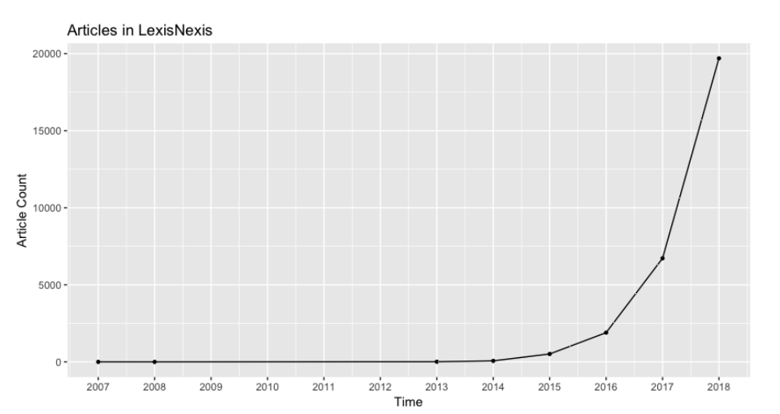

Blockchain Technology Adoption

[원문](https://papers.ssrn.com/sol3/papers.cfm?abstract_id=3189051)

|  |
| :-: |
| 일반적인 Technology Adoption Cycle |

|  |
| :-: |
| Google Trends: Blockchain |

|  |
| :-: |
| Google Trends: Bitcoin |

|  |
| :-: |
| Blockchain: News Articles |

|  |
| :-: |
| Blockchain: Book Titles |

전반적으로 웹검색, 잡지 기사, 책 제목을 기반 증거에서는 블록체인의 확산이 주로 처음 두 그룹 (혁신가, 얼리어답터) 내에 있음을 나타낸다. 이 두그룹 모두 블록체인이 두가지 이유로 높은 수준의 불확실성과 관련이 있음을 나타낸다. 

첫째, 블록체인은 아직 실험단계에 있다. 즉 기능이 완전히 개발되지 않았을 수도 있다. 이는 분산 동기화 문제 (비잔틴 장군의 문제)를 해결하기 위한 솔루션이 증가하고 있음이 나타낸다. 작업증명외에도 지분증명, 협력증명, 투표 시스템 드잉 있다. 

둘째, 신기술을 기존 프로세스와 통합하는 방법에 대해 명확한 그림을 가지고 있지 않을 수 있으며, 더 중요한 것은 예상되는 이점이 분명하지 않을 수도 있다는 것이다. 보고서 대다수는 기술을 채용하는 사람들이 기술을 수익화 하기 보다는 블록체인을 더 잘 이해하려고 시도하는 것으로 났다. 킬러앱은 아직 출현하지 않은 것으로 보이며, 일부 어플리케이션은 블록체인이 문제를 찾는 해결책으로 남아 있다고 주장하기도 한다.

따라서 전략적 관점에서 볼때, 경쟁사 보다 앞서 블록체인에 투자하는 이점은 투자가 긍정적이고 중요한 성과를 제공하지 못할 위험도 존재하므로 균형을 이루고 있다. 일반적으로 블록체인 채택을 고려하는 기업은 강력한 재정적 지위에 대한 높은 욕구를 가지고 있다. 후자는 구현 실패로 인한 잠재적인 실패도 감당할 수 있다. 이러한 증거는 유행보다는 합리적인 선택에 의해 주도되는 것으로 보이지만, 연구자와 실무자들은 여전히 회의론을 권장한다. 이들 중 일부는 블록체인 이니셔티브가 필요한지 여부를 질문한다. 몇몇 연구는 관계형 데이터베이스가 보다 효율적이고 효과적인 솔루션이라고 주장한다.

## 결론

블록체인은 많은 산업에서 기업의 외부 환경 (고객, 기존 경쟁자, 잠재적인 신규 진입자, 공급업체, 파트너, 규제 환경의 위험 또는 기회)을 변화시킬 가능성이 있다. 이는 가능한 모드 이해 관계자 (즉, 블록체인 생산자, 채택자, 투자자, 분석가)에게 기회와 위협이 있음을 의미한다. 그러나 최근의 과대광고에도 불구하고 기술 채택률은 상대적으로 낮다. 이는 채택자가 여전히 기술적 제한, 규제 문제 및 예쌍되는 효익의 자본화를 위한 잘 정의된 사업모형의 결여에 대해 우려하고 있음을 나타낸다.