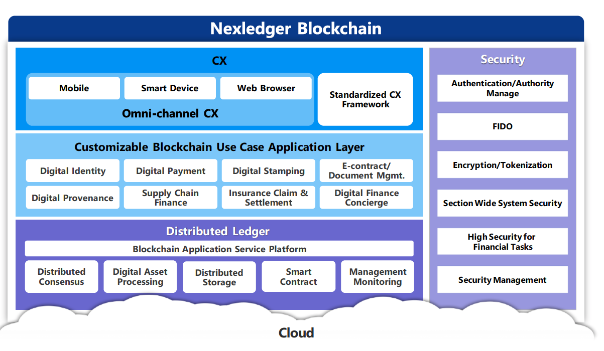

Unlocking Blockchain’s Transformative Power Across Industries

[원문](https://www.samsungsds.com/global/ko/enterprise-asset/IDC-nexledger-unlocking-blockchain-transformative-power-across-industries.html)을 개인적인 학습을 위해 요약한 내용입니다.

> 앞 부분은 블록체인 소개라 그냥 넘어갔습니다. 제가 궁금한건 NexLedger이기 때문에..

삼성SDS는 정부, 제조, 물류 등 다양한 산업에 쓰일 수 있는 플랫폼인 NexLegder를 통해 이러한 시장 기회를 다루고 있으며 이미 금융 산업에서 상용화된 사례를 보유하고 있습니다.

많은 수의 산업에 걸쳐 사용 사례가 있는 삼성 SDS는 상용화된 최초의 글로벌 공급 업체 중 하나이며 블록 체인 기반 세관 기술 검증을 성공적으로 수행한 세계 최초의 업체이기도 합니다. 또한 Nexledger는 자체 전문 컨센서스 알고리즘을 포함하여 플랫폼과 관련된 30 개 이상의 특허를 보유하고 있습니다.

> 자체 컨센서스 알고리즘을 갖고 있다는 것은 이더리움의 ERC20을 사용하지 않고 자체적인 블록체인 합의 알고리즘을 만들어서 사용했다는 의미로 볼수도 있습니다.

오픈 소스 하이브리드, 개인 허용 블록 체인 플랫폼인 Nexledger는 모니터링 도구, 외부 링크, 응용 프로그램 프로그래밍 인터페이스 및 구조화된 DevOps 환경과 같은 다양한 구성 요소를 통합하는 블록 체인 코어로 구성됩니다. 이것은 Bitcoin을 지원하는 공개 블록 체인에서 볼 수 있는 것보다 더 많은 성능 증가와 함께 다양한 사용 사례를 위한 전체 플랫폼을 만들었습니다. 삼성SDS가 달성한 새로운 성과는 초당 거래와 플랫폼에 추가된 노드(파트너) 측면에서 플랫폼 확장 능력면에서 대부분의 기업 요구 사항을 충족시키고 있습니다.

### 블록체인 프로토콜의 커스터마이제이션

이 플랫폼은 오픈 소스 블록 체인, Hyperledger 및 Ethereum의 기본 아이디어를 활용합니다. 삼성SDS는 자체 작업으로 이러한 영역을 더욱 강화했습니다. 예를 들어 트랜잭션 출력, 공개 / 개인 키 및 핵심 엔진과 같은 오픈 소스 프로토콜의 측면은 Nexledger 블록 체인 플랫폼에서 찾을 수 있으며 삼성 SDS 팀이 만든 다양한 새로운 기능과 함께 찾을 수 있습니다.

### 자체 내장된 인증 솔루션

 삼성 SDS는 또한 인증 기관을 이용하는 전반적인 아키텍처로 [Hyperledger Fabric](https://www.hyperledger.org/projects/fabric)을 채택했습니다. Ethereum에서 삼성 SDS는 체인 전체에서 거래를 사용자 정의하고 자동화하는 프로그래밍 가능한 인터페이스인 엔터프라이즈 수준의 스마트 컨트랙트 개념을 활용하고 있습니다. 그들은 또한 이를 뒷받침하는 자체 특허 컨센서스 알고리즘을 개발했습니다. 오픈 소스 하이브리드 모델인 Nexledger는 글로벌 분산원장의 원칙을 따르기 위해 쉽게 통합할 수 있는 오픈 소스 커뮤니티의 유연한 업데이트를 지원합니다. 그 결과 블록체인 플랫폼이 생겨났고, 이미 입증된 여러 서비스가 즉시 활용될 수 있습니다.

 > 이더리움에서 많은 부분 아이디어를 가져와 공개 블록체인에 적합한 합의 알고리즘 (지분증명) 대신 프라이빗 블록체인에 어울리는 좀더 간단한 합의 알고리즘을 추가한 것 같습니다.

### 빌트인 시큐리티

삼성 SDS는 인증 및 권한 관리를 포함하는 다양한 보안 서비스를 통해 이 서비스 내의 보안을 해결했습니다. 사용자 인터페이스 수준에서 플랫폼에 액세스하는 데 필요한 장치 유형에 대한 고려가 이루어 졌기 때문에 모바일, 스마트 장치 및 브라우저가 지원됩니다.

### 효율적인 처리

이 외에도 플랫폼이 상업적으로 우호적인 제공임을 보장하면서 삼성 SDS 고객의 상업적 요구를 충족시키기 위해 플랫폼에 몇 가지 맞춤형 변경이 있었습니다. 블록 체인 기술 플랫폼으로 설명된 Nexledger는 자격을 갖춘 자체 컨센서스 알고리즘을 사용합니다. 핵심 알고리즘은 노드가 네트워크에서 누락되어도 합의에 도달할 수 있으므로 자체적으로 내결함성 플랫폼이됩니다. 또한이 플랫폼은 허가 기반이며 Bitcoin을 뒷받침하는 공공 블록 체인 내에서 발견되는 성능 및 보안 문제를 해결했습니다. 삼성 SDS에 따르면 Nexledger는 Bitcoin을 지원하는 블록 체인 플랫폼보다 100 배 이상 빠릅니다. Bitcoin에 권한을 부여하는 공개 블록 체인의 알려진 한계를 둘러싼 문제와 우려를 해결하기 위해 대규모 데이터 트랜잭션을 처리하고 트랜잭션 수를 늘리는 데 도움이 되는 관리 및 모니터링 도구가 도입되었습니다.

> 퍼플릭이 아닌 프라이빗 블록체인 입니다. (당연한 얘기지만) 당연히 글로벌 하게 합의를 하는 퍼블릭보다는 빠르겠죠.

전반적으로 Nexledger는 시스템을 공개 블록 체인보다 비즈니스 용도에 훨씬 더 적합하게 만드는 다양한 도구 및 성능 기준을 통합합니다.

이 플랫폼은 여러 디지털 서비스에 대한 단일 지원 지점을 갖춘 광범위한 서비스를 가능하게합니다. 필요한 경우 삼성 SDS의 도움을 받아 고객이 조직이나 컨소시엄의 요구를 충족시키는 맞춤형 응용 프로그램을 제공할 수 있는 유연한 개발 플랫폼이 제공됩니다.

## 고객 이용 사례

### 금융 서비스

#### 케이스 1 : 신용 카드 고객을 위한 간단한 서드파티 로그인 모듈.

이 프로젝트는 고객의 신원 정보를 삼성 카드와 사용하여 타사 로그인 사용자를 인증하는 것을 포함합니다. 예를 들어, 버거 킹 (많은 사람들이 ID를 가지고 있지 않은)에 로그인하는 것은 사용자가 신원 생성 프로세스를 거쳐야하기 때문에 번거로울 수 있습니다. 삼성카드의 블록체인 인증으로 사용자들은 간단한 검증 방법을 통해 자신을 인증할 수 있어 이들에게 원활한 보안 경험을 제공할 수 있습니다. 게다가 삼성카드는 특정 고객이 블록체인 원장을 이용해 삼성카드 자격증을 어떻게 사용했는지 추적할 수 있을 것입니다. 그렇게함으로써 블록 체인 솔루션은 운영 비용과 위험을 낮추는 데 도움이됩니다.

#### 사례 2: 통합 고객 인증 시스템

은행연합회와의 이 프로젝트에서 삼성SDS는 18개 은행의 내부, 은행 간 및 금융 부문 간 비즈니스 프로세스 개선을 위한 블록체인 네트워크를 구축하는 업무를 맡았습니다. 한국에서는 기존 시스템에서 고객이 가입한 새로운 서비스를 위해 은행으로 등록하도록 요구하기 때문에 새로운 통합 고객 인증 시스템이 절실히 요구되고 있습니다. 삼성SDS는 은행 및 규제당국이 활용할 수 있는 사용자 ID 시스템을 만들어 규제당국에 필요한 사항을 준수하는 동시에 시스템 효율성을 개선해야 했습니다. 삼성SDS NexLedger는 전체 노드가 100개 이상인 클라우드 환경에서 초당 수천 개의 상호작용을 처리해야 하는 스트레스 테스트를 성공적으로 거쳤습다. 삼성SDS NexLedger가 거래, 품질, 확장성, 완성도, 속도 향상을 위해 노력했다는 증거입니다.

#### 사례 3 : 보험 제공자 및 환자를위한 신뢰할 수 있는 환경. 

최근 프로젝트에서 삼성 SDS는 블록 체인 플랫폼을 기반으로한 여러 생명 보험 제공 업체를 위한 공동 인증 시스템을 구축하기 위해 노력하고 있습니다. 이 공동 인증 시스템은 의료 보험 청구, 평가 및 상환 프로세스를 혁신하기 위해 의료 제공자 및 건강 보험 회사와 환자를 연결합니다. 시스템이 완전히 활용되면 환자는 온라인 앱을 사용하여 의료 제공자의 데이터를 보험 회사에 자동으로 전송하고 의료 보험 청구를 자동화할 수 있습니다. 게다가, 건강보험 회사들은 수동 데이터 입력 오류로 인해 더 이상 잘못된 금액을 다시 부과하는 것에 대해 더 이상 어려움을 겪지 않을 것이다.

### 물류

#### 사례 4: 혁신적인 전자계약 관리 시스템. 

삼성 SDS는 또한 전자 계약 / 문서 관리 주제에 관한 해양 물류 컨소시엄과 협력했습니다. 이 프로젝트는 선하증권과 신용장 등의 내용을 다루면서 한국, 중국, 일본, 베트남, 태국, 인도, 아랍에미리트(두바이), 네덜란드, 미국 등 11개 지역 간 화물을 정화하는 데 15일에서 3일이 소요되는 시간을 단축시켰다.

#### 사례 5: 효율적인 제품 출처 추적. 

한국 어묵 제조업체인 삼진 어묵은 삼성 SDS의 블록 체인 플랫폼을 배치하여 베트남 원산지에서 국내 판매 지점까지 제품의 출처를 추적했습니다. 추적은 사료 생산 및 번식 상태와 같은 측면을 포함하여 원산지의 생선 생산 품질에서부터 유통, 세관, 소매에 이르기까지 전체 공급망에 걸쳐있었습니다. 소비자는 QR 코드를 스캔하여 삼진 아묵의 제품의 출처를 확인할 수 있습니다.
블록체인은 제품의 재료 상태, 위치 및 처리를 여러 단계로 추적하여 제품의 품질을 보장하는 데 사용되었습니다. 이 프로젝트의 성공으로 삼성 SDS는 한국의 8 개 해산물 가공 회사를 대표하는 ASK (All About Seafood Korea)와 함께 PoC를 추가로 실행했습니다.

### 제조업

#### 사례 6: 효과적인 전자계약 관리 시스템과 문서 검증 시스템. 

삼성의 신재생에너지 부문인 삼성SDI의 도전 과제는 다양한 배터리 및 기타 재생에너지 형태를 제조하기 위해 공급망에 진입하는 원자재를 인증하는 것이었습니다. 공급망은 많은 수의 하청 업체와 다양한 수준의 보안으로 수많은 지역을 건넜습니다. 삼성SDS는 사기성 위험과 위조 가능성을 없애기 위해 블록체인 플랫폼을 배치했습니다. 문서 관리 및 문서 검증을 위한 디지털 스탬핑과 전자 계약과 같은 여러 모듈을 활용합니다. 그 결과 삼성SDI의 공급망에 들어가는 사기성 활동이나 위조 문제가 완화되었습니다. 또한 블록 체인에 가입하기 위해 검증되어야하는 하청 업체는 제출하는 문서가 신속하게 확인되어 프로세스의 속도를 향상시킴에 따라 더 빠른 지불로 이익을 얻을 수 있게 되었습니다.

### 정부

#### 사례 7 : 정부의 미래 블록 체인 컨설팅 프로젝트. 삼성 SDS는 또한 서울시와 함께 다음과 같이 작업했습니다.

- 관리 프로세스에서 블록체인 기술을 구현하기 위한 전략을 개발합니다.
- 시민을 위한 서비스의 편의성을 높이기 위해 기관 및 사무실 간의 운영 투명성을 향상시킵니다 (예 : 중고차 시장의 전반적인 투명성 향상).
- 2022 년까지 복지, 공공 안전 및 운송 서비스를위한 블록 체인 응용 프로그램의 향후 계획 및 설계를 진행합니다. .

또 삼성SDS는 물류산업에서 블록체인과 IoT를 통합해 사용사례를 확대하고 공공부문에서 일부 사용사례를 활용하는 방안을 추진 중입니다.

## 도전과 기회

성공적인 삼성 SDS NexLedger 사용 사례는 투명한 거래를 가능하게하는 불변의 기록을 제공하는 수단으로 블록체인의 유용성을 입증했습니다. 그러나 신흥 기술은 여전히 많은 조직의 레이더에서 벗어났습니다.

블록체인 컨설팅, 블록체인 플랫폼 구현, 블록체인 시스템 전체 운영에 대한 삼성SDS의 경험은 이 기술의 잠재력을 깨닫는 조직에게 다시 한번 귀중한 것으로 여겨질 것입니다. 현재 시장은 블록체인 기술을 이해하고 구현하는 데 필요한 지식이 부족합니다. 특히, IDC 연구에 따르면 분산 원장 시장은 여전히 매우 초기입니다. 일반적으로 최상위 끝에 있는 시장의 작은 부분 만이 블록 체인 이니셔티브의 모든 형태에 적극적으로 착수하고 있습니다.

오늘날 블록체인 시장은 삼성 SDS와 같은 퍼스트 무버들이 개척해나가는 척박한 땅입니다. 기술이 관심을 끌기 시작하면, 플랫폼 제공업체는 몇 가지 성공적인 맞춤형 사용 사례를 구현하기 위한 중요한 경험을 얻을 수 있기 때문에 이 기회를 잡을 수 있습니다.

또한 삼성 SDS는 파트너 생태계를 확장하여 비즈니스 가치를 분명히하고 원하는 기술적 결과에 대한 기술 전문 지식을 모집하고 있습니다. 예를 들어, 삼성 SDS는 이미 글로벌 회계 및 컨설팅 회사인 Ernst & Young과 협력하여 블록 체인 시장에서 새로운 비즈니스 기회를 발견하고 시장 동향 및 글로벌 기술에 대해 공유하고 있습니다. 또한 삼성 SDS는 블록 체인을 서비스로 제공하기 위해 AWS를 클라우드 서비스 파트너로 선택했습니다.

## 결론

아직 초기이지만 블록 체인 기술이 거래 속도 증가, 서류 작업 감소 및 문서의 무결성 및 보안 증가 측면에서 상당한 절감 효과를 가져올 수 있는 잠재력은 중요합니다. 이 기술을 적용할 수 있는 분야가 다르지만 컨소시엄의 "회원"이 늘어남에 따라 기술의 가치가 높아질 것입니다. 블록체인이 제공할 수 있는 것의 대부분은 디지털 변환 전략을 뒷받침할 것이다.

삼성SDS는 대기업의 일원이라는 장점이 있으므로 다양한 산업 분야에서 여러 가지 제품을 테스트하고 생산할 수 있었습니다. 이로 인해 신흥 블록 체인 시장을 장악할 수 있는 잠재적인 글로벌 플레이어로서 강력한 위치에 있습니다.

IDC는 이 시장이 향후 몇 년 동안 상당한 성장세를 보일 것으로 예상하며, 앞서 언급한 바와 같이, 대부분의 기회는 이 분야의 최초 개발자가 가져가게 될 것입니다. 일단 비용 절감과 효율성이 증명된다면, 이것이 올바른 길이라는 것이 업계 나머지 사람들에게 분명해질 것입니다. 지속적인 절감과 효율성은 새로운 현실의 일부이지만 조기 채택자는 이러한 혜택을 먼저 보게 될 것입니다.
