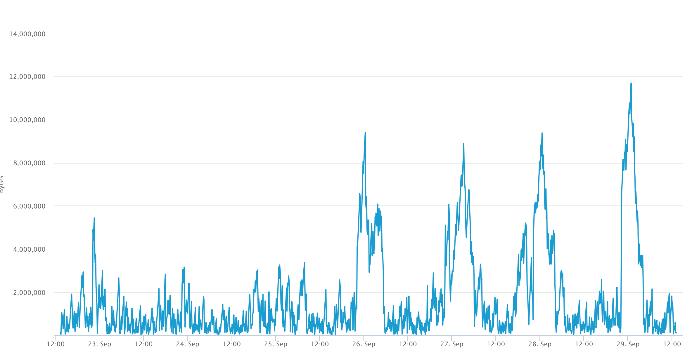

Mempool

[원문](https://coinsutra.com/bitcoin-mempool/)

비트코인 트랜잭션이 네트워크로 전송되면, 사용 가능한 모든 비트코인 노드에서 먼저 확인하게 된다. 성공적으로 검증작업을 통과하면 'Mempool'에 들어가서 마이너가, 그 블록을 선택하여 다음 블록영역에 들어갈 때까지 대기하게 된다. 따라서, Mempool은 기본적으로 블록에 들어가기전에 보류중인 모든 트랜잭션에 대한 노드의 보류의 영역인 것이다.

모든 노드는 확인되지 않은 트랜잭션을 저장할 수 있는 RAM 용량이 다르다. 결과적으로, 각 노드는 보류중인 트랜잭션을 자체적으로 렌더링하게 된다. 이는 다양한 메모리풀 크기와 서로다른 소스에서 볼 수 있는 트랜잭션 수를 설명하게 된다. 하지만 메모리 풀 크기에 따라 노드가 충돌하지 않기 위해서, 메모리 풀 크기가 RAM용량에 너무 가까워 지게 되면 노드는 최소 수수료 임계값을 설정한다. 이 임계값보다 낮은 kb당 수수료를 가진 거래는 즉시 메모리풀에서 제거되며, kb당 충분한 수수료를 가진 거래만이 메모리 풀에 엑세스 할 수 있다.

메모리풀은 BIP 35 (Bitcoin Imporvment Proposal)의 일부이며, SPV wallets(경량형 비트코인 지갑)이 트랜잭션을 기록하는 것을 돕는다. 기본적으로 메모리풀은 일종의 비트코인 네트워크의 병목현상이라 볼 수 있다. 블록체인에서 더 빠른 트랜잭션이 확인될 수록, 사용자는 더 나은 경험을 할 수 있게 된다. 신규 트랜잭션 블록 마이닝 비율이 메모리풀에 도착하는 신규 트랜잭션 속도보다 낮으면, 정체현상이 발생하고, 거래가 승인되기까지 오래 걸릴 수 있다. 노드가 새 유효한 블록을 수신하면, 해등 블록에 포함된 모든 트랜잭션이 해당 메모리풀에서 제거된다. 이는 메모리 풀 크기의 감소를 가져온다.

> 현재 메모리 풀의 크기는 [여기](https://www.blockchain.com/charts/mempool-size)서 볼 수 있다.

예를들어, 메모리 풀의 크기가 약 3MB인 경우, 트랜잭션이 확인되기 위해 평균 3블록이 소요된다는 것을 의미한다. 메모리풀 거래 중 일부는 'dust transactions' (아주 소량의 비트코인을 보내는 것)과 같이  확인되기까지 오랜 시간이 걸릴 것이라는 사실을 발신자가 알고 있는, 우선순위가 낮은 거래일 것이다.