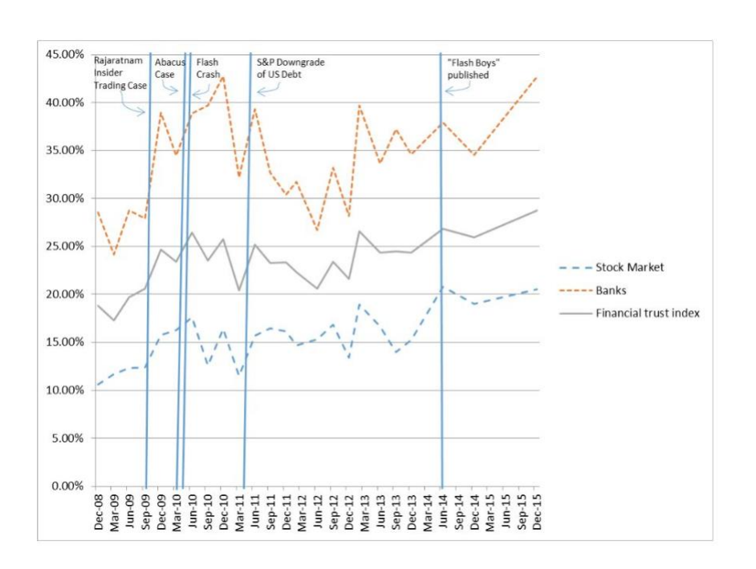
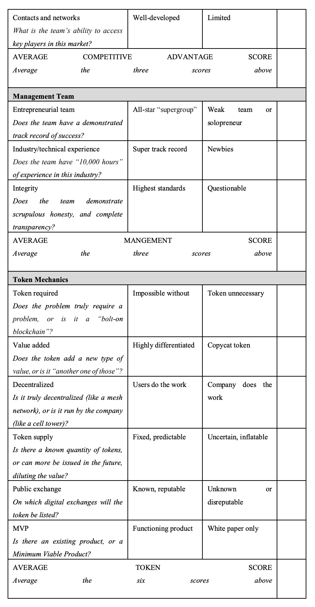

How Value is Created in Tokenized Assets

[원문](https://papers.ssrn.com/sol3/papers.cfm?abstract_id=3146191)

## 1. Introduction

2010년 5월, 초기 비트코인 개발자인 Laszlo Hanyecz는 비트코인을 사용하여 처음으로 공개 구매를 했다. 그 당시, 그 비트코인은 약 40달러의 가치가 있었다. 오늘날 그것들은 1억달러의 가치가 있을 것이다.

이 이야기의 가장 일반적인 해석은 Hanyecz가 피자 값을 너무 많이 지불했다는 것이다. 우리는 Hanyecz가 새로운 기술에 대한 신뢰를 쌓음으로써 엄청난 가치를 창출했다는 다른 관점에서 바라본다. 사실, 이 구매는 알렉산더 그래엄 벨이 전화로 말한 "왓슨씨, 이리 오세요. 보고 싶어요."와 같은 역사적인 말로 기억될 수 있다. Hanyecz는 비트코인을 사용하여 실제 제품을 구입함으로써 비트코인이 실제 화폐 가치를 가질 수 있다는 것을 보여주었다. 그는 초기의 개발자들에게 비트코인이 새로운 종류의 디지털 화폐로 사용될 수 있다고 신뢰를 주었다.

그 신뢰은 전염성이 있었다. 그것은 비트코인을 그 역사적인 구매 이후 가치를 2,500,000%까지 증가시켰을 뿐만 아니라, 그것은 또한 완전히 새로운 "토큰 자산"의 디지털 자산 Class를 만들었다. 그런 의미에서 피자는 거래였다.

투자자들은 이러한 디지털 자산을 어떻게 평가하는가? 대부분의 경우, 자산, 수익 또는 보증이 적용되지 않다. 일부 경제학자들이 그랬던 것처럼 자산 전체를 투기적인 것으로 무시하는 것은 근시안적이다. 왜 어떤 토큰화된 자산은 만 달러 가치가 있고 다른 자산들은 사실상 아무 가치도 없는 것일까? 수백 개의 새로운 토큰 출시를 관찰하고 각각의 성공률을 측정함으로써 투자자의 행동에 대해 알 수 있는 것은 무엇일까? 이 지식을 사용하여 어떤 토큰의 가치가 증가할 수 있는지 예측할 수 있습을까? 비트코인의 다음을 예측할 수 있을까?

이 논문에서 우리는 투자자 신뢰라는 잘 이해된 개념을 사용하여 이러한 질문에 답한다. 우리는 투자자들이 토큰화된 자산을 어떻게 평가할지, 평가할 ‘어려운 숫자 (Hard Number)’가 없을 때 어떻게 평가할 것인지에 대한 새로운 이론적 틀을 제시한다. 마지막으로 토큰 제작자와 투자자 모두에게 이익이 되는 토큰 평가에 대한 분석 도구를 소개gks다. 이는 바로 토큰 신뢰 프레임 워크입니다.

## 2. 토큰화된 자산이란?

1997년, 록 뮤지션 데이비드 보위가 "Bowie Bond"라고 불리는 새로운 투자 펀드 선보였다. 투자 은행가 데이비드 풀먼의 아이디어로, 보위 본드는 평균 10년간 7.9%의 이자율을 제시했다. 이 채권은 데이빗 보위의 25개 앨범에 대한 예상 수익에 의해 지원되었는데, 이것은 시간이 지남에 따라 수익 잠재력을 가질 것으로 합리적으로 예상될 수 있다.

투자자들은 이 채권에 확신을 가질 수 있다. 왜냐하면 무디스로부터 투자 적격 등급을 받았고, 결국 미국의 프루덴셜 보험사에 의해 5,500만 달러에 매입되었다. 즉, 보위는 자신의 음악에 권리를 팔기 보다는 채권을 다시 사기 위해 사용했다.

보위 본드는 디지털 음악과 같은 무형 자산도 증권화할 수 있다는 것을 일찍이 증명했다. 디지털 음악이 가능했다면, 디지털 컴퓨터 코드라고 못할건 없지 않은가? 이것은 정비트코인과 Ethereum, Ripple 과 같은 소위 "altcoin"을 포함한 새로운 종류의 디지털 자산에서 일어난 일이다. 기존 채권과 마찬가지로 토큰도 기본 자산 또는 엔터프라이즈에서 가치의 일부분으로 이해할 수 있다. 다음 분류법을 제안합니다.

- 비트코인과 같은 통화 토큰을 사용하여 실제 상품을 구매하고 판매할 수 있다.
- Ethereum과 같은 플랫폼 토큰은 블록체인 플랫폼에서 트랜잭션을 실행하기 위해 "지급"으로 사용할 수 있다.
- 자산이 지원된 토큰은 부동산, 미술품 또는 수집품과 같은 기본 물리적 자산에 연결된다.

오늘날 블록체인 기술은 블록체인이 분산형 소유권 및 제어, 새로운 합의 메커니즘, 데이터의 불변성, 신뢰도 없는 프로토콜, 새로운 토큰 등의 기능을 제공하기 때문에 사용자가 이러한 토큰의 소유권을 저장하고 전송할 수 있는 일종의 "연료" 다. 실제로 우리는 새로운 ‘토큰화된 경제’에 진입할 가능성이 높다. 여기서 투자자들은 스포츠 팀부터 도시, 정부까지 가치 자산의 부분적 소유권을 살 수 있고, 블록체인 기술에 기록될 것이다.

이러한 변혁적인 추세를 감안할 때 투자자가 토큰화된 자산을 어떻게 평가하는지 이해하는 것이 중요하다. 보위 본드의 경우, 그것은 아티스트의 음악으로부터 예상되는 미래 수익으로 뒷받침되었다. 기업이나 예상되는 미래의 수익에 의해 뒷받침되지 않는 상품권을 투자자들은 어떻게 평가하는가? 그 가치는 어디에서 나온 것인가?

## 3. 토큰화된 자산

이러한 질문에 답하기 위해 먼저 알려진 가치의 자산, 불확실한 가치의 자산, 새로운 토큰화된 자산으로 뒷받침되는 디지털 토큰을 고려할 것이다. 우리는 투자자들이 상품권에서 화폐 가치를 매기기 위해 사용하는 정신적 지름길 (Mental Shortcut)을 더 잘 설명하기 위해 이 분류 체계를 제안한다.

### 3-1. 알려진 가치가 있는 자산으로 지원되는 토큰 

대략적인 가격이 알려진 기초 물리적 자산(예: 금, 부동산, 미술 등)을 나타내는 토큰을 생각해보자. Bowie Bond와 마찬가지로 이러한 토큰은 실제 자산 또는 예측 가능한 수익 흐름을 통해 뒷받침된다. 블록체인 기술이 발전함에 따라, 우리는 토큰화된 "실제" 자산의 수가 엄청나게 증가할 가능성이 높다. 예를 들면 다음과 같다.

- 부동산: 뭄바이의 투자자들은 뉴욕 부동산 시장에 맞춰 맨해튼에 부동산을 소유할 수 있다.
- 수집품: 미술 애호가들이 반 고흐 그림이 후원하는 토큰을 소유할 수 있으며, 이 토큰은 반 고흐의 작품이 인기 있는 한 그 가치를 유지할 수 있다.
- 기업: 벤처 캐피털 회사는 자체적인 토큰을 발행할 것이며, 이는 투자자들이 회사의 포트폴리오 회사에 대한 신뢰도가 높아짐에 따라 가치가 평가될 것이다.

각 경우에, 토큰은 기초 자산 가치의 부분적 소유권을 나타내지만 자산 자체를 나타내지 않는다. (토큰의 정의는 "사실상실체의 가시적 또는 유형적 소유권의 역할을 하는 것".) 토큰을 사용하면 인식된 값의 몫을 나타낸다고 말하는 것이 더 정확하다.

미국 달러가 여전히 금본위제일 때, 그것은 물리적인 금으로 뒷받침되었다. 미국이 금본위제를 벗어났을 때, 사회적 계약이 지지를 받았다. 달러 가치가 있다는 것에 널리 동의했기 때문입니다.

동일한 사회계약은 교환권과도 같은 것이다. 충분한 투자자들이 가치가 있다고 동의하는 한, 그들은 가치가 있다. 더 많은 투자자들이 시장에 진출하거나, 또는 투자자들이 미래의 교환 가치에서 더 신뢰을 갖게 되면, 그들은 가치가 상승하게 된다. 투자자들이 신뢰을 잃으면, 그들은 무너진다.

데이빗 보위의 작품이 "Bowie 토큰"으로 뒷받침될 미래를 상상해 보자. 그리고 나서 데이비드 보위의 재산은 데이비드 보위의 후편 카탈로그에 대한 투자자들의 신뢰를 높이기 위해 가능한 모든 것을 할 것이다. 인기 영화에 대한 라이센스 부여, 보위 테마 음악 페스티벌 개최 등. 이러한 방식으로, 그들은 투자자, 그리고 그들 자신을 위한 가치를 창출할 것이다.

따라서, 알려진 가치가 있는 자산의 지원을 받는 토큰값은 다음과 같이 간단히 계산할 수 있다.

$${토큰의\,가치} = \frac{총\,자산의\,가치}{토큰의\,수}$$ 

### 3-2. 가치를 알수 없는 자산으로 뒷받침 되는 토큰

그러나 대부분의 알트코인에는 실제적인 자산이 없다. 그러나 사회계약은 가치가 있다고 판단한다. 매일 수십억 개의 알트코인이 디지털 교환으로 구매되고 판매된다. 이 값은 어디에서 발생하는가?

이 문제에 접근하는 한 가지 방법은 네트워크 효과를 통해서이다. Metcalfe의 법칙에 따르면 네트워크의 가치는 네트워크 사용자 수에 비례하여 증가한다. 네트워크의 n 명의 사용자의 경우 각 사용자의 값은 총 사용자 수에 비례한다.

$$n(n-1) = n^2 - n$$

100개의 토큰 풀에 의해 지원되는 간단한 블록체인 플랫폼을 상상해 보자. 각 토큰의 값이 네트워크의 모든 사용자에 대해 1달러인 경우 10명의 사용자가 총 100달러 또는 토큰당 1달러의 값을 형성한다. Metcalfe의 법칙은 10배 증가할 때마다 네트워크 효과가 100배 증가한다고 추정한다. 예를 들어 네트워크가 10명에서 100명으로 증가하면 네트워크의 총 가치는 100달러에서 약 10,000달러로 증가한다

그러나 토큰 수는 고정되어 있으므로 토큰 값이 1달러에서 100달러로 증가한다.

실제로, 모든 블록체인 자산의 총 시가총액화를 기준으로 블록체인 지갑의 성장을 분석할 때 정확히 알 수 있는 것은 다음과 같다.

이러한 발견은 Metcalfe의 규칙은 디지털 토큰의 가치에 적용된다는 것을 보여주지만, 고려해야 할 것이 있다 토큰 수가 일정하게 유지되기 때문에 토큰의 가격이 불균형적으로 증가하는 것을 볼 수 있다. 이는 명목통화와 토큰의 차이를 만든다. 달러화를 사용하는 사람이 많을수록 달러화 가치가 높아지지 않는다. 따라서 가치가 증가할 가능성이 있는 토큰은 미래에 성장할 가능성이 있는 크고 확립된 사용자 기반이 있는 토큰이다.

분산 원장은 일반적으로 ‘해싱’이라고 알려진 복잡한 수학 문제를 해결함으로써 네트워크에 컴퓨팅 능력을 빌려주는 분산된 컴퓨터의 연결에 의해 구동된다는 사실을 기억해야 한다. 비트코인, 총 컴퓨팅 능력, 또는 ‘해시 파워’와 같은 이른바 ‘작업 증명’ 블록체인의 경우, 컴퓨터의 가치를 측정하는 또 다른 방법이다 해싱은 실제 전기 비용을 포함하기 때문에 Metcalfe의 법칙에 따라 네트워크의 총 "가치"를 측정하는 또 다른 척도로 사용될 수 있다.

### 3-3. 새롭게 토큰화된 자산

기초 자산 없이 그리고 사용자 네트워크(예: ICO나 토큰 판매 등이) 없이 새로운 토큰이 생성되는 경우, 투자자들은 가능한 모든 참조 포인트를 사용하여 주관적으로 가격을 계산한다.

투자가들이 어떻게 이런 결정을 내리는지를 조사하기 위해, 우리는 몇 달 동안 약 250명의 토큰 투자자들과 함께 작업 회의를 가졌다. 우리는 보스턴과 매사추세츠 캠브리지에서 일련의 "블록체인 투자자 미팅"을 만들었다. 각 미팅에서 우리는 그룹으로서 분석하고 토론하기 위해 몇 가지 높은 등급의 ICO 상품을 선정했다. 그리고 나서 우리는 투자자들의 의사결정 과정을 관찰하면서 각 ICO에 대한 논의를 촉진했다. 마지막으로, 우리는 참가자들에게 ICO에 개인적으로 투자할 것인지 여부를 투표하라고 요구했다.

우리는 투자자들이 다음을 포함한 다양한 요인을 찾고 있다는 것을 알게 되었다.

- 팀: 창엄 멤버들이 입증된 성공 기록을 가지고 있는가?
- 아이디어: 토큰이 실제 문제를 신뢰할 수 있는 방식으로 해결하는가?
- 시장: 시장은 강하고 성장가능성이 있는가, 아니면 틈새 시장이 줄어들고 있는가?
- 사용자 채택: 어떻게 구매자와 판매자가 토큰을 실제로 사용하도록 할 것인가?
- 버즈: 다른 투자자들은 토큰에 대해 뭐라고 하는가? 홍보가 잘 되고 있는가?

우리는 두 가지 유형의 ICO 투자자를 식별했는데, 그것은 장기적으로는 매입하고 보유할 계획이었던 투자자와 가능한 한 빨리 매입하여 매도하려는 투자자들이다. 장기 투자에 대한 속어적인 ["hodl" (존버하는 사람 정도의 뜻)](https://en.wikipedia.org/wiki/Hodl)은 단기 투자자들이 보통 "pump and dump" 라고 부르는 사람들 이었다.력한 팀이 주도하는 강력한 아이디어에 관심이 있는 곳에서는 첫 날 거래가 급증하면 수익성이 높아지기를 바라며 ‘하이프 사이클’에 더 관심을 보였다.

기업가정신의 팀몬스 모델을 토대로, 우리는 ICO 투자기회를 평가하고, 장기 사용자 채택을 유도할 가능성이 가장 높은 투자기회를 식별하여, 네트워크 평가를 즐기는 엄격한 방법을 개발했다. 이 모델,Token Confidence의 프레임워크는 아래에 설명되어 있다. 그 기초를 이해하기 위해서, 우선 투자자의 마음을 살펴보자. 미래의 불확실성과 앵커로서의 과거의 성과가 부족하다는 것을 고려해 볼 때, 무엇 때문에 애초에 투자자의 신뢰가 형성되는가?

## 4. 토큰에서 투자자들이 신뢰 만들기

신뢰는 모든 금융 거래의 필수적인 요소이다. 구매자와 판매자는 서로를 신뢰해야 하고, 그들이 참여하는 시장에 신뢰 가져야 하며, 시장은 그것을 지배하는 기관에 대한 신뢰를 가져야 한다. 예일 투자자 신뢰 지수, ZEW 투자자 신뢰 지수, State Street Confidence 지수 등 투자자의 신뢰를 측정하기 위한 여러 지표가 작성되었다. 

위의 수치는 시장 움직임이 투자자 신뢰 지수에 의해 측정된 것과 매우 관련이 있음을 보여준다. 우리는 또한 이것을 상식적인 사실로 받아들인다. Fed는 "시장 감정"을 높게 유지하기 위해 신중하게 단어를 선택한다. 금융 언론은 시장 침체에 대해 "격렬한"또는 "소름 끼치는"투자자라고 말한다. 이것들은 모두 신뢰의 척도이다.

신뢰와 시장 성장이 상관관계가 있다면, 토큰이 공적 교류에 가치를 부여하기 전에 새로운 블록체인 토큰을 만드는 사람들이 어떻게 자신감을 창출할 수 있을까? 행동경제학의 최근 연구 결과, 특히 대니얼 카너먼과 아모스 트버스키의 기초 연구 결과는 투자자들의 마음에 대한 흥미로운 단서를 제공하고, 블록체인 신생기업들이 투자자의 신뢰를 쌓기 위해 얼마나 노력할 수 있는지를 보여준다.

### 친숙함

우리는 우리가 아는 것을 신뢰한다. 이것이 광고, 종교 육성, 정치, 왕조의 원칙이다. 래리 자코비가 《Becoming Famous Overnight》에서 보여준 것처럼, 우리는 그 정보에 대해 이미 잘 알고 있다면 새로운 정보를 더 유리하게 볼 수 있다. 실험 대상을 무작위로 노출하면, 기억하는 방법을 기억하지 못하더라도 나중에 그 이름을 ‘기억’할 가능성이 더 높다. 폭넓은 인식을 구축할 수 있는 토큰은 자신감을 쌓을 가능성이 높으며 따라서 더 많은 가치를 창출할 수 있다.

750개가 넘는 ICO에 대한 분석에서 우리는 창업자들이 광고 예산이나 홍보를 통해 인식을 높일 수 있다는 사실을 발견했지만, 종종 ‘풀뿌리’ 노력, 예를 들어 강력한 개발 공동체를 구축하거나 기존 블록체인 애호가 네트워크를 활용하는 등의 노력으로 인해 더욱더 많은 성과를 거두었다. 교훈은 더 큰 마케팅 예산이 필요하다는 것이 아니라 토큰 제작자가 강력한 사용자 네트워크를 구축하는 데 집중해야 한다는 것이다.

### 후광 효과

우리는 잘생긴 사람들이 더 똑똑하다고 가정하는 경향이 있다. 이를 ‘후광 효과’라고 하는데, 이는 쉽게 재확인된 속성이 식별하기 어려운 다른 속성과 결합된다. 투자자들이 긍정적인 관점에서 회사나 브랜드를 볼 때 리더십 팀에 대한 그들의 견해에 "뒤집어지는" 경향이 있다

새로운 토큰 제공에 참여할지 여부를 결정할 때 투자자는 잘 알려진 회사 또는 학술 기관에서 온 창립 팀에게 "후광 효과"를 돌리는 경향이 있다. 예를 들어, Dragonchain 블록 체인 기술은 원래 Disney에서 일하면서 팀에 의해 개발되었다. Dragonchain이 1,370만 달러의 ICO를 출시했을 때 Disney는 토큰과 공식적인 제휴가 없었지만 미디어 스토리의 일부가 되었다.

새로운 토큰에 대한 자신감을 측정하기 위해 투자자들은 다른 신뢰의 상징을 찾는다. 토큰이 잘 알려진 기술 브랜드(우버, 구글, 페이스 북), 금융 브랜드(비자, 페이팔, 애플 페이) 또는 교육 브랜드(하버드 비즈니스 스쿨, 스탠퍼드, MIT)와 연결되면 후광 효과가 작용한다는 좋은 신호가 된다.

### 직관

미국의 경제학자 허버트 사이먼은 인간이 어떻게 결정을 내리는지 연구했고, 그의 아이디어는 인공지능 분야에서의 선구적인 업적에 의해 깊이 형성되었다. 그를 매료시킨 주제 중 하나는 직관이었다. 직관은 분명한 인간의 특성이었을까, 아니면 기계도 직관을 배울 수 있었을까? 그는 직관이 무의식적인 패턴 인식에 지나지 않는다고 믿게 되었다. 우리는 "이 영화를 전에 본 적이 있다." 다시 말해, 직관에 대해 마법이나 신비스러운 것은 없다: 직관은 친숙함에 기반을 두고 있다. 그래서 전문가들은 종종 "어떻게 알게 되었는 지" 와 관계 없이 "알고" 있다.

그러나 직관이 간단한 알고리즘으로 일대일로 맞서게되면 알고리즘이 승리한다.. 다니엘 카너먼은 그의 획기적인 책 《Thinking, Fast and Slow》에서 "Intuitions vs. Formulas"에 대한 내용을 한 챕터에 할애 했다. 그의 결론은 "전문가 예측"대 "단순한 공식"을 측정하는 수십 가지 학술 연구를 검토한 후, 수식은 승리 결과를 예측할 가능성이 더 크다고 결론 내렸다.

토큰 제안을 평가할 때 직관을 신뢰할 수 없는 이유는 그 제안이 너무 새롭기 때문이다. 직관적인 판단을 내리기 위해 그것을 검토하는 데 필요한 ‘10,000시간’를 가진 사람은 아무도 없다. 카너먼의 연구는 투자자들이 ICO를 평가하기 위해 5~6가지의 간단한 공식을 만드는 것이 더 낫다는 것을 보여준다. 우리가 아래에 제시하는 것은 바로 이 틀이다.

## 5. 토큰 신뢰를 위한 프레임워크

Babson College 교수 Jeffrey Timmons는 기업가적 사상의 매력을 평가하기 위해 기업가정신의 Timmons 모델을 개발했다. 그것은 새로운 상품을 개발하려는 기업가들과 기업가 아이디어를 평가하려는 투자자들에 의해 사용될 수 있다. 여러 다른 범주에서 동일한 질문을 엄격하게 함으로써, 엔젤 투자자나 기업가는 다른 사업 아이디어에 대한 반응을 비교를 할 수 있다.

우리는 토큰 오퍼링과 더 관련이 있도록 Timmons 모델을 구축했다. 목록의 각 질문에 대해 1~5의 값을 지정한다.. 각 질문의 점수는 각 섹션 끝에 평균을 내고 각 섹션의 점수는 마지막에 평균을 낸다.

실제로, 대부분의 토큰 (정의에 의한)이 평균이기 때문에, 약 3점의 점수가 일반적이다. 점수가 2에 가까워지는 토큰은 낮은 투자자의 신뢰를 보여 주며 피해야하며 약 4 점의 점수는 높은 투자자의 신뢰를 나타내며 더 자세히 볼 가치가 있다. 다른 투자와 마찬가지로, 이것은 프로세스의 끝이 아니라 강력한 시작을 의미한다.

투자자들의 경우, 토큰 신뢰도를 위한 프레임워크는 덜 매력적인 기회를 걸러내기 위한 도구로 보아야 한다. 높은 점수를 받는 토큰의 경우, 투자자는 설립 팀을 인터뷰하고, 토큰 사용자를 찾고, 더 깊은 경쟁적 분석을 할 것이다.

기업가 또는 창업 팀의 경우, Token Confidence 프레임워크를 아이디어를 강화하는 도구로 사용할 수 있다. 여전히 잘 아는 제3자가 가장 객관적으로 토큰 신뢰의 기본틀을 작성할 수 있는 가장 좋은 위치에 있다. 설립자들이 편견이 없는 외부 소스보다 더 낙관적으로 점수를 매길 가능성이 높기 때문이다. 이는 토큰 제작자와 토큰 투자자들 사이에 존재하는 정보의 비대칭성과 "우리의 실명에도 눈이 멀 수 있다."는 인식적 편견 때문이다.

## 6. 결론

블록체인 기술의 형태로 우리 경제체제에 엄청난 변화가 일어나고 있다. 새로운 자산인 암호화폐인 알트코인 및 토큰은 빠르게 증가하고 있으며, 투자자들은 이러한 새로운 "토큰"을 가치 있게 평가할 프레임워크를 찾고 있다.

이 논문의 주요 공헌은 기존의 이론적 및 분석 도구를 기반으로 토큰 평가를위한 유용한 출발점을 제공하는 동시에 토큰 가치를 평가하기 위한 새로운 프레임 워크를 제공하는 것이다. 우리는 행동 경제학과 기업가 정신 연구에 대한 잘 발달된 문헌에 의존하며, 이러한 경험적 발견이 투자자의 마음 속에 어떻게 작용하는지 설명하고 투자 결정을 내릴 때 수정되어야 한다. 따라서 이 연구는 실무자뿐만 아니라 학계에서 처음으로 이루어졋다. 이 연구의 다음 단계는 시간이 지남에 따라 토큰의 성능에 대한, 실제 데이터를 바탕으로 실제 세계의 프레임 워크를 테스트하는 것이다.

"실제" 자산(부동산, 로열티 스트림 또는 귀금속)의 지원을 받는 토큰은 매우 쉽게 가치를 창출할 수 있다. 실제 자산(예: Ethereum 또는 Ripple)의 지원을 받지 않는 토큰의 가치는 총 네트워크 사용자 수 또는 총 해시 파워(총 Method power)를 확인하여 추정할 수 있다. 일반적으로 ICO이라고 알려진 새로운 토큰 제공은 토큰 신뢰 프레임워크를 사용하여 평가할 수 있다. 이러한 오퍼링은 투자자의 신뢰를 처음 구축하는 경우에 더 높게 평가될 수 있다.

신뢰는 우리 경제 시스템의 성공적인 기능에 중요한 요소이다. 어떤 것이 가치 있다고 믿는 사람이 충분하다면, 그 믿음을 멈출 때까지는 그럴 것이다. 이것이 우리가 종교의 노래와 이야기, 정치의 화려 함과 상황, 월스트리트의 의식과 규칙과 같은 가장 큰 사회 기관을 중심으로 정교한 구조를 만드는 이유다. 은행가들이 은행 로고가 있는 옷깃 핀을 착용하고 의사들이 왜 흰 코트를 입는가에 대한 이유기도 하다. 이러한 구조는 이러한 기관에 대한 신뢰 창출하여 합법성을 부여한다..

새로운 토큰을 출시하고자 하는 야심 찬 기업가들은 a) 강력한 사용자 네트워크를 끌어들이는 것을 통해 투자자의 신뢰를 구축하고 b) 토큰을 잘 알려진 회사와 연관시키고 c) 블록체인 공간에서 투자자들 사이의 토큰에 친숙 함을 구축하는 것이 현명할 것이다. 

토큰에서 장기적인 가치를 구축하려면 제도적 구조를 통해 장기적인 신뢰를 구축하는 것이 필요하다. 종교가 이야기, 경전, 그리고 노래를 가지고 있는 것처럼, 장기적인 가치를 창조하고자 하는 토큰은 이야기, 태그, 광고를 포함할 것이다. 그들은 잘 관리된 자문 팀의 형태로 "엘더 (원로)"의 도움을 받을 것이고, 그들은 끊임없이 말, 습관, 복장에 대한 그들의 가치를 전달할 것이다. 예를 들어, 리플 토큰의 설립자들은 정기적으로 블럭체인 회의에 리플 로고가 있는 라펠 핀을 꽂은 채 정치인들의 방식으로 등장한다.

투자자의 신뢰를 쌓는 데는 시간이 걸린다. 신뢰할 수 있는 프로젝트에 투자하는 것도 시간이 걸린다. 토큰 창안자와 토큰 투자가 모두 토큰 신뢰 프레임워크를 사용하여 블록체인 경제와 세계를 위한 장기적인 가치를 구축하는 데 집중할 수 있다.