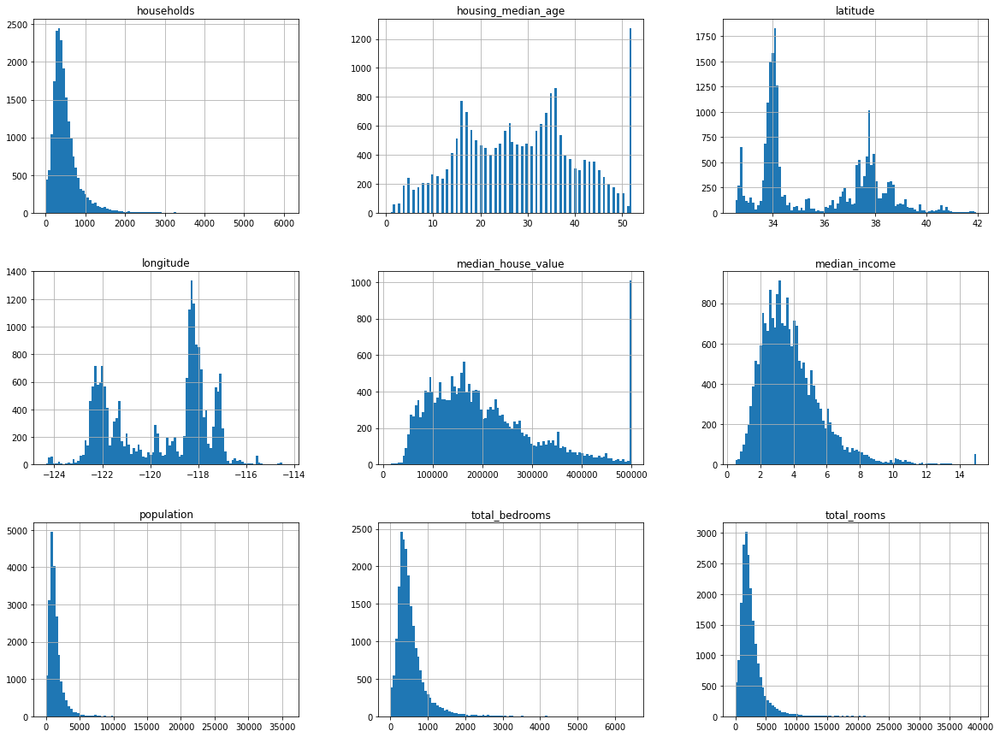
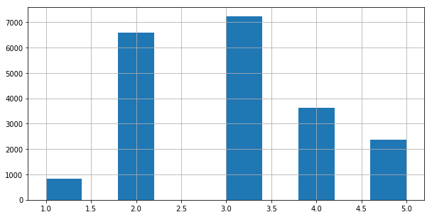
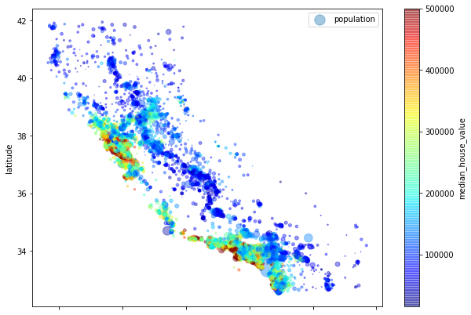
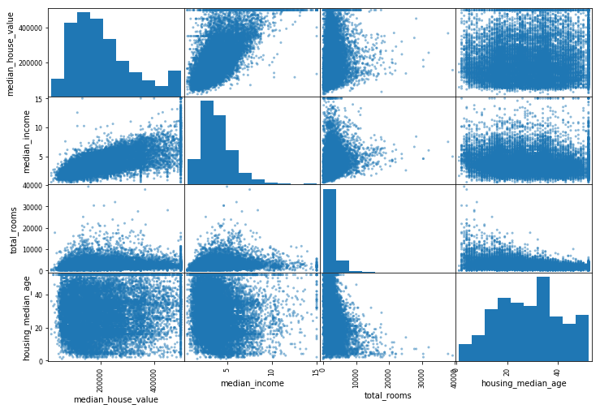

California Housing 데이터를 바탕으로 scikt-learn을 활용한 머신러닝 예제.

## 1. 기본적인 데이터 로딩

프록시 환경이라, 프록시를 핸들러에 추가하였습니다.

```python
import os
import tarfile
from six.moves import urllib
import numpy as np
import pandas as pd

# 데이터 로딩
HOUSING_PATH = os.path.join("datasets", "housing")
HOUSING_URL = "http://www.dcc.fc.up.pt/~ltorgo/Regression/cal_housing.tgz"

def fetching_housing_data(housing_url=HOUSING_URL, housing_path=HOUSING_PATH):
    if not os.path.isdir(housing_path):
        os.makedirs(housing_path)

    proxy = urllib.request.ProxyHandler({'http': 'http://proxy.url', 'https':'http://proxy.url'})
    opener = urllib.request.build_opener(proxy)
    urllib.request.install_opener(opener)

    tgz_path = os.path.join(housing_path, "housing.tgz")
    urllib.request.urlretrieve(housing_url, tgz_path)
    housing_tgz = tarfile.open(tgz_path)
    housing_tgz.extractall(path=housing_path)
    housing_tgz.close()

fetching_housing_data()

def load_housing_data(housing_path=HOUSING_PATH):
    csv_path = os.path.join(housing_path, "housing.csv")
    return pd.read_csv(csv_path)

housing = load_housing_data()
housing.head()
```

<table border="1" class="dataframe">
  <thead>
    <tr style="text-align: right;">
      <th></th>
      <th>longitude</th>
      <th>latitude</th>
      <th>housing_median_age</th>
      <th>total_rooms</th>
      <th>total_bedrooms</th>
      <th>population</th>
      <th>households</th>
      <th>median_income</th>
      <th>median_house_value</th>
      <th>ocean_proximity</th>
    </tr>
  </thead>
  <tbody>
    <tr>
      <th>0</th>
      <td>-122.23</td>
      <td>37.88</td>
      <td>41.0</td>
      <td>880.0</td>
      <td>129.0</td>
      <td>322.0</td>
      <td>126.0</td>
      <td>8.3252</td>
      <td>452600.0</td>
      <td>NEAR BAY</td>
    </tr>
    <tr>
      <th>1</th>
      <td>-122.22</td>
      <td>37.86</td>
      <td>21.0</td>
      <td>7099.0</td>
      <td>1106.0</td>
      <td>2401.0</td>
      <td>1138.0</td>
      <td>8.3014</td>
      <td>358500.0</td>
      <td>NEAR BAY</td>
    </tr>
    <tr>
      <th>2</th>
      <td>-122.24</td>
      <td>37.85</td>
      <td>52.0</td>
      <td>1467.0</td>
      <td>190.0</td>
      <td>496.0</td>
      <td>177.0</td>
      <td>7.2574</td>
      <td>352100.0</td>
      <td>NEAR BAY</td>
    </tr>
    <tr>
      <th>3</th>
      <td>-122.25</td>
      <td>37.85</td>
      <td>52.0</td>
      <td>1274.0</td>
      <td>235.0</td>
      <td>558.0</td>
      <td>219.0</td>
      <td>5.6431</td>
      <td>341300.0</td>
      <td>NEAR BAY</td>
    </tr>
    <tr>
      <th>4</th>
      <td>-122.25</td>
      <td>37.85</td>
      <td>52.0</td>
      <td>1627.0</td>
      <td>280.0</td>
      <td>565.0</td>
      <td>259.0</td>
      <td>3.8462</td>
      <td>342200.0</td>
      <td>NEAR BAY</td>
    </tr>
  </tbody>
</table>

```python
housing.info()
```

```bash
<class 'pandas.core.frame.DataFrame'>
RangeIndex: 20640 entries, 0 to 20639
Data columns (total 10 columns):
longitude             20640 non-null float64
latitude              20640 non-null float64
housing_median_age    20640 non-null float64
total_rooms           20640 non-null float64
total_bedrooms        20433 non-null float64
population            20640 non-null float64
households            20640 non-null float64
median_income         20640 non-null float64
median_house_value    20640 non-null float64
ocean_proximity       20640 non-null object
dtypes: float64(9), object(1)
memory usage: 1.6+ MB
```

`ocean_proximity`는 텍스트로 정보가 들어가 있는 것 같다.

```python
housing['ocean_proximity'].value_counts()
```

```bash
<1H OCEAN     9136
INLAND        6551
NEAR OCEAN    2658
NEAR BAY      2290
ISLAND           5
Name: ocean_proximity, dtype: int64
```

```python
housing.describe()
```

<table border="1" class="dataframe">
  <thead>
    <tr style="text-align: right;">
      <th></th>
      <th>longitude</th>
      <th>latitude</th>
      <th>housing_median_age</th>
      <th>total_rooms</th>
      <th>total_bedrooms</th>
      <th>population</th>
      <th>households</th>
      <th>median_income</th>
      <th>median_house_value</th>
    </tr>
  </thead>
  <tbody>
    <tr>
      <th>count</th>
      <td>20640.000000</td>
      <td>20640.000000</td>
      <td>20640.000000</td>
      <td>20640.000000</td>
      <td>20433.000000</td>
      <td>20640.000000</td>
      <td>20640.000000</td>
      <td>20640.000000</td>
      <td>20640.000000</td>
    </tr>
    <tr>
      <th>mean</th>
      <td>-119.569704</td>
      <td>35.631861</td>
      <td>28.639486</td>
      <td>2635.763081</td>
      <td>537.870553</td>
      <td>1425.476744</td>
      <td>499.539680</td>
      <td>3.870671</td>
      <td>206855.816909</td>
    </tr>
    <tr>
      <th>std</th>
      <td>2.003532</td>
      <td>2.135952</td>
      <td>12.585558</td>
      <td>2181.615252</td>
      <td>421.385070</td>
      <td>1132.462122</td>
      <td>382.329753</td>
      <td>1.899822</td>
      <td>115395.615874</td>
    </tr>
    <tr>
      <th>min</th>
      <td>-124.350000</td>
      <td>32.540000</td>
      <td>1.000000</td>
      <td>2.000000</td>
      <td>1.000000</td>
      <td>3.000000</td>
      <td>1.000000</td>
      <td>0.499900</td>
      <td>14999.000000</td>
    </tr>
    <tr>
      <th>25%</th>
      <td>-121.800000</td>
      <td>33.930000</td>
      <td>18.000000</td>
      <td>1447.750000</td>
      <td>296.000000</td>
      <td>787.000000</td>
      <td>280.000000</td>
      <td>2.563400</td>
      <td>119600.000000</td>
    </tr>
    <tr>
      <th>50%</th>
      <td>-118.490000</td>
      <td>34.260000</td>
      <td>29.000000</td>
      <td>2127.000000</td>
      <td>435.000000</td>
      <td>1166.000000</td>
      <td>409.000000</td>
      <td>3.534800</td>
      <td>179700.000000</td>
    </tr>
    <tr>
      <th>75%</th>
      <td>-118.010000</td>
      <td>37.710000</td>
      <td>37.000000</td>
      <td>3148.000000</td>
      <td>647.000000</td>
      <td>1725.000000</td>
      <td>605.000000</td>
      <td>4.743250</td>
      <td>264725.000000</td>
    </tr>
    <tr>
      <th>max</th>
      <td>-114.310000</td>
      <td>41.950000</td>
      <td>52.000000</td>
      <td>39320.000000</td>
      <td>6445.000000</td>
      <td>35682.000000</td>
      <td>6082.000000</td>
      <td>15.000100</td>
      <td>500001.000000</td>
    </tr>
  </tbody>
</table>

그래프로 보자

```python
%matplotlib inline
import matplotlib.pyplot as plt
# bins는 막대의 두께, figsize는 그래프의 크기다.
housing.hist(bins=100, figsize=(20, 15))
plt.show()
```



## 2. 데이터 분석

이제 데이터를 test set과 train set으로 나눠 보자.
test_size 는 말그대로 테스트의 크기이고, random_states는 random값 생성을 위한 seed 값이다.

```python
from sklearn.model_selection import train_test_split
train_set, test_set = train_test_split(housing, test_size=0.2, random_state=42)
```

이렇게 랜덤하게 나누는 것은 데이터가 클때, 그리고 속성이 많을 때는 괜찮다. 그러나 그렇게 데이터가 많지 않으면, 샘플링을 하는 과정에서도 bias가 생길 수 있다. 만약 한국의 인구비가 6:4라면, 테스트 split을 할 때에도 6:4 로 성비가 뽑혀야 괜찮다고 할 수 있을 것이다. 이를 `stratified sampling`이라고 한다. 랜덤으로 뽑을 경우, 6:4를 보장할 수는 없을 것이다.

다시 예제로 돌아와서, 만약 median_income이 median_housing_prices를 예측하는데 큰 요소라고 가정을 해보자. 그러기 위해선, 위에서의 예제 처럼 다양한 median_income을 카테고리화 해서 테스트 셋을 만드는 것이 중요할 것이다. 위 그림에서 볼 수 있듯이, median_income은 값이 너무나도 다양하므로, stratum처리를 해주지 않으면 테스트 셋을 랜덤하게 뽑아 낼 때마다 값이 널뛰기를 할 것이다.

그래서, 1.5로 나눈다음 5보다 큰 값은 다 5로 replace 해버렸다.

```python
housing["income_cat"] = np.ceil(housing["median_income"] / 1.5)
housing["income_cat"].where(housing["income_cat"] < 5, 5.0, inplace=True)
housing['income_cat'].hist(bins=10, figsize=(10, 5))
```



이제 카테고리화 했으니, 카테고리에 다라서 균등하게 나눠보도록 합시다.

```python
# 불균형한 데이터에 대해서 고르게 test, train set을 나눠준다.
from sklearn.model_selection import StratifiedShuffleSplit

split = StratifiedShuffleSplit(n_splits=1, test_size=0.2, random_state=42)
for train_index, test_index in split.split(housing, housing['income_cat']):
    strat_train_set = housing.loc[train_index]
    strat_test_set = housing.loc[test_index]

strat_test_set["income_cat"].value_counts() / len(strat_test_set)
```

```bash
3.0    0.350533
2.0    0.318798
4.0    0.176357
5.0    0.114583
1.0    0.039729
Name: income_cat, dtype: float64
```

얼추 그래프의 분포와 비슷한 양상을 보이고 있다. 최초의 목적은 달성했으니, 컬럼을 드랍하자.

```python
for set_ in (strat_train_set, strat_test_set):
    set_.drop("income_cat", axis=1, inplace=True)

housing = strat_train_set.copy()
housing.plot(kind="scatter", x="longitude", y="latitude")
```


투명도를 넣어서 조금더 선명하게 보자.

```python
housing.plot(kind="scatter", x="longitude", y="latitude", alpha=0.1)
```


조금더 이쁘장하게 만들어보자

```python
housing.plot(kind="scatter", #산점도
             x="longitude",
             y="latitude",
             alpha=0.4, #투명도
             s=housing['population'] / 100, #나타낼 데이터
             label="population", #라벨
             figsize=(10, 7), #그래프 크기
             c="median_house_value", #색 부여할 데이터
             cmap=plt.get_cmap("jet"), #색
             colorbar = True)

plt.legend()
```



correlation 매트릭스를 그려보자

```python
corr_matrix = housing.corr()
corr_matrix
```

<table border="1" class="dataframe">
  <thead>
    <tr style="text-align: right;">
      <th></th>
      <th>longitude</th>
      <th>latitude</th>
      <th>housing_median_age</th>
      <th>total_rooms</th>
      <th>total_bedrooms</th>
      <th>population</th>
      <th>households</th>
      <th>median_income</th>
      <th>median_house_value</th>
    </tr>
  </thead>
  <tbody>
    <tr>
      <th>longitude</th>
      <td>1.000000</td>
      <td>-0.924478</td>
      <td>-0.105848</td>
      <td>0.048871</td>
      <td>0.076598</td>
      <td>0.108030</td>
      <td>0.063070</td>
      <td>-0.019583</td>
      <td>-0.047432</td>
    </tr>
    <tr>
      <th>latitude</th>
      <td>-0.924478</td>
      <td>1.000000</td>
      <td>0.005766</td>
      <td>-0.039184</td>
      <td>-0.072419</td>
      <td>-0.115222</td>
      <td>-0.077647</td>
      <td>-0.075205</td>
      <td>-0.142724</td>
    </tr>
    <tr>
      <th>housing_median_age</th>
      <td>-0.105848</td>
      <td>0.005766</td>
      <td>1.000000</td>
      <td>-0.364509</td>
      <td>-0.325047</td>
      <td>-0.298710</td>
      <td>-0.306428</td>
      <td>-0.111360</td>
      <td>0.114110</td>
    </tr>
    <tr>
      <th>total_rooms</th>
      <td>0.048871</td>
      <td>-0.039184</td>
      <td>-0.364509</td>
      <td>1.000000</td>
      <td>0.929379</td>
      <td>0.855109</td>
      <td>0.918392</td>
      <td>0.200087</td>
      <td>0.135097</td>
    </tr>
    <tr>
      <th>total_bedrooms</th>
      <td>0.076598</td>
      <td>-0.072419</td>
      <td>-0.325047</td>
      <td>0.929379</td>
      <td>1.000000</td>
      <td>0.876320</td>
      <td>0.980170</td>
      <td>-0.009740</td>
      <td>0.047689</td>
    </tr>
    <tr>
      <th>population</th>
      <td>0.108030</td>
      <td>-0.115222</td>
      <td>-0.298710</td>
      <td>0.855109</td>
      <td>0.876320</td>
      <td>1.000000</td>
      <td>0.904637</td>
      <td>0.002380</td>
      <td>-0.026920</td>
    </tr>
    <tr>
      <th>households</th>
      <td>0.063070</td>
      <td>-0.077647</td>
      <td>-0.306428</td>
      <td>0.918392</td>
      <td>0.980170</td>
      <td>0.904637</td>
      <td>1.000000</td>
      <td>0.010781</td>
      <td>0.064506</td>
    </tr>
    <tr>
      <th>median_income</th>
      <td>-0.019583</td>
      <td>-0.075205</td>
      <td>-0.111360</td>
      <td>0.200087</td>
      <td>-0.009740</td>
      <td>0.002380</td>
      <td>0.010781</td>
      <td>1.000000</td>
      <td>0.687160</td>
    </tr>
    <tr>
      <th>median_house_value</th>
      <td>-0.047432</td>
      <td>-0.142724</td>
      <td>0.114110</td>
      <td>0.135097</td>
      <td>0.047689</td>
      <td>-0.026920</td>
      <td>0.064506</td>
      <td>0.687160</td>
      <td>1.000000</td>
    </tr>
  </tbody>
</table>

```python
# 1에 가까울 수록 긍정적으로 강한 관계가 있음.
# -1에 가까울 수록 부정적으로 관계가 있음.
corr_matrix["median_house_value"].sort_values(ascending=False)
```

값은 ~1 부터 1 사이의 값을 가지며, 1에 가까울 수록 강한 positive 상관관계를, -1에 가까울 수록 강한 negative 상관관계를 갖는다.

```bash
median_house_value    1.000000
median_income         0.687160
total_rooms           0.135097
housing_median_age    0.114110
households            0.064506
total_bedrooms        0.047689
population           -0.026920
longitude            -0.047432
latitude             -0.142724
Name: median_house_value, dtype: float64
```

0에 가까울 수록 아무런 관계가 없다는 것이다.


상관관계가 있을 수록, plot이 우/좌상향 분포를 나타낸다. 과연 그런지 봅시다.

```python
from pandas.plotting import scatter_matrix

attributes = ['median_house_value', 'median_income', 'total_rooms', 'housing_median_age']
scatter_matrix(housing[attributes], figsize=(12, 8))
```



```python
housing.plot(kind="scatter", x="median_income", y="median_house_value", alpha=0.1)
```

median_income 과 median_house_value와 상관관계

1. 확실히 우상향 하는 분포를 띄고 있다.
2. 500,000달러에 가로 선이 확실하게 보이는데, 이는 450,000달러와 350,000달러에서도 뚜렷하게 보이고 있다.


추가적으로, 몇가지 속성 값을 만들어보자.

```python
housing["rooms_per_household"] = housing["total_rooms"] / housing["households"]
housing["bedrooms_per_room"] = housing["total_bedrooms"] / housing["total_rooms"]
housing["population_per_household"] = housing["population"] / housing["households"]

corr_matrix = housing.corr()
corr_matrix['median_house_value'].sort_values(ascending=False)
```

```bash
median_house_value          1.000000
median_income               0.687160
rooms_per_household         0.146285
total_rooms                 0.135097
housing_median_age          0.114110
households                  0.064506
total_bedrooms              0.047689
population_per_household   -0.021985
population                 -0.026920
longitude                  -0.047432
latitude                   -0.142724
bedrooms_per_room          -0.259984
Name: median_house_value, dtype: float64
```

## 3. 머신러닝 알고리즘 활용을 위한 데이터 준비

### 1) 데이터 클리닝

일단, `total_bedrooms` 컬럼에 빈값들이 있는 것을 확인했다. 이 컬럼을 드랍하던지, 아니면 빈값을 적절하게 채우는 방법 이 있다. 빈값을 적절히 채우기 위해서는, 중간값(median)을 활용하는 것이 좋겠다.

```python
from sklearn.preprocessing import Imputer
imputer = Imputer(strategy="median")
```

`median`은 오로지 숫자 값만 처리할 수 있으므로, 숫자가 아닌 컬럼은 제거할 필요가 있다.

```python
housing_num = housing.drop("ocean_proximity", axis=1)
```

그리고 imputer를 적용해보자.

```python
imputer.fit(housing_num)

# 밑에 두개는 같은 결과를 보여준다.
imputer.statistics_
housing_num.median().values
```

```bash
array([-118.51  ,   34.26  ,   29.    , 2119.5   ,  433.    , 1164.    ,
        408.    ,    3.5409])
```

imputer한 값을 다시 dataframe으로 가져오자.

```python
X = imputer.transform(housing_num)
housing_str = pd.DataFrame(x, columns=housing_num.columns)
housing_str.head()
```

<table border="1" class="dataframe">
  <thead>
    <tr style="text-align: right;">
      <th></th>
      <th>longitude</th>
      <th>latitude</th>
      <th>housing_median_age</th>
      <th>total_rooms</th>
      <th>total_bedrooms</th>
      <th>population</th>
      <th>households</th>
      <th>median_income</th>
    </tr>
  </thead>
  <tbody>
    <tr>
      <th>0</th>
      <td>-121.89</td>
      <td>37.29</td>
      <td>38.0</td>
      <td>1568.0</td>
      <td>351.0</td>
      <td>710.0</td>
      <td>339.0</td>
      <td>2.7042</td>
    </tr>
    <tr>
      <th>1</th>
      <td>-121.93</td>
      <td>37.05</td>
      <td>14.0</td>
      <td>679.0</td>
      <td>108.0</td>
      <td>306.0</td>
      <td>113.0</td>
      <td>6.4214</td>
    </tr>
    <tr>
      <th>2</th>
      <td>-117.20</td>
      <td>32.77</td>
      <td>31.0</td>
      <td>1952.0</td>
      <td>471.0</td>
      <td>936.0</td>
      <td>462.0</td>
      <td>2.8621</td>
    </tr>
    <tr>
      <th>3</th>
      <td>-119.61</td>
      <td>36.31</td>
      <td>25.0</td>
      <td>1847.0</td>
      <td>371.0</td>
      <td>1460.0</td>
      <td>353.0</td>
      <td>1.8839</td>
    </tr>
    <tr>
      <th>4</th>
      <td>-118.59</td>
      <td>34.23</td>
      <td>17.0</td>
      <td>6592.0</td>
      <td>1525.0</td>
      <td>4459.0</td>
      <td>1463.0</td>
      <td>3.0347</td>
    </tr>
  </tbody>
</table>

### 2) 텍스트와 카테고리 데이터 다루기

`ocean_proximity`는 우리가 문자여서 못썼다.

```python
housing_cat = housing['ocean_proximity']
housing_cat.head(10)
```

```bash
17606     <1H OCEAN
18632     <1H OCEAN
14650    NEAR OCEAN
3230         INLAND
3555      <1H OCEAN
19480        INLAND
8879      <1H OCEAN
13685        INLAND
4937      <1H OCEAN
4861      <1H OCEAN
Name: ocean_proximity, dtype: object
```

이렇게 하면 카테고리로 만들어 버릴 수 있다.

```python
housing_cat_encoded, housing_categories = housing_cat.factorize()
housing_cat_encoded[:10]
housing_categories
```

```bash
array([0, 0, 1, 2, 0, 2, 0, 2, 0, 0])
Index(['<1H OCEAN', 'NEAR OCEAN', 'INLAND', 'NEAR BAY', 'ISLAND'], dtype='object')
```

너의 text 적당한 number로 카테고리 되었다. Korean 불만있어요?

근데 이렇게 한다면, 0과 1을 비슷한 값으로, 0과 4를 안비슷한 값으로 판단해버릴 것이다. 사실 숫자에는 별의미가 없기 때문에 저런일이 발생해서는 안된다. 그래서 사용하는 것이 `one-hot encoding`이다. `one hot endoing`은 이런 카테고리 데이터를 벡터화 하는 것이다. [여기](https://brunch.co.kr/@sokoban/8)에 잘 정리 되어 있다.

```python
from sklearn.preprocessing import OneHotEncoder
encoder = OneHotEncoder()

# housing_cat_encoded는 횡방향으로 데이터를 길게 늘어뜨려 놓았다.
# 데이터 프레임과 마찬가지 형식으로 종방향으로 데이터를 바꾸기 위해 reshape를 하였다.

housing_cat_1hot = encoder.fit_transform(housing_cat_encoded.reshape(-1, 1))
housing_cat_1hot.toarray()
```

```bash
array([[1., 0., 0., 0., 0.],
       [1., 0., 0., 0., 0.],
       [0., 1., 0., 0., 0.],
       ...,
       [0., 0., 1., 0., 0.],
       [1., 0., 0., 0., 0.],
       [0., 0., 0., 1., 0.]])
```

### 3) 커스텀 트랜스포머 만들기

이제 이 과정을 데이터가 들어올 때 마다 일일히 할 수 없는 노릇이므로, 이를 자동화하는 과정을 만들어 보려고 한다. scikit-learn에서는 이러한 데이터 클린업 과정을 자동화 할 수 있는 Class를 만들 수 있다. 이를 위한 클래스에서 필요한 것은 `fit()`, (무조건 `return self`), `transform()`, `fit_transform()`이 세가지 메소드를 구현해야 한다. 그리고 이를 위해서는 `TransformerMixin`클래스를 더해야 한다. 추가로 `BaseEstimator`를 더하면,`get_params()`와 `set_params()`메소드도 구현할 수 있는데, 이는 [hyperparameter](https://en.wikipedia.org/wiki/Hyperparameter)를 튜닝할 때 유용하게 사용할 수 있다.

```python
from sklearn.base import BaseEstimator, TransformerMixin

rooms_ix, bedrooms_ix, population_ix, household_ix = 3, 4, 5, 6

# TransformerMixin Custom Cleanup Operation을 하기 위한 필수요소
# 필수로 구현해야 하는 것
# fit (return self)
# transform ()
# fit_transform ()
# BaseEstimator 는 (*args, **kargs)룰 피할 수 있으며
# 두가지 method를 추가로 구현 가능, get_params(), set_params()
# automatic hyperparameter tuning을 하는데 유용하다고함..
# 아래예제에서는 add_bedrooms_per_room가 hyperparameter이며, 이 속성을 추가할지 여부를 결정할 수 있음.
# 가변적으로 추가해야할 파라미터들이 있을 때 유용할 것으로 보임.


class CombinedAttributesAdder(BaseEstimator, TransformerMixin):

    def __init__(self, add_bedrooms_per_room = True): # no *args or **kargs
        self.add_bedrooms_per_room = add_bedrooms_per_room

    def fit(self, X, y=None):
        return self  # nothing else to do

    def transform(self, X, y=None):
        # 가정당 방의 갯수를 구한다.
        rooms_per_household = X[:, rooms_ix] / X[:, household_ix]
        # 가정당 인구 수를 구한다.
        population_per_household = X[:, population_ix] / X[:, household_ix]
        # add_bedroooms_per_room (이것이 hyperparameter다!!) 이 true면
        if self.add_bedrooms_per_room:
            # 방당 침실 수도 구한다.
            bedrooms_per_room = X[:, bedrooms_ix] / X[:, rooms_ix]
            # 다 하나의 array로 합혀 준다.
            return np.c_[X, rooms_per_household, population_per_household, bedrooms_per_room]
        else:
            return np.c_[X, rooms_per_household, population_per_household]

# 위에서 만든걸 선언한다.
attr_adder = CombinedAttributesAdder(add_bedrooms_per_room=False)
# 이를 바탕으로 housing의 값을 변경한다.
housing_extra_attribs = attr_adder.transform(housing.values)

# 새로 생긴 값을 추가해서 housing을 만든다.
housing_extra_attribs = pd.DataFrame(housing_extra_attribs, columns=list(housing.columns)+["rooms_per_household", "population_per_household"])
housing_extra_attribs.head()
```

<table border="1" class="dataframe">
  <thead>
    <tr style="text-align: right;">
      <th></th>
      <th>longitude</th>
      <th>latitude</th>
      <th>housing_median_age</th>
      <th>total_rooms</th>
      <th>total_bedrooms</th>
      <th>population</th>
      <th>households</th>
      <th>median_income</th>
      <th>ocean_proximity</th>
      <th>rooms_per_household</th>
      <th>population_per_household</th>
    </tr>
  </thead>
  <tbody>
    <tr>
      <th>0</th>
      <td>-121.89</td>
      <td>37.29</td>
      <td>38</td>
      <td>1568</td>
      <td>351</td>
      <td>710</td>
      <td>339</td>
      <td>2.7042</td>
      <td>&lt;1H OCEAN</td>
      <td>4.62537</td>
      <td>2.0944</td>
    </tr>
    <tr>
      <th>1</th>
      <td>-121.93</td>
      <td>37.05</td>
      <td>14</td>
      <td>679</td>
      <td>108</td>
      <td>306</td>
      <td>113</td>
      <td>6.4214</td>
      <td>&lt;1H OCEAN</td>
      <td>6.00885</td>
      <td>2.70796</td>
    </tr>
    <tr>
      <th>2</th>
      <td>-117.2</td>
      <td>32.77</td>
      <td>31</td>
      <td>1952</td>
      <td>471</td>
      <td>936</td>
      <td>462</td>
      <td>2.8621</td>
      <td>NEAR OCEAN</td>
      <td>4.22511</td>
      <td>2.02597</td>
    </tr>
    <tr>
      <th>3</th>
      <td>-119.61</td>
      <td>36.31</td>
      <td>25</td>
      <td>1847</td>
      <td>371</td>
      <td>1460</td>
      <td>353</td>
      <td>1.8839</td>
      <td>INLAND</td>
      <td>5.23229</td>
      <td>4.13598</td>
    </tr>
    <tr>
      <th>4</th>
      <td>-118.59</td>
      <td>34.23</td>
      <td>17</td>
      <td>6592</td>
      <td>1525</td>
      <td>4459</td>
      <td>1463</td>
      <td>3.0347</td>
      <td>&lt;1H OCEAN</td>
      <td>4.50581</td>
      <td>3.04785</td>
    </tr>
  </tbody>
</table>

## 4. 모델 적용하기

머신러닝을 할 때 중요한 것은 데이터 보정이다. 이 데이터에서 방의 갯수는 최소 6개에서 최대 39,320개 까지 있고 (우리집 방 한개...ㅠㅠ) median_income은 손을 댄 관계로 1~15까지 밖에 없다. 이러한 숫자들을 조정하는 방법에는 크게 두가지가 있다.

#### (1) Min Max Scaling - Normalization (정규화)

정규화 = (값 - 최소값) / (최대값 - 최소값)

값을 다 0 ~ 1 사이로 바꿔 버리는 것이다. 여기에서는 `MinMaxScaler()`를 쓴다.

#### (2) Standardization (표준화)

표준화 = (값 - 평균) / 표준편차

정규화랑은 다르게, 정해진 값의 범위가 없다. 이는 outlier에게 덜 영향을 받는 다는 장점이 있다. 여기에서는 `StandardScaler`를 쓴다.

암튼 이런 transforamation 스텝을 순서에 맞게 거쳐서 이쁜 값을 만드는 것이 중요할 것이다. 이를 위해서 `PipeLine` 클래스를 사용할 것이다.

`Pipeline`의 `fit`을 부르면, 안에 tuple로 있는 모든 메소드들의 `fit_transform()`을 순차저긍로 호출하게 된다. 마지막까지 다 하게 되면, 마지막에는 `fit()`을 호출하고 끝낸다.

```py
from sklearn.pipeline import Pipeline
from sklearn.preprocessing import StandardScaler

# Pipeline, 여러가지 transforamation을 엮는 데 효과적.
# 이름 / estimator 로 구성되어 있음.
# 마지막 estimator를 제외 하고 모두 transformers여야 함. (즉, fit_transform() 메소드가 필요함)
# 순서대로 fit_transform()을 실행하다가, 마지막에는 fit()을 실행함.

num_pipeline = Pipeline([
        ('imputer', Imputer(strategy="median")), # 빈 값을 중간 값으로 채워주고
        ('attribs_adder', CombinedAttributesAdder()), # 위에서 만든 속성 추가 클래스를 활용하고
        ('std_scaler', StandardScaler()), # 값을 모두 표준화 시킨다.
    ])

num_pipeline.fit_transform(housing_num)
```

```bash
array([[-1.15604281,  0.77194962,  0.74333089, ..., -0.31205452,
        -0.08649871,  0.15531753],
       [-1.17602483,  0.6596948 , -1.1653172 , ...,  0.21768338,
        -0.03353391, -0.83628902],
       [ 1.18684903, -1.34218285,  0.18664186, ..., -0.46531516,
        -0.09240499,  0.4222004 ],
       ...,
       [ 1.58648943, -0.72478134, -1.56295222, ...,  0.3469342 ,
        -0.03055414, -0.52177644],
       [ 0.78221312, -0.85106801,  0.18664186, ...,  0.02499488,
         0.06150916, -0.30340741],
       [-1.43579109,  0.99645926,  1.85670895, ..., -0.22852947,
        -0.09586294,  0.10180567]])
```

이제 숫자 컬럼만 뽑아는 class 도 만들어보자.

```py
# attributes로 주어진 컬럼만 dataframe으로 추출해서 만들어냄
class DataFrameSelector(BaseEstimator, TransformerMixin):
    def __init__(self, attribute_names):
        self.attribute_names = attribute_names
    def fit(self, X, y=None):
        return self
    def transform(self, X):
        return X[self.attribute_names].values
```

```py
from sklearn.pipeline import Pipeline
from sklearn.preprocessing import StandardScaler

num_attribs = list(housing_num)
cat_Attribs = ["ocean_proximity"]

num_pipeline = Pipeline([
    ('selector', DataFrameSelector(num_attribs)), # 숫자있는 컬럼만 추출
    ('imputer', Imputer(strategy='median')), # 빈 값에 대해 중간값으로 채움
    ('attribs_adder', CombinedAttributesAdder()), # 여러가지 속성을 더 추가
    ('std_scaler', StandardScaler()) # 값들에 대해서 최종적으로 표준화
])
```

텍스트를 카테고리로 처리하기 위한 pipeline

```py
from sklearn.preprocessing import OneHotEncoder

cat_pipeline = Pipeline([
    ('selector', DataFrameSelector(cat_Attribs)),
    ('cat_pipeline', OneHotEncoder())
])
```

그리고 이것들을 다 합치자.

```py
from sklearn.pipeline import FeatureUnion

full_pipeline = FeatureUnion(transformer_list=[("num_pipeline", num_pipeline), ("cat_pipeline", cat_pipeline)])
```

적용

```py
housing_prepared = full_pipeline.fit_transform(housing)
housing_prepared.shape
housing_prepared.data
```

```
(16512, 16)
array([-1.15604281,  0.77194962,  0.74333089, ..., -0.09586294,
        0.10180567,  1.        ])
```

### 4. 모델 선택하고 훈련 시키기

```py
from sklearn.linear_model import LinearRegression

lin_reg = LinearRegression()
lin_reg.fit(housing_prepared, housing_labels)
```

일단 빠르게 비교하기 위해 일부 데이터만 가지고 해보자.

```py
# let's try the full pipeline on a few training instances
some_data = housing.iloc[:5]
some_labels = housing_labels.iloc[:5]
some_data_prepared = full_pipeline.transform(some_data)

print("Predictions:", lin_reg.predict(some_data_prepared))
print("Labels:", list(some_labels))
```

```bash
Predictions: [210644.6046718  317768.80715244 210956.43323562  59218.98852743
 189747.55850878]
Labels:      [286600.0, 340600.0, 196900.0, 46300.0, 254500.0]
```

Mean Squared Error (MSE)를 구해봅시다.

```py
from sklearn.metrics import mean_squared_error

housing_predictions = lin_reg.predict(housing_prepared)
lin_mse = mean_squared_error(housing_labels, housing_predictions)
lin_rmse = np.sqrt(lin_mse)
lin_rmse
```

```bash
68628.19819848923
```

median_housing_values가 120,000~265,000 인걸 감안했을때, 68628은 너무나 큰 값이다. 굉장히 underfit한 상태임을 알 수 있다.

이번엔 `DecsionTreeRegressor`를 활용해보자. 이 모델은 linear하지 않은 데이터 들 사이에 상관관계를 찾을 때 유용하다. [여기](https://ko.wikipedia.org/wiki/%EA%B2%B0%EC%A0%95_%ED%8A%B8%EB%A6%AC_%ED%95%99%EC%8A%B5%EB%B2%95) 에서 자세하게 공부해 볼 수 있다.

```py
# 디시전 트리를 사용해보자.
from sklearn.tree import DecisionTreeRegressor

tree_reg = DecisionTreeRegressor()
tree_reg.fit(housing_prepared, housing_labels)

housing_predictions = tree_reg.predict(housing_prepared)
tree_mse = mean_squared_error(housing_labels, housing_predictions)
tree_rmse = np.sqrt(tree_mse)
tree_rmse
```

```bash
0
```

에러가 전혀 없다고 나온다. 이건 좀 아니지 않나요?

## 5. Cross-Validation으로 evlaution을 향상 시키기

training set을 training set과 validation set으로 일정비율로 나누어, 테스트해보자. 이방식 중 하나 가 `K-fold cross-validation`이라고 하는데, 일정한 비율로 랜덤하게 n회 누어서, 반복해서 테스트 하는 방법이다.

```py
# 트레이닝셋을 벨리데이션 셋으로 또 나눠서 10번 cross-validation을 해보자.
# K-fold cross validation
# 트레이닝셋을 10개로 나눠서, 디시젼 트리 모델을 각각 10번 테스트 해보는 것이다.

from sklearn.model_selection import cross_val_score
scores = cross_val_score(tree_reg, housing_prepared, housing_labels, scoring="neg_mean_squared_error", cv=10)
tree_rmse_scores  = np.sqrt(-scores)
tree_rmse_scores
```

10번 돌린 결과가 나왔다.

```
array([68226.82910941, 67439.68375039, 70350.36780248, 68827.53048332,
       69029.59842291, 75828.55054539, 70465.73078927, 71469.01269653,
       76190.79186194, 69329.49606677])
```

```py
def display_scores(scores):
    print("Scores:", scores)
    print("Mean:", scores.mean())
    print("Standard derivation:", scores.std())

display_scores(tree_rmse_scores)
```

```bash
Scores: [68226.82910941 67439.68375039 70350.36780248 68827.53048332
 69029.59842291 75828.55054539 70465.73078927 71469.01269653
 76190.79186194 69329.49606677]
Mean: 70715.75915284026
Standard derivation: 2865.9683978538446
```

디시전 트리를 활용한결과, 그다지 좋아보이지 않는다. Linear Model보다 구려보이기까지 하다. Cross-Validation은 단순히 모델을 평가하는 것 뿐만 예측치가 얼마나 정확한지 제공 (정규분표) 한다.

```py
lin_scores = cross_val_score(lin_reg, housing_prepared, housing_labels,
                             scoring='neg_mean_squared_error', cv=10)
lin_rmse_scores = np.sqrt(-lin_scores)
display_scores(lin_rmse_scores)
```

```bash
Scores: [66782.73844323 66960.1179304  70347.95241464 74739.57053231
 68031.13387784 71193.84183403 64969.63055912 68281.61137905
 71552.91570804 67665.10081912]
Mean: 69052.46134977776
Standard derivation: 2731.6740174446295
```

Leaner Model이 조금더 나은 걸 확인할 수 있다.

이번에는 `RandomForestRegressor`를 활용해보려고 한다. [랜덤 포레스트](https://ko.wikipedia.org/wiki/%EB%9E%9C%EB%8D%A4_%ED%8F%AC%EB%A0%88%EC%8A%A4%ED%8A%B8)라고 불리우는 이방식은, 일종의 앙상블 학습 방법으로, 훈련 과정에서 구성한 다수의 의사결정 트리로 부터 분류 또는 평균를 출력함으로서 작동한다. 정확성도 높고, 간편하고 빠르게 학습을 하는 등 다양한 장점이 있지만 너무 느리다 ㅠ.ㅠ

```py
# 마지막으로 해볼 것은 RandomForestRegressor
# 디시젼 트리를 랜덤하게 여러개 피처를 만들어서 테스트 하는 방식

from sklearn.ensemble import RandomForestRegressor
forest_reg = RandomForestRegressor()
forest_reg.fit(housing_prepared, housing_labels)

scores = cross_val_score(forest_reg, housing_prepared, housing_labels, scoring="neg_mean_squared_error", cv=10)
forest_rmse_scores  = np.sqrt(-scores)
display_scores(forest_rmse_scores)
```

```bash
Scores: [52997.4173118  50186.47321364 53029.31828865 54414.07187827
 52394.46338811 56393.90724324 51383.83051346 50054.41972395
 55828.51540902 51771.1262269 ]
Mean: 52845.35431970437
Standard derivation: 2058.1934731131732
```

표준 편차가 조금더 줄어들었지만, 아직도 만족스러운 결과라 할 수는 없다.

#### 참고: 모델을 파일로 떨구는 방법

```py
from sklearn.externals import joblib
joblib.dump(forest_reg, "forest_reg_model.pkl")
saved_model = joblib.load("forest_reg_model.pkl")
```

## 6. 모델 튜닝하기

### Grid Search

좋은 결과를 만들어내는 하이퍼파리미터의 조합을 찾을 때 까지 찾는 것을 의미한다.

```py
## 모델 튜닝하기
#  hyperparameter를 만져서 좋은 모델 만들어보기

from sklearn.model_selection import GridSearchCV

# 첫번째: n_estimator 3개 * max_features 4개 로 총 12가지 의 조합으로 하이퍼 파라미터로 평가함
# 두번째: 2 *3 개 총 6가지 조합으로 테스트 해봄.
# 총 18가지 조합으로 RandomForestRegressor를 실행.
# 그리고 cv=5, 즉 Five-fold test를 하므로 총 90가지의 경우의 트레이닝을 고려하게됨.


param_grid = [
    {'n_estimators': [3, 10, 30], 'max_features': [2, 4, 6, 8]},
    {'bootstrap': [False], 'n_estimators': [3, 10], 'max_features': [2, 3, 4]}
]

forest_reg = RandomForestRegressor()
grid_search = GridSearchCV(forest_reg, param_grid, cv=5, scoring='neg_mean_squared_error')
grid_search.fit(housing_prepared, housing_labels)

grid_search.best_params_
grid_search.best_estimator_
```

param_grid를 통해 Scikit-learn은 첫번째로 12가지 의 조합(3 * 4)을, 두번째에는 6가지의 조합(2*3)을 활용하여 총 18가지의 방법으로 Grid Search를 진행했다. 그리고 이 모델을 cv(Cross-validation)을 5번씩 해서 총 90번의 연산이 돌아가게 된다.

```bash
{'max_features': 8, 'n_estimators': 30}
RandomForestRegressor(bootstrap=True, criterion='mse', max_depth=None,
           max_features=8, max_leaf_nodes=None, min_impurity_decrease=0.0,
           min_impurity_split=None, min_samples_leaf=1,
           min_samples_split=2, min_weight_fraction_leaf=0.0,
           n_estimators=30, n_jobs=None, oob_score=False,
           random_state=None, verbose=0, warm_start=False)
```

```py
cvres = grid_search.cv_results_
for mean_score, params in zip(cvres['mean_test_score'], cvres['params']):
    print(np.sqrt(-mean_score), params)
```

```bash
63620.795837027006 {'max_features': 2, 'n_estimators': 3}
55548.92569283444 {'max_features': 2, 'n_estimators': 10}
53050.85861795343 {'max_features': 2, 'n_estimators': 30}
59815.23943111992 {'max_features': 4, 'n_estimators': 3}
52773.64511880433 {'max_features': 4, 'n_estimators': 10}
50671.92650291877 {'max_features': 4, 'n_estimators': 30}
59985.840862213074 {'max_features': 6, 'n_estimators': 3}
52228.35440259691 {'max_features': 6, 'n_estimators': 10}
50217.90441108211 {'max_features': 6, 'n_estimators': 30}
59089.278039491895 {'max_features': 8, 'n_estimators': 3}
51630.326121947954 {'max_features': 8, 'n_estimators': 10}
50199.124440913874 {'max_features': 8, 'n_estimators': 30}
62217.97955428267 {'bootstrap': False, 'max_features': 2, 'n_estimators': 3}
53866.30814960368 {'bootstrap': False, 'max_features': 2, 'n_estimators': 10}
60700.922958303796 {'bootstrap': False, 'max_features': 3, 'n_estimators': 3}
52858.54368577 {'bootstrap': False, 'max_features': 3, 'n_estimators': 10}
58618.59314938758 {'bootstrap': False, 'max_features': 4, 'n_estimators': 3}
51672.291663087286 {'bootstrap': False, 'max_features': 4, 'n_estimators': 10}
```

RMSE가 제일 작은 50199.124440913874 {'max_features': 8, 'n_estimators': 30} 가 최적의 모델인 것으로 나타났다.

### Randomize Search

앞선 그리드 서치의 경우, 조합의 수가 적을 경우에는 유용한 방법이다. 하지만 조합이 너무 많아 지는 경우, 검색이 엄청나게 오래 걸리게 될 것이다. 이 경우에는 `RandomizedSearchCV`를 대신 활용한다. 이는 `GirdSearchCV`와 굉장히 유사한 방법이지만, 모든 조합을 다 때려 박아보는 대신 랜덤하게 하이퍼파라미터에 값을 설정하여 탐색하는 방법이다. 이 방법은 일단 컴퓨팅 자원을 상대적으로 아낄 수 있다는게 가장 큰 장점이다. 그리고 만약 1000회 시도 한다고 가정했을 때, 매 회차마다 1000개의 서로 다른 하이퍼 파라미터를 사용할 수 있다는 장점도 있다. (그리드 서치였다면, 단 몇개의 제한적인 값만 사용했을 것이다)

### Esemble Method

다른 방법으로는 좋은 결과를 내고 있는 모델들을 짬뽕시키는 것이다.

## 7. 최적의 모델과 에러를 분석하기

```py
feature_importances = grid_search.best_estimator_.feature_importances_
feature_importances
```

```bash
array([7.25174043e-02, 6.40038155e-02, 4.30423521e-02, 1.50651260e-02,
       1.41694078e-02, 1.55005328e-02, 1.36335231e-02, 3.85814812e-01,
       4.51628522e-02, 1.08855596e-01, 4.37230361e-02, 5.91899634e-03,
       1.65641423e-01, 1.29954352e-04, 2.35727395e-03, 4.46389467e-03])
```

각 속성별 중요도를 알아봅시다,,

```py
extra_attribs = ['rooms_per_hhold', 'pop_per_hhold', 'bedrooms_per_room']
cat_encoder = cat_pipeline.named_steps['cat_pipeline']
cat_hone_hot_attribs = list(cat_encoder.categories_[0])
attributes = num_attribs + extra_attribs + cat_hone_hot_attribs
sorted(zip(feature_importances, attributes), reverse=True)
```

```bash
[(0.3858148117438145, 'median_income'),
 (0.16564142348730257, 'INLAND'),
 (0.10885559563684136, 'pop_per_hhold'),
 (0.07251740425030011, 'longitude'),
 (0.06400381547849927, 'latitude'),
 (0.045162852166503266, 'rooms_per_hhold'),
 (0.04372303606477461, 'bedrooms_per_room'),
 (0.043042352127968635, 'housing_median_age'),
 (0.015500532784205033, 'population'),
 (0.015065126043213665, 'total_rooms'),
 (0.014169407785424392, 'total_bedrooms'),
 (0.01363352312072851, 'households'),
 (0.005918996335933865, '<1H OCEAN'),
 (0.004463894670505644, 'NEAR OCEAN'),
 (0.0023572739519965376, 'NEAR BAY'),
 (0.00012995435198802713, 'ISLAND')]
```

중요도를 나열해보고, 여기애서 별 영향이 없는 변수 (`ocean_proximity`에서는 `INLAND`가 아니면 다 별 의미가 없어보인다.) 를 제거하는 방법도 사용할 수 있겠다.

## 8. 최종적으로 예측하기

```python
final_model = grid_search.best_estimator_

X_test = strat_test_set.drop("median_house_value", axis=1)
y_test = strat_test_set['median_house_value'].copy()

X_test_prepared = full_pipeline.transform(X_test)

final_prediction = final_model.predict(X_test_prepared)

final_mse = mean_squared_error(y_test, final_prediction)
final_rmse = np.sqrt(final_mse)
final_rmse
```

```bash
68139.43891327262
```
