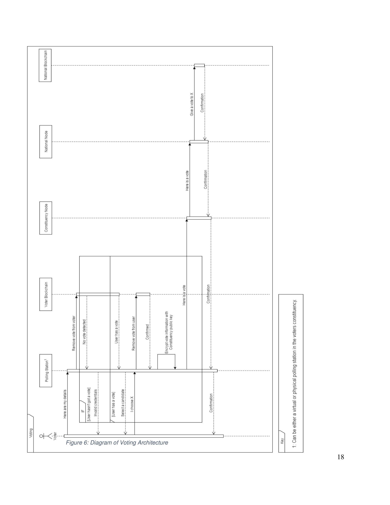

Digital Voting with the use of Blockchain Technology

[원문](https://www.economist.com/sites/default/files/plymouth.pdf)

## 1. Summary

이 보고서의 목적은 블록체인 기술을 사용하여 디지털 투표 문제를 해결하자는 우리의 제안을 요약하는 것이다. 현재 투표 관행과 관련된 문제들을 소개함으로써 시작하고, 그 후 블록체인 기술이 무엇이고 어떻게 사용되고 있는지에 대한 간단한 설명을 시작한다. 다음 섹션에서는 디지털 투표의 현재 배치와 이들이 직면하고 있는 문제에 대해 살펴본다. 보고서의 주요 부분은 제안된 설계에 대한 상세 내역, 잠재적인 결함과 위협의 분석이다. 마지막 섹션은 우리의 설계가 당면한 문제를 해결하는 방법에 대한 결론이다.

## 2. Introduction

투표는 어느 나라에서나 중대하고 심각한 사건이다. 한 국가가 투표를 하는 가장 흔한 방법은 종이 기반 시스템을 통해서이지만, 현대 기술의 21세기에 투표를 가져올 때가 아닌가? 디지털 투표는 투표 기계나 인터넷 브라우저와 같은 전자 장치를 사용하여 투표를 하는 것이다. 투표소에서 기계를 사용하여 투표할 때 전자 투표라고 하고 웹 브라우저를 사용할 때는 i-투표라고 한다.

디지털 투표의 보안은 디지털 투표 시스템의 실행을 고려할 때 항상 가장 큰 관심사다. 이러한 기념비적인 결정이 달린 상황에서, 잠재적인 공격으로부터 데이터를 보호하고 보호하는 시스템의 능력에 대해서는 의심의 여지가 없이 중요한 문제다. 보안 문제를 잠재적으로 해결할 수 있는 한 가지 방법은 블록체인 기술을 이용하는 것이다.

Blockchain 기술은 암호화폐 비트코인의 기본 아키텍처 설계에서 비롯된다. 이것은 레코드가 트랜잭션의 형태를 취하는 분산 데이터베이스의 한 형태이며, 블록은 이러한 트랜잭션의 모음이다. 블록체인 사용으로 디지털 투표를 위한 안전하고 강력한 시스템이 만들어질 수 있다. 이 보고서는 어떻게 Blockchain 기술을 사용하여 안전한 디지털 투표 시스템을 구현할 수 있는지에 대해 개략적으로 설명한다.

## 3. 블록체인이 무엇이고 보통 어떻게 사용 되는가?

(생략)

## 4. 현재 디지털 투표 시스템

많은 디지털 투표 시스템이 현재 전 세계 국가에서 사용되고 있다. 우리는 이러한 시스템들 중 일부를 조사하여 현재의 구현, 특히 에스토니아에서 익숙해졌다.

에스토니아는 2005년부터 전자투표를 해왔고 2007년에는 세계 최초로 온라인 투표를 허용했다. 2015년 총선에서 i-투표제를 통해 전체 투표의 30.5% 투표율을 기록했다. (Vabariigi Valimiskomisjon, 2016). 이 제도의 기초는 모든 에스토니아 시민들이 받는 국가 신분증이다. 이러한 카드에는 소유자를 식별하는 암호화된 파일이 들어 있으며 소유자는 온라인 뱅킹 서비스, 디지털 서명 문서, 정부 데이터베이스에 대한 정보 액세스 및 i-voting 등 여러 온라인 및 전자 활동을 수행할 수 있다.

투표하려면 카드 판독기에 카드를 입력한 다음 연결된 컴퓨터의 투표 웹 사이트에 액세스해야 한다. 그런 다음 PIN 번호를 입력하고 투표할 수 있는지 확인한다. 일단 확인이 되면, 그들은 선거일 4일 전까지 투표권을 행사/변경할 수 있다. 또한 유권자는 컴퓨터에 대한 카드 판독기가 없는 경우 휴대 전화를 사용하여 i-투표에 참여할 수 있다. 그러나 이 프로세스를 수행하려면 휴대폰 특수 SIM 카드가 필요합니다. (2015년 에스토니아 외무성)

투표자가 투표용지를 제출하면, 투표용지는 온라인 투표 기간이 끝날 때까지 암호화되고 저장되는 투표용지 서버에 공개적으로 접근 가능한 투표용 포워딩 서버를 통해 통과된다. 그런 다음 투표는 모든 식별 정보를 정리하고 DVD로 모든 네트워크와의 연결이 끊어진 투표 집계 서버로 전송된다. 이 서버는 암호를 해독하고 표를 계산한 다음 결과를 출력합한다. 이 프로세스의 각 단계가 기록되고 감사됩니다.

연구원들은 2013년 지방선거에서 아이 투표 과정을 관찰하고 연구했으며, 이 시스템을 통해 여러 잠재적인 보안 위험을 강조했다. 이러한 위험 중 하나는 사용자가 투표하는 것을 모니터링하고 나중에 다른 후보자에게 투표권을 변경하는 클라이언트측 시스템의 악성 프로그램의 가능성이다.

서버를 설정하고 표를 전송하는 데 사용되는 기기에 맬웨어가 저장되더라도 공격자가 서버를 직접 감염시킬 수 있는 위험도 있다. (Springall et al., 2014) 그러나, 이 보고서는 또한 Estonian Information Systems Authority로부터 비난을 받고 있다. (Veldre, 2014)

## 5.제안

우리의 디자인을 위해 우리는 현재의 투표를 완전히 대체하지 않고 오히려 현재의 시스템 내에 통합되는 시스템을 만들려고 노력했다. 우리는 가능한 한 많은 다양한 투표 방법을 허용하기 위해 이것을 (이 제안) 하기로 결정했는데, 이것은 대다수의 사람들이 투표에 접근할 수 있는 것이다.

### 5.1 등록

디자인의 첫 번째는 등록 과정이다. 유권자를 확인하는 것은 시스템 내에서 보안을 수립하는 데 필수적이다. 부정직한 목적으로 누군가의 신원이 오용되지 않도록 하는 것은, 특히 모든 투표가 중요한 곳에서 투표를 고려할 때 중요하다. 등록 프로세스 설계는 그림 4 (하단) 에서 확인할 수 있다. 사용자가 투표 등록을 할 수 있도록 웹과 우편양식을 모두 이용한다. 이 모든 정보는 투표를 요청하는 정부에 동의하는 사용자를위한 트랜잭션을 형성한다. 이 트랜잭션 투표 블록 체인과는 분명히 다른 유권자 블록 체인에 만들어집니다.

트랜잭션을 분석하고 투표를 받지 않았거나, 거부 당하면 마이너는 사용자를 확인할지 여부를 결정한다. 사용자가 확인되면 제공된 경우 주소와 이메일 주소에 정보가 있는 투표 용지를 보낸다. 또한 투표소에서 사용할 무작위로 생성된 암호를 보낸다. 이 서신이 보내지면 마이너부는 유권자 블록 체인에 대한 무한한 정부 투표에서 투표권을 사용자에게 제공하는 트랜잭션을 만듭니다.

이 과정에서 유권자 블록체인은 각 유권자에 대해 이 프로세스의 각 단계에서 발생하는 두 트랜잭션의 기록을 보관하는 데 사용된다.

첫번째, 사용자가 등록하면 트랜잭션이 생성된다.

다음 트랜잭션은 정부 마이너가 그 사용자의 투표권을 허가할 때 발생한다.

사용자가 서신을 수신한 후, 그들은 투표에 그들의 자격 증명을 사용하여 투표할 수 있는 투표권을 기다릴 수 있다. 이 유권자 블록체인에는 사용자가 투표한 세부 사항이 포함되지 않는다.

### 5.2 투표 메커니즘과 구조

아키텍처를 결정할 때 우리는 비트코인 네트워크의 분산과 가용성과 기존 투표의 통합 과정 모두에서 강한 영감을 얻었다. 네트워크는 서로 다른 두 개의 블록 체인을 수용하는 다중 계층 분산형 인프라로서, 네트워크는 세 개의 추상 계층, 즉 국가, 선거구 및 지역으로 나뉜다.

로컬 계층에는 전국의 모든 디지털 폴링 스테이션이 포함되어 있으며, 각 각은 선거구 노드에 연결된다. 로컬 노드는 연결된 지역구 노드와 해당 지역구 노드 자체에서만 다른 로컬 노드와 통신하도록 설정된다.

선거구 계층에는 선거구 수준에 있는 것으로 간주되는 모든 노드가 포함된다. 이 노드는 위치에 따라 서로 및 폴링 스테이션의 하위 집합에 직접 연결된다. 국가 계층은 위치에 묶여 있지 않은 노드 모음이며, 순수한 목적은 거래를 채굴하고 투표 블록 체인에 블록을 추가하는 것이며, 모든 선거구 노드는 국가 노드와 통신하고 국가 노드는 서로 통신할 수 있다.

독립 기관은 투표 과정을 모니터링하고 감사한다. 이 본문은 국가 노드를 호스트하거나 액세스할 수 있으며 암호화되지 않은 결과가 암호화된 투표와 일치하는지 확인할 수 있다. 개인과 조직은 국가 노드가 되기 위해 자발적으로 참여 할 수 있다. 이러한 신청서는 정부가 정한 최소 요구 사항을 충족하도록 정부가 처리한다. 이 개인들은 또한 계산 과정에서 마이너 역할을 할 것이다.

설계의 일환으로 공용 및 개인 키를 기반으로하는 암호화 방법을 가지고 있으며 블록 체인 내에서 데이터가 분리되는 구조를 구현했다. 이 분리는 선거구 수준의 노드가 키 쌍을 생성하도록함으로써 달성되었다. 공개 키는 연결된 폴링 스테이션 노드에 배포된 다음 공개 키를 사용하여 해당 폴링 스테이션에 대한 투표를 암호화한다. 그런 다음 데이터는 블록 체인 내의 암호화된 형식으로 저장되어 전체 네트워크로 전파된다.

각 선거구마다 공용 키가 다르기 때문에 블록 체인 내의 데이터 청크가 블록 체인 옆에 있는 데이터 청크와는 다르게 암호화된다. 우리는 이 방법을 투표 마감일 전에 어떤 한 사람이라도 투표 데이터를 해독할 수 없도록 막기로 결정했다. 만약 해커가 선거구 개인 키를 간신히 손에 쥐게 된다면, 그들은 블록체인의 특정 부분만 해독할 수 있을 것이고, 그래서 투표의 완전한 결과를 결코 알지 못할 것이다. 투표 마감일이 지나면, 선거구 노드 내의 소프트웨어는 블록체인 네트워크가 데이터를 해독할 수 있도록 개인 키를 발행하며, 이는 다시 표를 계산할 수 있음을 의미한다. 

### 5.3 투표 절차

투표할 때가 되면, 사용자의 인증은 세 가지 뚜렷한 증거를 요구한다. 즉, 등록 시 제공된 비밀번호와 QR 코드가 포함된 투표 카드이다. 투표에는 두 가지 방법(웹 브라우저, 물리적 투표소)이 있으므로 인증 세부 정보를 입력하는 방법이 달라야 한다. 그러나 투표하려면 세 가지 정보를 모두 제공해야 한다. 또한 각 사용자는 특정 선거구에 등록되므로 선거구 내의 지역 투표소 또는 투표 카드에 제공된 URL로 인터넷을 통해서만 투표할 수 있다는 점을 유념해야 한다. (각 선거구는 투표가 올바른 네트워크 내에서 통합될 수 있도록 자체 웹 서버와 URL을 갖추어야 한다.)

막후에서 투표소는 유권자들이 이미 투표용지를 다 써버리지 않았는지 확인하기 위해 유권자들을 확인할 것이다. 사용자가 투표권을 가지고 있다면, 방송국은 사용자가 계속해서 투표 화면을 볼 수 있게 할 것이다. 그렇지 않으면 시스템이 사용자에게 적절하게 응답한다.

(기권 등 선택권에서) 투표권을 선택하고 제출을 확정하면, 해당 투표는 트랜잭션이 되고, 해당 선거구의 공개 키로 암호화된다. 그런 다음 이 트랜잭션이 블록으로 추가되고 업데이트가 해당 특정 지역구 노드에 연결된 다른 모든 노드에 푸시된다. 그런 다음 전체 네트워크가 업데이트될 때까지 연결된 노드가 해당 피어에 데이터를 전달한다. 투표가 확인되면 투표소는 유권자 블록체인 내에서 사용자의 투표권을 제거하는 트랜잭션을 생성할 것이다. 두 개의 블록체인 즉, 등록한 사용자와 여전히 투표권이 있는 사용자와 관련된 거래를 포함하는 블록체인, 두 번째 블록체인(예: 의결된 당사자)이 있다는 점을 유념해야 한다. 이 두 개의 뚜렷한 블록체인을 사용함으로써 우리는 투표자들의 투표를 선택할 때 유권자들의 익명성을 보장한다.

## 6. 설계 분석

제안서 내에서 잠재적인 악의적 공격을 방지하기 위해 공격 벡터의 크기를 최소화하는 서비스와 시스템을 설계하려고 했다. 우리는 투표 과정의 각 단계에 대해 생각했는지 확인하기 위해 다양한 관점에서 설계를 평가하고 분석하려고 노력해 왔다. 보고서의 이 섹션에서는 우리의 제안과 관련된 잠재적인 위험에 대해 논의하고, 그러한 위험을 완화하기 위해 취할 수 있는 조치를 제안한다.

한 가지 위험은 투표일에 유권자가 신분증, 비밀번호 또는 투표 카드를 잊어버리는 것이다. 이 경우 유권자들은 입후보할 투표를 할 수 없을 것이다. 가능한 위험 완화에는 정확한 정보를 가지고 그날 늦게 돌아오는 유권자나 전화기와 같은 백업 인증 서비스의 구현이 가능할 수 있다. 또는, 잊어버린 암호 시스템을 유권자 등록 웹 사이트에 추가할 수 있다. 이것은 다른 웹 사이트에서 작동하는 암호를 복구하는 것과 동일한 방식으로 작동한다. 그러나 이것은 해커가 유권자들의 비밀번호를 모르는 사이에 바꾸려고 시도하는 위험을 증가시킨다.

51%의 공격은 제안된 설계에 대한 잠재적 위협이다. 그 공격의 근거는 이론적으로 누군가가 디지털 투표용 해시 비율의 대부분을 통제할 수 있고, 그 결과 공공 원장을 조종할 수 있다는 것이다. 이러한 규모의 처리 능력을 갖춘 하드웨어를 구입하는 데 필요한 막대한 비용 때문에 이러한 유형의 공격이 발생할 가능성은 희박하다.

우리 시스템 내 투표의 온라인 측면은 해커들이 자신의 장치를 통해 잠재적으로 유권자들을 다양한 방법으로 이용할 수 있기 때문에 해커들에게 가장 큰 공격 요소다. 이 소프트웨어와 싸우기 위해 클라이언트 장치에 다운로드되어 투표소에 안전한 연결을 설정할 수 있다.

## 7. 결론

결론적으로, 우리의 서비스 제안은 정부와 공공 기반 시설 양쪽의 기계들로 구성된 지리적으로 분산된 네트워크들로 구성되어 있다. 이 인프라에는 분명하게 분리된 두 개의 블록체인, 누가 투표를 했는지와 같은 투표 정보에 대한 다른 하나의 블록체인이 있다. 이러한 블록체인들은 특정 정당에 대한 표를 개인 유권자에게 다시 연결시키는 어떠한 위협도 완전히 제거하기 위해 완전히 별개로 행해지며, 누가 투표를 했는지 그리고 실제로 얼마나 많은 표가 존재하는지를 추적하는 능력을 유지한다.

투표에 등록한 사람에 대한 정보가 포함된 블록 체인은 또한 서비스가 각 유권자를 고유하고 5.1 절에 설명된대로 보장할 수 있게 한다. 등록한 후 세부 정보를 확인한 후 투표를 할당합니다. 이 등록된 유권자가 투표가 시작될 때 자신의 신원을 증명하기 위해 5.3 절에 설명된 3 가지 요소 인증 방법이 있다. 또한 우리는 특정 방식으로 투표를 강요하지 않도록해야하므로 사용자가 투표를 보내기 전에 제출을 확인하도록 두 번째 요청을받는 이중 검사 서비스를 통합했다. 이것은 또한 우발적인 투표를 거의 근절할 수 있게 할 것이다.

또한, 우리가 사용하고 있는 암호화 메커니즘 때문에 (제 5.3절에서 설명한 바와 같이) 어떤 사람도 전체 서비스 네트워크를 먼저 통제하지 않고 모든 투표에 접근하기가 거의 불가능할 것이다. 여기서부터 개인 키 게시 방법을 사용하면 누구든 투표의 블록체인을 읽고 새롭게 사용 가능한 선거구 개인 키로 암호를 해독하여 선거 결과를 확인할 수 있다.