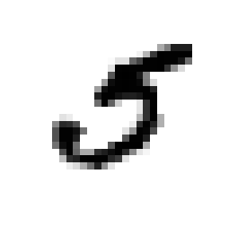
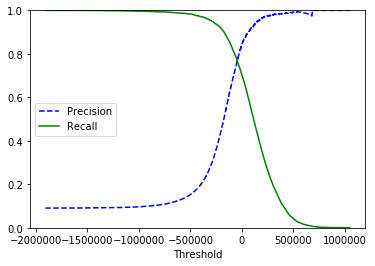

## Classification

[MNIST](http://yann.lecun.com/exdb/mnist/)는 각 숫자를 손으로 쓴 이미지를 모아놓은 데이터 셋입니다. 이 데이터 셋을 학습시켜서, 이 손글씨가 과연 숫자 몇을 의미하는지 판별 할 수 있도록 학습시켜 보겠습니다.

### 1. 데이터 불러오기

원래대로 라면, sklearn에서 데이터를 잘 가져와야 하지만, 왠지 잘 안될 때가 있습니다. 그 때까지 고려해서 아래와 같은 코드를 작성했습니다.

```python
from six.moves import urllib
from sklearn.datasets import fetch_mldata
try:
    mnist = fetch_mldata('MNIST original')
except urllib.error.HTTPError as ex:
    print("Could not download MNIST data from mldata.org, trying alternative...")

    # Alternative method to load MNIST, if mldata.org is down
    from scipy.io import loadmat
    mnist_alternative_url = "https://github.com/amplab/datascience-sp14/raw/master/lab7/mldata/mnist-original.mat"
    mnist_path = "./mnist-original.mat"
    response = urllib.request.urlopen(mnist_alternative_url)
    with open(mnist_path, "wb") as f:
        content = response.read()
        f.write(content)
    mnist_raw = loadmat(mnist_path)
    mnist = {
        "data": mnist_raw["data"].T,
        "target": mnist_raw["label"][0],
        "COL_NAMES": ["label", "data"],
        "DESCR": "mldata.org dataset: mnist-original",
    }
    print("Success!")
```

```python
mnist
```

```
{'COL_NAMES': ['label', 'data'],
 'DESCR': 'mldata.org dataset: mnist-original',
 'data': array([[0, 0, 0, ..., 0, 0, 0],
        [0, 0, 0, ..., 0, 0, 0],
        [0, 0, 0, ..., 0, 0, 0],
        ...,
        [0, 0, 0, ..., 0, 0, 0],
        [0, 0, 0, ..., 0, 0, 0],
        [0, 0, 0, ..., 0, 0, 0]], dtype=uint8),
 'target': array([0., 0., 0., ..., 9., 9., 9.])}
```

```python
X, y = mnist['data'], mnist['target']
X.shape, y.shape
```

```
((70000, 784), (70000,))
```

한번 손글씨를 보도록 하겠습니다.

```python
# 36000 번의 그림을 찍어보자.
%matplotlib inline
import matplotlib
import matplotlib.pyplot as plt

some_digit = X[36000]
some_digit_image = some_digit.reshape(28, 28)
plt.imshow(some_digit_image, cmap=matplotlib.cm.binary, interpolation="nearest")
plt.axis('off')
plt.show()
```



```python
y[36000]
```

y는 5가 나오는 것을 알수 있다.

### 2. 간단하게 학습시켜 보기

```python
# train 과 test 을 나누었다.
X_train, X_test, y_train, y_test = X[:60000], X[60000:], y[:60000], y[60000:]

# 무작위로 섞어버린다.
import numpy as np

shuffle_index = np.random.permutation(60000)
X_train, y_train = X_train[shuffle_index], y_train[shuffle_index]

# y값이 5인 것들만
y_train_5 = (y_train == 5)

# y값이 5인 것들만 (true, false)로
y_test_5 = (y_test == 5)
```

경사하강법, `SGDClassifier`를 사용해 보겠습니다.

#### 경사하강법

경사하강법은, 초기값(Initial Weight)부터 경사를 따라 내려가서 최저값을 찾는 방법입니다.


초기값에서 서서히 내려가다보면, 손실이 최소화되는 부분을 찾는 방법입니다. [여기](https://blog.naver.com/phj8498/221351582162)를 참조하시면 잘 설명되어있습니다.

```python
# 경사하강법을 활용하여 손실점이 가장 적은 기울기를 찾아보겠습니다.
from sklearn.linear_model import SGDClassifier

sgd_clf = SGDClassifier(random_state=42)
sgd_clf.fit(X_train, y_train_5)
```

정확도를 구해보겠습니다.

```python
# 정확도를 구해보자.
from sklearn.model_selection import cross_val_score
cross_val_score(sgd_clf, X_train, y_train_5, cv=3, scoring="accuracy")
```

```
array([0.9661 , 0.95445, 0.96365])
```

정확도가 무려 96%에 육박하고 있네요. 정말 대단합니다. 근데 과연 이게 정확하게 측정한걸까?

```python
# 흠터레스팅.. 과연 근데 이게 맞는 정확도일까?
# 무조건 5가 아니라고 하는 Classifier를 만들어서 한번 예측을 하게 해보자.
from sklearn.base import BaseEstimator

class Never5Classifier(BaseEstimator):
    def fit(self, Y, y=None):
        pass
    def predict(self, X):
        # X 만큼 데이터가 들어오면 모두 false로 예측을 한다.
        return np.zeros((len(X), 1), dtype=bool)
```

```python
never_5_clf = Never5Classifier()
cross_val_score(never_5_clf, X_train, y_train_5, cv=3, scoring="accuracy")
```

```
array([0.90725, 0.90865, 0.91305])
```

그렇다. 숫자가 10개니까, 대충 90%가 결과가 나온 것이다.

### 3. Confusion Matrix


- TN (True Negative): 실제 값이 false인데 예측을 false로 했다. (오류)
- FP (False Positive): 실제 값이 false인데 예측을 true로 했다. (정답)
- FN (False Negative): 실제 값이 true인데 예측을 false로 했다. (오류)
- TP (True Positive): 실제 값이 true인데 예측을 true로 했다. (정답)

```python
from sklearn.model_selection import cross_val_predict
from sklearn.metrics import confusion_matrix

y_train_pred = cross_val_predict(sgd_clf, X_train, y_train_5, cv=3)
confusion_matrix(y_train_5, y_train_pred)
```

```
array([[53884,   695],
       [ 1621,  3800]])
```

이 Confusion Matrix를 평가하는 방법은 여러가지가 있다.

#### 1) Precision (정밀도)

$$precision = \frac{TP}{TP+FP}$$

실제 이게 맞다라고 예측했을때, 정말로 정답일 확률이다.

#### 2) Recall (재현율)

$$recall = \frac{TP}{TP+FN}$$

실제로 이게 정답일때, 이것을 정답으로 잘 맞출 수 있는 확률이다.

```python
from sklearn.metrics import precision_score, recall_score, f1_score
precision_score(y_train_5, y_train_pred)
recall_score(y_train_5, y_train_pred)
```

```
0.8453837597330367, 0.7664380798709157
```

즉, 정확히 5라고 예측할 확률은 84%, 실제로 5를 5라고 판단할 확률은 76%가 되는 것이다. ㅠ.ㅠ

#### 3) F1 Score

정밀도와 재현도를 바탕으로 각각의 가중치를 두어서 평균을 구하는 방식이다.

$$F_1 = \frac{2}{ \frac{1}{precision} + \frac{1}{recall}  }$$

$$\frac{TP}{TP + \frac{FN+FP}{2}}$$

```python
f1_score(y_train_5, y_train_pred)
```

```
0.7664380798709157
```

우리가 해야 할일은, Precision과 Recall을 적절히 올려주는 것이지만, 불행하게도, 이 둘 사이에는 Trade off가 존재한다.

### 4. Precision/Recall Tradeoff

둘 사이의 Tradeoff를 알기 위해서, `SGDClassifer`가 어떻게 classification을 만들어 내는지 알아보자. 각 인스턴스마다, `SGDClassifier`는 `decision function`(결정함수)를 사용하여 점수를 매기는데, 이 스코어가 `threshold` 보다 높으면 true로 그렇지 않으면 negative로 분류하게 된다.


왼쪽에는 낮은 점수를 기록한 negative, 오른쪽에는 높은 점수를 기록한 positive가 존재한다. `threshold`가 가운데에 있다고 가정했을 때, 그리고 이 `threshold`가 어느정도이냐에 따라서 Precision 과 Recall값이 달라지게 된다. 즉 5라고 일단 예측해버리면, Recall은 성공하겠지만, 모두 5가 아니라고 판단하면, Precision이 높아지게 될 것이다.

실제 어떤지 살펴보자. 앞서 숫자 5짜리 이미지를 가지고 판단해본다.

```py
y_scores = sgd_clf.decision_function([some_digit])
y_scores
```

```
array([236922.67347034])
```

점수가 20만점이 넘게 나왔다. 이제 threshold를 높여보자.

```py
threshold = 250000
y_some_digit_pred = (y_scores > threshold)
y_some_digit_pred
```

```
array([False])
```

threshold를 내려보자.

```py
threshold = 0
y_some_digit_pred = (y_scores > threshold)
y_some_digit_pred
```

```
array([True])
```

예측이 달라지는 것을 확인할 수 있다. 이제 threshold에 따라 recall과 precision이 어떻게 달라지는지 그래프로 확인해보자.

```py
from sklearn.metrics import precision_recall_curve

y_scores = cross_val_predict(sgd_clf, X_train, y_train_5, cv=3, method='decision_function')
precisions, recalls, thresholds = precision_recall_curve(y_train_5, y_scores)

def plot_precision_recall_vs_threshold(precisions, recalls, thresholds):
    plt.plot(thresholds, precisions[:-1], "b--", label='Precision')
    plt.plot(thresholds, recalls[:-1], "g-", label='Recall')
    plt.xlabel("Threshold")
    plt.legend(loc="center left")
    plt.ylim([0, 1])

plot_precision_recall_vs_threshold(precisions, recalls, thresholds)
plt.show()
```



이 Tradeoff를 감안해서 , 적절한 값을 찾아야 할 것이다.
