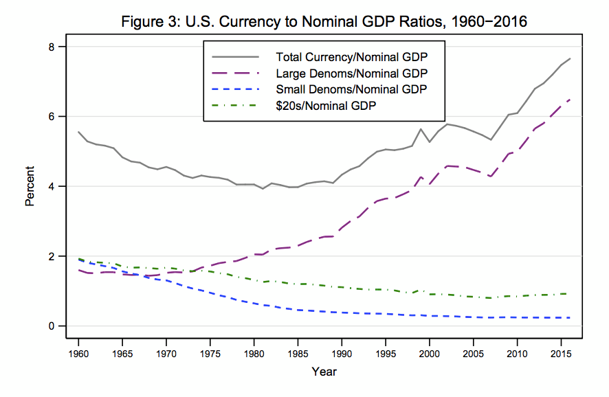

Transaction Costs and Tethers: Why I’m a Crypto Skeptic

[원문](https://www.nytimes.com/2018/07/31/opinion/transaction-costs-and-tethers-why-im-a-crypto-skeptic.html)

통화 역사의 광범위한 스윕을 살펴보면 시간이 지남에 따라 변화의 방향이 분명해졌다. 즉, 비즈니스 수행의 마찰과 이러한 마찰을 처리하는 데 필요한 실제 자원의 양을 줄이는 것이다. 처음에는 무겁고, 간수하기 어려우며, 많은 자원을 소비하는 금과 은으로 만든 동전이 있었다.

그리고 나서 지불 준비금으로 뒷받침 되는 지폐가 있었다. 이들은 동전보다 다루기가 훨씬 쉬웠기 때문에 인기가 있었다. 그들은 또한 아담 스미스 가 말했듯, "공중을 떠다니는 마차 길 (a sort of waggon-way through the air)"을 제공하여 다른 용도로 자원을 확보하는 물리적 귀금속의 필요성을 줄였다.

그럼에도 불구하고, 그 시스템은 여전히 상당한 양의 상품 자금을 필요로 했다. 그러나 민간 은행들이 금이나 은이 아닌 예치금으로 보유했던 중앙은행은 이러한 필요를 크게 줄였고, 금융 자금으로의 전환은 거의 완전히 그것을 없앴다.

한편, 사람들은 현금 거래에서 점차 멀어져 처음에는 수표로 지불했고, 그 다음에는 신용카드와 직불카드 그리고 다른 디지털 방식으로 옮겨갔다.

이 역사에 비추어볼 때, 암호통화에 대한 열정은 매우 이상하게 보인다. 왜냐하면 그것은 장기적 경향과 정반대이기 때문이다. 거의 무손실 거래를 추구하는 대신에, 비트코인이나 다른 암호 단위를 이전하려면 과거 거래의 완전한 기록을 제공해야 하기 때문에 우리는 사업을 하는데 많은 비용이 든다. 마우스 클릭으로 돈을 버는 대신, 우리는 자원을 많이 사용하는 계산으로 돈을 벌어야 한다.

그리고 이러한 비용은 부수적인 것이 아니라 혁신을 일으킬 수 있는 것이다. Brunnermeier와 Abadi가 지적했듯이, 새로운 Bitcoin을 만들거나 기존 비트코인을 이전하는 데 비용이 많이 드는 높은 비용은 분산형 시스템에 대한 신뢰도를 높이는 프로젝트에 필수적이다.

은행권은 사람들이 은행들을 발행한 은행에 대해 뭔가를 알고 있었기 때문에 효과가 있었다. 그리고 이 은행들은 그들의 명성을 지키기 위한 인센티브를 가지고 있었다. 정부는 가끔 화폐를 만드는 특권을 남용해 왔지만 대부분의 정부나 중앙은행은 그들의 명성에 관심을 가지고 있기 때문에 자제한다. 하지만 여러분은 비트코인이 누가 발행했는지 모른 채 진짜임을 확신해야만 한다. 따라서 진짜 거래인지 확인하기 위해 금화를 물어뜯는 것과 같은 (금이 진짜인지 확인하기 위한) 디지털 방식이 필요하고, 그 실험을 행하는 비용은 사기를 억제할 만큼 높아야 한다.

즉, 암호 통화 애호가들은 화폐 시스템을 300 년으로 되돌리기 위해 최첨단 기술을 효과적으로 사용하고 있습니다. 왜 그런 일을 하고 싶어 하는 거야? 그게 무슨 문제야? 나는 아직 그 질문에 대한 명확한 답을 보지 못했다.

통용되는 돈은 일반적으로 그 일을 꽤 잘한다는 것을 명심해라. 거래 비용이 낮다. 지금부터 연간 1달러 구매력은 매우 예측 가능하며, 이는 비트코인보다 훨씬 더 예측 가능하다. 은행계좌를 사용하는 것은 은행을 신뢰하는 것을 의미하며, 대형 은행은 암호 통화 토큰을 보유한 회사보다 훨씬 더 많은 신뢰를 정당화한다. 그렇다면 왜 훨씬 덜 잘 작동하는 돈의 형태로 변하는 것일까?

실제로 비트코인이 출시된 지 8년이 지난 지금, 암호 화폐는 실제 상업에 거의 침투하지 못했다. 몇몇 회사들은 그것들을 지불수단으로 받아들이겠지만, 내 감각은 이것이 실제 유용성보다는 일종의 신호 전달에 더 가깝다는 것이다. 나를 봐, 나는 최첨단이다! 하지만 그들은 투기적인 놀이로 압도적으로 이용되고 있다. 그것은 교환의 매개체로서 유용하기 때문이 아니다.

이것은 암호화폐가 결국 아무 것도 아닌 순수한 거품이라는 것을 의미하는가? 통화와 비슷한 다른 자산들이 실제로 돈으로 많이 쓰이지 않지만 어쨌든 사람들이 보유하고 있다는 것을 지적할 가치가 있다. 금은 아주 오랫동안 실제 화폐가 아니었지만, 그 가치는 그대로이다.

그리고 현금의 상당 부분도 마찬가지라고 말할 수 있다. 현금거래는 일반적이지만, 그것들은 구매가치의 아주 작은 부분만을 차지한다. 그러나 달러 현금 보유는 1980 년대 이후 GDP의 점유율로 실제로 증가했으며, 이는 50 달러와 100 달러 지폐가 대부분을 차지 했다.

이제, 고액권 지폐는 보통 결제에 사용되지 않는다. 사실, 많은 상점들은 그것을 받아들이지 않습니다. 그럼 그 돈이 무슨 소용이야? 우리는 모두 그 답을 알고 있다: 탈세, 불법 행위 등 그리고 그것의 대부분은 미국 밖에 있으며, 외국인들이 미국 화폐의 절반을 가지고 있다고 추정하고 있다.

분명히 암호 통화는 사실상 동일한 사업의 일부와 경쟁하고 있습니다. 비트코인을 사용하여 청구서를 지불하는 사람은 거의 없지만 일부 사람들은 마약을 구입하고 선거를 전복하는 등 일부 사람들을 사용하고 있습니다. 그리고 금과 고액 지폐의 예는 이런 종류의 수요가 많은 자산 가치를 지원할 수 있음을 시사한다. 그렇다면 암호 화폐는 지지자들이 주장하는 기술이 아니라도 거품이 아닐 수도 있다는 뜻일까?

음, 여기가 바로 테더링(구속력, tethering)이 있는 곳이다. 더 정확하게는 암호통화에서는 없는 것이다.

평범한 삶에서 사람들은 죽은 대통령의 초상화가 담긴 녹색 종이의 가치가 어디에서 오는지에 대해 걱정하지 않는다. 다른 사람들이 달러 지폐를 수락하기 때문에 달러 지폐를 수락합니다. 그러나 달러 가치는 전적으로 자기 충족 기대에서 비롯된 것이 아니다. 궁극적으로 미국 정부가 세금 부채를 지불하는 것으로 달러를 받아 들일 것이라는 사실에 의해 지원되고 있다. 정부이기 때문에 시행할 수 있는 부채다. 원한다면, 총 든 남자들이 그렇게 말하기 때문에 화폐는 기본 가치를 가지고 있다. 그리고 이는 사람들이 믿음을 잃으면 무너질 수 있는 거품이 아니라는 뜻이다.

그리고 마약단속기 등에 놓여있는 100달러 지폐의 가치는 미국의 작은 액면가의 가치로 이어진다.

어느 정도까지는 금도 비슷한 상황에 있다. 대부분의 사람들은, 금이 가치를 지니고 있다고 믿기 때문에 금은 가치를 지닌채 존재하게 된다. 그러나 금은 보석과 치아를 채우는 것과 같은 실제 용도로 사용되며, 실제 경제에 약하지만 실질적인 구속력을 주는 실제적인 용도를 가지고 있다.

반면에 암호 통화는 지원되지도, 현실에서 사용되지도 않는다. 그들의 가치는 전적으로 자기 충족 기대에 달려 있다. 즉, 전체 붕괴가 실제 가능성임을 의미한다. 투기꾼들이 집단적으로 의심을 품고 갑자기 비트코인의 가치가 없다고 두려워한다면 비트코인은 쓸모없어질 것이다.

그런 일이 일어날까? 나는 그것이 그렇지 않은 것보다 더 가능성이 있다고 생각한다. 즉 비트코인 (다른 암호 통화는 아니지만)이 주로 암시장 거래 및 탈세에 사용되는 잠재적인 균형이 있을 수 있지만, 그것이 존재한다면, 그러한 균형점은 실망스러운 것이다. 일단 블록 체인된 미래의 꿈이 사라지면 실망은 아마도 모든 것을 무너 뜨릴 것이다.