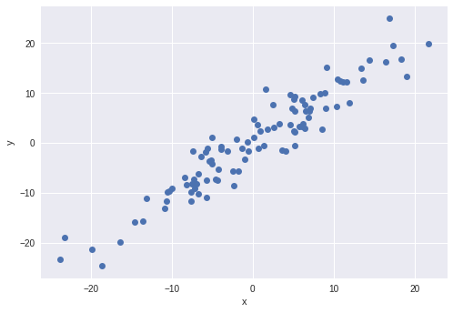

Pytorch - 02) Linear Regression

## Linear Regression

Linear Regression이 한국말로 뭐였더라?

```python
import torch
import torch.nn as nn
import matplotlib.pyplot as plt
import numpy as np
```

### 데이터셋 만들기

대충 뭔가 있어보이는 데이터셋을 만들자.

```python
X = torch.randn(100, 1)*10
y = X + 3*torch.randn(100, 1)
plt.plot(X.numpy(), y.numpy(), 'o')
plt.ylabel('y')
plt.xlabel('x')
```



```python
# nn.Module은 사용자 정의 모듈을 생성하는데 있어서 가장 기초가 되는 모듈이다.
class LR(nn.Module):

  # linear regression의 입력값과 출력값 갯수를 받는다.
  def __init__(self, input_size, output_size):
    super().__init__()
    # nn.Linear를 상속받는다.
    self.linear = nn.Linear(input_size, output_size)

  # 정방향 호출 함수. 이 함수를 통해서 linear regression을 수행하게 된다.
  def forward(self, x):
    pred = self.linear(x)
    return pred
```

nn.Linear는 

$$y = xA^{T} + b$$

```python
# random seed
torch.manual_seed(1)
# 입력값이 한개고, 출력값이 한개
model = LR(1, 1)
print(model)
```

```
LR(
  (linear): Linear(in_features=1, out_features=1, bias=True)
)
```

파라미터를 살펴보면

```python
print(list(model.parameters()))
```

이렇게 weight와 bias 가 무작위로 들어가 있는 것을 알 수 있다.

```
[Parameter containing:
tensor([[0.5153]], requires_grad=True), Parameter containing:
tensor([-0.4414], requires_grad=True)]
```

이제 Linear Regression을 해보자.


```python
w, b = model.parameters()
def get_params():
  return w[0][0].item(), b[0].item()

def plot_fit(title):
  plt.title = title
  # weight 와 bias
  w1, b1 = get_params()
  # -30 부터 30까지 
  x1 = np.array([-30, 30])
  # 선형 추정선을 그려본다.
  y1 = w1*x1 + b1
  plt.plot(x1, y1, 'r')
  plt.scatter(X, y)
  plt.show()

plot_fit('Initial Model')
```


회귀선,,,인지,, 추정선,,,인지 암튼지간에 제대로 그리지 못했다는 것을 알 수 있다. 그래서 이를 학습시키려고 한다.

```python
criterion = nn.MSELoss()
optimizer = torch.optim.SGD(model.parameters(), lr = 0.01)
```

criterion은 `Mean Squred Error`를 , optimizer는 stochastic gradient descent (확률적 경사하강법)을 사용한다. learning_rate는 0.01 이다.

배치 경사하강법은, 매스텝에서 전체 훈련세트를 활용해서 그래디언트를 계산하기 대문에, 훈련세트가 커지면 속도가 매우 느려진다. 그러나 SGD는 매스텝에서 무작위 딱 한개의 샘플만을 처리하고, 그 샘플에 대한 그래디언트만 계산한다. 

따라서 속도는 훨씬 빠르지만, 매 iteration 에서 적은 데이터만 처리하기 때문에 훨씬 불안정하다. 위아래로 요동치면서 감소하므로, 물론 시간이 지나면 최소값에 얼추 닿긴 하겠지만, 말그대로 얼추일 뿐이다. 

이러한 무작위성은 국소최소값을 벗어나게 하므로 (무작위로 처리하므로), 전역 최소값을 찾을 확률이 더 크다. 

암튼 지간에


```python
# 100 회 반복
epochs = 100
losses = []
for i in range(epochs):
  # 예측
  y_pred = model.forward(X)
  # 오차 계산
  loss = criterion(y_pred, y)
  print("epoch:", i, "loss:", loss.item())
  
  # 오차 누적 (계산을 위해서)
  losses.append(loss)
  # optimzer 초기화
  optimizer.zero_grad()
  # backward를 수행하여 그래디언트 계산
  loss.backward()
  # learning rate 만큼 가중치를 주어서 hyper parameter 업데이트
  optimizer.step()
```

```
epoch: 0 loss: 31.671594619750977
epoch: 1 loss: 22.02737808227539
epoch: 2 loss: 16.717256546020508
epoch: 3 loss: 13.792343139648438
epoch: 4 loss: 12.180136680603027
epoch: 5 loss: 11.290426254272461
epoch: 6 loss: 10.798413276672363
epoch: 7 loss: 10.525352478027344
epoch: 8 loss: 10.372870445251465
epoch: 9 loss: 10.286834716796875
...
epoch: 90 loss: 10.071357727050781
epoch: 91 loss: 10.071175575256348
epoch: 92 loss: 10.071000099182129
epoch: 93 loss: 10.070833206176758
epoch: 94 loss: 10.070671081542969
epoch: 95 loss: 10.070516586303711
epoch: 96 loss: 10.070366859436035
epoch: 97 loss: 10.07022476196289
epoch: 98 loss: 10.070086479187012
epoch: 99 loss: 10.069954872131348
```

```python
plt.plot(range(epochs), losses)
plt.ylabel('Loss')
plt.xlabel('epoch')
```


시간이 지나면서 오차가 감소한 것을 알 수 있다. 

```python
plot_fit("Trained Model")
```


이전보다 잘 학습되었다.