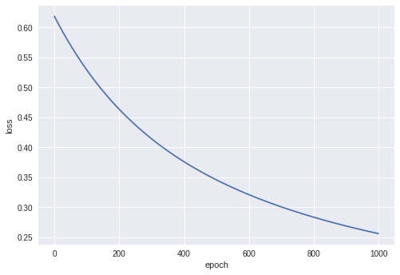

Pytorch - 03) Perceptron

## Perceptron

(마지막 정리가 되길 바라며)

Perceptron은 우리 두뇌 (뉴런)의 인지능력을 모방하도록 만든 인위적인 네트워크다.


퍼셉트론은 다수의 신호를 받아서, 하나의 신호를 출력한다. 여기에서 x는 입력값이고 w는, 가중치라고 부르는 weight이다. 각 입력치에 가중치를 부여하여, 입력신호화 계산하고, 그 신호의 총합이 정해진 값을 넘으면 1을 출력한다.

각 입력신호에 weight가 부여되며, 이 weight가 클수록 해당 입력값이 중요한 역할을 한다고 볼 수 있다. 머신러닝에서 하는 것은 이 weight을 조정하는 작업이라고 할 수 있다.

이렇게만 보면, 앞에서 보았던 linear classification 모형이라고도 볼 수 있다. 실수형의 input 벡터를 받아서, 이를 선형으로 계산하는 것이라고도 볼 수 있다. 

처음에는 임의로 설정된 weight으로 시작하여, 여기에 training data를 모형에 입력하며 weight을 결과값에 맞도록 개선 나간다. 

$$ b + w1x1 + w2x2 < 0 $$

$$ b + w1x1 + w2x2 \geq 0 $$

여기서 가중치 (weight)는 입력신호과 결과에 주는 영향도를 조절하며, 편향 (bias)는이 뉴런이 얼마나 쉽게 활성화(1을 출력하느냐?)화되는 지를 조정하는 변수다.

그러나 문제는, 말그대로 선형분류만 가능하다는 것이다. XOR 논리는 어느 한쪽이 1일때만 1을 출력하는 배타적인 논리연산인데, 이를 선으로 구별하지 못하는 것을 알 수 있다.


xor 연산은 (1,0)이나 (0,1) 일 때 활성화되는데, 선으로는 이를 구별해내지 못한다.

그래서 이러한 문제를 해결하기 위해 여러개의 퍼셉트론을 layer화 하여 극복해 내었다.


## perceptron in pytorch 

### 데이터셋 만들기

```python
import torch
import torch.nn as nn
import numpy as np
import matplotlib.pyplot as plt

from sklearn import datasets

n_pts = 100
centers = [[-0.5, 0.5], [0.5, -0.5]]
X, y = datasets.make_blobs(n_samples=n_pts, random_state=123, centers=centers, cluster_std=0.4)

x_data = torch.Tensor(X)
y_data = torch.Tensor(y.reshape(100, 1))

print(x_data[:5])
print(y_data[:5])
```

```
tensor([[-0.1372, -0.0715],
        [ 0.8044, -0.3706],
        [-0.6022, -0.6194],
        [ 0.5709, -0.5120],
        [ 0.0064,  0.1533]])
tensor([[0.],
        [1.],
        [0.],
        [1.],
        [0.]])
```

```python
def scatter_plot():
  plt.scatter(X[y==0, 0], X[y==0, 1])
  plt.scatter(X[y==1, 0], X[y==1, 1])
  
scatter_plot()
```


이런 형태의 만들어 냈다.

### 모델만들기

```python
class Model(nn.Module):
  
  def __init__(self, input_size, output_size):
    super().__init__()    
    self.linear = nn.Linear(input_size, output_size)
    
  def forward(self, X):
    pred = torch.sigmoid(self.linear(X))
    return pred
  
  def predict(self, x):
    return 1 if pred >= 0.5 else 0     
```

활성화 함수로 sigmoid함수를 사용하였다.

$$ s(z) = \frac{1}{1 + e ^ {-z}} $$


모양에서도 알 수 있듯이, 이함수의 특징은

- 0/1 을 구별하는 부분은 경사가 급격하고, 나머지는 완만하다.
- 활성함수의 값을 성공확률이라는 의미로 해석이 가능하다.

```python
torch.manual_seed(2)
model = Model(2, 1)
list(model.parameters())
```

```
[Parameter containing:
 tensor([[ 0.1622, -0.1683]], requires_grad=True), Parameter containing:
 tensor([0.1939], requires_grad=True)]
 ```

input 값이 두개이고, output은 하나인 model을 만들어 냈다.

```python
[w, b] = model.parameters()
w1, w2 = w.view(2)
b1 = b[0]


def get_params():
  return w1.item(), w2.item(), b.item()
  
print(w1.item(), w2.item(), b1.item())
```

```
0.16220331192016602 -0.1682732105255127 0.19390898942947388
```

랜덤으로 가중치 2개와 bias가 생성되었다.

```python
def plot_fit(title):
  plt.title = title
  w1, w2, b1 = get_params()
  # 0 = w1*x1 + w2*x2 + b
  x1 = np.array([-2.0, 2.0])  
  # 0 = w1*x1 + w2*x2 + b
  # 를 x2 입장에서 계산
  x2 = (w1*x1 + b1) / -w2
  plt.plot(x1, x2, 'red')
  scatter_plot()
```


아직은 회귀선이 나타나지 않은 것을 알 수 있다. 이제 이것을 학습시켜 보자.

```python
criterion = nn.BCELoss()
optimizer = torch.optim.SGD(model.parameters(), lr=0.01)
```

이번에 사용해볼 손실함수는 Cross Entropy Loss 다. (binary의 경우에는 Binary Cross Entropy Loss, `BCELoss`를 사용해야하며, 활성함수로 sigmoid를 꼭써줘야 한다.)

Regression에서는 MSE를, Classification에서는 Cros Entropy를, 여러 class를 구별하는 경우에는 Softmax를 쓴다.

공식은 아래와 같다.

$$ \text{Cross Entropy} = P(X) * -log(Q(x)) $$

여기서 $$P(x)$$는 실제값을, $$Q(x)$$는 예상값이다.


예측이 맞을때에는 0으로 수렴하고, 틀릴 경우에는 무한대로 발산하는 특성을 가지고 있다. 즉, 틀릴수록 loss를 크게 두어서 가중치를 조절할 수 있게 하는 것이다.


### training

```python
epochs = 1000
losses = []
for i in range(epochs):
  
  y_pred = model.forward(x_data)
  loss = criterion(y_pred, y_data)
  print("epoch: ", i, "loss: ", loss.item())
  losses.append(loss.item())

  optimizer.zero_grad()
  loss.backward()
  optimizer.step()
```

```
epoch:  0 loss:  0.6185115575790405
epoch:  1 loss:  0.6174639463424683
epoch:  2 loss:  0.6164201498031616
epoch:  3 loss:  0.6153794527053833
epoch:  4 loss:  0.614342451095581
epoch:  5 loss:  0.6133086681365967
epoch:  6 loss:  0.6122783422470093
epoch:  7 loss:  0.6112515330314636
epoch:  8 loss:  0.6102280616760254
epoch:  9 loss:  0.6092080473899841
...
epoch:  990 loss:  0.25722837448120117
epoch:  991 loss:  0.2571081817150116
epoch:  992 loss:  0.25698813796043396
epoch:  993 loss:  0.2568681538105011
epoch:  994 loss:  0.2567485272884369
epoch:  995 loss:  0.2566289007663727
epoch:  996 loss:  0.2565094828605652
epoch:  997 loss:  0.25639018416404724
epoch:  998 loss:  0.2562710642814636
epoch:  999 loss:  0.2561522126197815
```

loss가 0.25에 수렴하고 있다.

```python
plt.plot(range(epochs), losses)
plt.ylabel('loss')
plt.xlabel('epoch')
```



점점 loss가 줄어들고


육안으로 보기에도, 정확히 분류하는 것을 알 수 있었다.

### Test

```python
point1 = torch.Tensor([1.0, -1.0])
point2 = torch.Tensor([-1.0, 1.0])
plt.plot(point1.numpy()[0], point1.numpy()[1], 'ro')
plt.plot(point2.numpy()[0], point2.numpy()[1], 'ko')


print("Red point positive probability = {}".format(model.forward(point1).item()))
print("black point positive probability = {}".format(model.forward(point2).item()))

print("Red point in class = {}".format(model.forward(point1).item()))
print("black point in class = {}".format(model.forward(point2).item()))

plot_fit('Trained Model')
```

```
Red point positive probability = 0.9424158334732056
black point positive probability = 0.05055497586727142
Red point in class = 1
black point in class = 0
```

