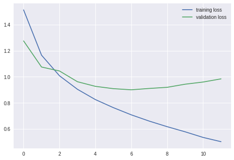
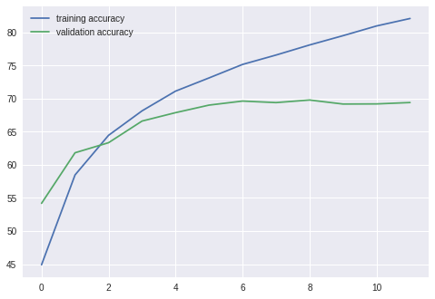
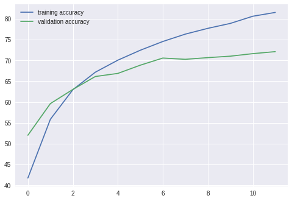

Pytorch - 08) CIFAR 10

CIFAR 10 는 열가지 단어별 이미지가 있는 데이터 셋이다. 기존에 손글씨를 분류하는 것 보다는 확실히 어려운 작업이 될 것이다. 


## 전처리 작업

```python
import torch
import matplotlib.pyplot as plt
import numpy as np

from torch import nn
from torch.nn import functional as F
from torchvision import datasets, transforms

transformer = transforms.Compose([transforms.Resize((32, 32)),
                                  transforms.ToTensor(),
                                  transforms.Normalize((0.5, 0.5, 0.5), (0.5, 0.5, 0.5))
                                 ])

training_dataset = datasets.CIFAR10(root='./data', train=True, download=True, transform=transformer)
validation_dataset = datasets.CIFAR10(root='./data', train=False, download=True, transform=transformer)

training_loader = torch.utils.data.DataLoader(dataset=training_dataset, batch_size=100, shuffle=True)
validation_loader = torch.utils.data.DataLoader(dataset=validation_dataset, batch_size=100, shuffle=False)

def im_convert(tensor):
  image = tensor.clone().detach().numpy()
  image = image.transpose(1, 2, 0)
  image = image * np.array([0.5, 0.5, 0.5] + np.array([0.5, 0.5, 0.5]))
  image = image.clip(0, 1)
  return image

classes = ("plane", "car", "bird", "cat", "deer", "dog", "frog", "horse", "ship", "truck")

dataiter = iter(training_loader)
images, labels = dataiter.next()

fig = plt.figure(figsize=(25, 4))

for i in np.arange(20):
  # row 2 column 10
  ax = fig.add_subplot(2, 10, i+1, xticks=[], yticks=[])
  plt.imshow(im_convert(images[i]))
  ax.set_title(classes[labels[i].item()])CIFA
```


## Optimizer 와 Criterion

```python
criterion = nn.CrossEntropyLoss()
optimizer = torch.optim.Adam(model.parameters(), lr=0.001)
```

## training

```python
epochs = 12
running_loss_history = []
running_correct_history = []
validation_running_loss_history = [] 
validation_running_correct_history = []

for e in range(epochs):
  
  running_loss = 0.0
  running_correct = 0.0
  validation_running_loss = 0.0
  validation_running_correct = 0.0
  
  for inputs, labels in training_loader:    
     
    inputs = inputs.to(device)
    labels = labels.to(device)
    outputs = model(inputs)
    loss = criterion(outputs, labels)
    
    optimizer.zero_grad()
    loss.backward()
    optimizer.step()
    
    _, preds = torch.max(outputs, 1)
    
    running_correct += torch.sum(preds == labels.data)
    running_loss += loss.item()
    
    
    
  else:    
    # 훈련팔 필요가 없으므로 메모리 절약
    with torch.no_grad():
      
      for val_input, val_label in validation_loader:
        
        val_input = val_input.to(device)
        val_label = val_label.to(device)
        val_outputs = model(val_input)
        val_loss = criterion(val_outputs, val_label)
        
        _, val_preds = torch.max(val_outputs, 1)
        validation_running_loss += val_loss.item()
        validation_running_correct += torch.sum(val_preds == val_label.data) 
    
    
    epoch_loss = running_loss / len(training_loader)
    epoch_acc = running_correct.float() / len(training_loader)
    running_loss_history.append(epoch_loss)
    running_correct_history.append(epoch_acc)
    
    val_epoch_loss = validation_running_loss / len(validation_loader)
    val_epoch_acc = validation_running_correct.float() / len(validation_loader)
    validation_running_loss_history.append(val_epoch_loss)
    validation_running_correct_history.append(val_epoch_acc)
    
    print("===================================================")
    print("epoch: ", e + 1)
    print("training loss: {:.5f}, acc: {:5f}".format(epoch_loss, epoch_acc))
    print("validation loss: {:.5f}, acc: {:5f}".format(val_epoch_loss, val_epoch_acc))
```


## 1st try 

LeNet을 활용하여, 기존에 손글씨를 분류했을 때 썼던 파라미터 그대로 해보자.

### Model

```python
class LeNet(nn.Module):
  
  def __init__(self):
    super().__init__()
    # RGB세개 1채널, 20개 특징 추출, filter 크기, stride 1
    self.conv1 = nn.Conv2d(3, 20, 5, 1)
    # 전에서 20개
    self.conv2 = nn.Conv2d(20, 50, 5, 1)
    self.fc1 = nn.Linear(5*5*50, 500)
    # 0.5 가 권장 할 만하대
    self.dropout1 = nn.Dropout(0.5)
    self.fc2 = nn.Linear(500, 10)

  def forward(self, x):
    x = F.relu(self.conv1(x))
    x = F.max_pool2d(x, 2, 2)
    x = F.relu(self.conv2(x))
    x = F.max_pool2d(x, 2, 2)
    # flatten
    x = x.view(-1, 5*5*50)
    x = F.relu(self.fc1(x))
    x = self.dropout1(x)
    x = self.fc2(x)
    return x
```

### 결과

```
===================================================
epoch:  1
training loss: 1.51251, acc: 44.908001
validation loss: 1.27473, acc: 54.189999
===================================================
epoch:  2
training loss: 1.16539, acc: 58.480003
validation loss: 1.07463, acc: 61.829998
===================================================
epoch:  3
training loss: 1.00764, acc: 64.464005
validation loss: 1.04436, acc: 63.349998
===================================================
epoch:  4
training loss: 0.90411, acc: 68.162003
validation loss: 0.96203, acc: 66.619995
===================================================
epoch:  5
training loss: 0.82512, acc: 71.142006
validation loss: 0.92654, acc: 67.889999
===================================================
epoch:  6
training loss: 0.76343, acc: 73.138000
validation loss: 0.90890, acc: 69.029999
===================================================
epoch:  7
training loss: 0.70817, acc: 75.176003
validation loss: 0.90005, acc: 69.639999
===================================================
epoch:  8
training loss: 0.66021, acc: 76.596001
validation loss: 0.91046, acc: 69.409996
===================================================
epoch:  9
training loss: 0.61744, acc: 78.116005
validation loss: 0.91911, acc: 69.799995
===================================================
epoch:  10
training loss: 0.57813, acc: 79.522003
validation loss: 0.94296, acc: 69.189995
===================================================
epoch:  11
training loss: 0.53510, acc: 80.990005
validation loss: 0.95957, acc: 69.209999
===================================================
epoch:  12
training loss: 0.50244, acc: 82.116005
validation loss: 0.98390, acc: 69.419998
```





### 총평

딱봐도 Overfitting이 일어났고, 정확도도 구리다.

## 2nd Model

Convolution을 하나더 추가해서, 특징을 조금더 뽑아내는 방향으로 바꿔보자.

```python
class LeNet_2(nn.Module):
  
  def __init__(self):
    super().__init__()
    # 32px 이었다가, conv를 거치면서 절반으로 감소
    self.conv1 = nn.Conv2d(3, 16, 3, 1, padding=1)
    self.conv2 = nn.Conv2d(16, 32, 3, 1, padding=1)
    self.conv3 = nn.Conv2d(32, 64, 3, 1, padding=1)
    self.fc1 = nn.Linear(4*4*64, 500)
    self.dropout1 = nn.Dropout(0.5)
    self.fc2 = nn.Linear(500, 10)
    
  def forward(self, x):
    x = F.relu(self.conv1(x))
    x = F.max_pool2d(x, 2, 2)
    x = F.relu(self.conv2(x))
    x = F.max_pool2d(x, 2, 2)
    x = F.relu(self.conv3(x))
    x = F.max_pool2d(x, 2, 2)
    x = x.view(-1, 4*4*64)
    x = F.relu(self.fc1(x))
    x = self.dropout1(x)
    x = self.fc2(x)
    return x
```

첫번째 Conv에서는 입력채널이 3개, 추출할 filter는 3개이며 filter의 크기는 3, stride는 1이다. 그리고 padding을 1씩 넣어서 크기가 줄어드는 것을 방지했다.

따라서 각각의 convolution을 거칠 때마다 입력값이 절반으로 줄어들게 된다. (MaxPooling 사이즈가 2, 2 이므로)

| input | conv1 | pool1 | conv2 | pool2 | conv3 | pool3 |
|:-----:|:-----:|:-----:|:-----:|:-----:|:-----:|:-----:|
| 32   | 32    | 16    | 16     | 8     | 8 | 4|


### 결과

```
===================================================
epoch:  1
training loss: 1.51715, acc: 44.712002
validation loss: 1.25653, acc: 55.230000
===================================================
epoch:  2
training loss: 1.16654, acc: 58.526001
validation loss: 1.09924, acc: 60.959999
===================================================
epoch:  3
training loss: 1.02785, acc: 63.822002
validation loss: 1.02541, acc: 64.019997
===================================================
epoch:  4
training loss: 0.91954, acc: 67.690002
validation loss: 1.01354, acc: 64.529999
===================================================
epoch:  5
training loss: 0.84753, acc: 70.680000
validation loss: 0.92927, acc: 67.639999
===================================================
epoch:  6
training loss: 0.79165, acc: 71.830002
validation loss: 0.88947, acc: 69.279999
===================================================
epoch:  7
training loss: 0.73852, acc: 73.806000
validation loss: 0.92085, acc: 68.559998
===================================================
epoch:  8
training loss: 0.68945, acc: 75.670006
validation loss: 0.91607, acc: 68.529999
===================================================
epoch:  9
training loss: 0.64567, acc: 77.178001
validation loss: 0.93162, acc: 69.290001
===================================================
epoch:  10
training loss: 0.61021, acc: 78.222000
validation loss: 0.89344, acc: 70.389999
===================================================
epoch:  11
training loss: 0.57332, acc: 79.376007
validation loss: 0.93702, acc: 70.189995
===================================================
epoch:  12
training loss: 0.53661, acc: 80.696007
validation loss: 0.92468, acc: 70.689995
```




정확도가 향상된 모습이지만, 여전히 Overfitting이 발생하고 있다.

## 3rd try

Data Augmentation, 데이터에 인위적인 변화를 주어서 학습이 용이하게 끔 해보자.


```python
transform_train = transforms.Compose([transforms.Resize((32, 32)),
                                      transforms.RandomHorizontalFlip(),
                                      transforms.RandomRotation(10),
                                      transforms.RandomAffine(0, shear=10, scale=(0.8, 1.2)),
                                      transforms.ColorJitter(brightness=0.2, contrast=0.2, saturation=0.2),
                                      transforms.ToTensor(),
                                      transforms.Normalize((0.5, 0.5, 0.5), (0.5, 0.5, 0.5))
                                     ])

transformer = transforms.Compose([transforms.Resize((32, 32)),
                                  transforms.ToTensor(),
                                  transforms.Normalize((0.5, 0.5, 0.5), (0.5, 0.5, 0.5))
                                 ])


training_dataset = datasets.CIFAR10(root='./data', train=True, download=True, transform=transform_train)
validation_dataset = datasets.CIFAR10(root='./data', train=False, download=True, transform=transformer)

training_loader = torch.utils.data.DataLoader(dataset=training_dataset, batch_size=100, shuffle=True)
validation_loader = torch.utils.data.DataLoader(dataset=validation_dataset, batch_size=100, shuffle=False)
```

`transform_train`에 적용된 augmentation을 살펴보자

- `transforms.RandomHorizontalFlip()` 0.5확률로 이미지를 뒤집음
- `transforms.RandomRotation(10)` 10도 이하로 랜덤하게 기울인다.
- `transforms.RandomAffine(0, shear=10, scale=(0.8, 1.2)` 기하학(...)에서 쓰이는 아핀변환이다.

- `transforms.ColorJitter(brightness=0.2, contrast=0.2, saturation=0.2)` 밝기, 대비, 채도를 랜덤하게 조절한다.


### 결과

```
===================================================
epoch:  1
training loss: 1.69155, acc: 38.206001
validation loss: 1.47858, acc: 46.969997
===================================================
epoch:  2
training loss: 1.39742, acc: 49.534004
validation loss: 1.23282, acc: 54.919998
===================================================
epoch:  3
training loss: 1.27040, acc: 54.270004
validation loss: 1.14570, acc: 58.629997
===================================================
epoch:  4
training loss: 1.17016, acc: 58.068005
validation loss: 1.06811, acc: 61.609997
===================================================
epoch:  5
training loss: 1.11306, acc: 60.408005
validation loss: 1.02522, acc: 63.559998
===================================================
epoch:  6
training loss: 1.07079, acc: 61.996002
validation loss: 0.98546, acc: 65.559998
===================================================
epoch:  7
training loss: 1.01881, acc: 63.968002
validation loss: 0.91596, acc: 68.080002
===================================================
epoch:  8
training loss: 0.98842, acc: 65.208000
validation loss: 0.89914, acc: 68.000000
===================================================
epoch:  9
training loss: 0.96484, acc: 65.940002
validation loss: 0.88494, acc: 68.619995
===================================================
epoch:  10
training loss: 0.93930, acc: 66.904007
validation loss: 0.88999, acc: 68.830002
===================================================
epoch:  11
training loss: 0.91366, acc: 67.650002
validation loss: 0.84115, acc: 70.619995
===================================================
epoch:  12
training loss: 0.89831, acc: 68.562004
validation loss: 0.83667, acc: 70.750000
```


어떻게 하면 정확도를 더 올릴 수 있을까~~~?