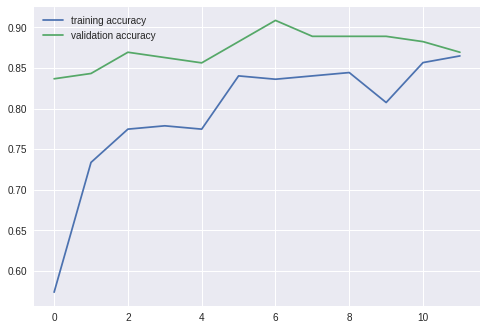
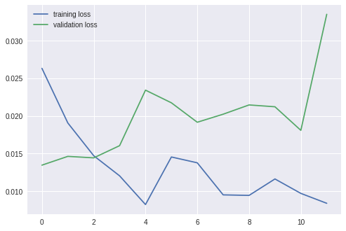

Pytorch - 09) Transfer Learning

## Transfer Learning

기존에 만들어진 모델을 이용하여, 새로운 모델이 조금더 빠르게 학습하고 예측을 더 높이는 방법이다.

실질적으로, CNN을 처음부터 학습시키는 일은 많지 않다. 이 모델은 고려해야할 사항이 많고, (Layer의 숫자, 활성화함수의 종류, 기타 hyper parameter 등) 실질적으로 학습을 시키기 위해서는 엄청난 자원과 시간이 소비되기 때문이다. 그래서 기존에 학습되어 있는 모델을 바탕으로 새로운 모델을 만들어 학습하는 것을 transfer learning이라고 한다.

## 언제 써야 하는가?

- Labeled 된 data 가 많지 않을 때 (학습시킬 데이터가 많지 않을 때)
- 효과적으로 훈련된 모델이 이미 존재할 때

## AlexNet

2012년 ImageNet Large Scale Visual Recognition Challenge에서 우승한 팀 논문의 첫번째 저자가 Alex 머시기 인데, 그 사람의 이름을 따서 개발한 CNN을 AlexNet이라 한다. 구조적인 관점에서는 LeNet과 크게 다르지 않지만, GPU를 사용하여 의미있는 결과를 얻었다. 이후 연구자들은 CNN구조를 설계 할 때 GPU를 고려하는 것이 유행처럼 번졌다. 

총 5개의 Convolutional Layer와 3개의 fully-connected layer로 구성되어 있으며, 맨마지막 1000개의 category분류를 위해 Softmax를 사용한다. 이렇게 만들어진 AlexNet은 65만개의 perceptron, 6000만개의 parameter와 6억 3천만개의 connection으로 구성되어 있다. 

LeNet은 32x32크기의 흑백영상이라 크기가 매우작았찌만, AlexNet은 227x227x3로 구성되어 있기 때문에, 첫번째 kernel의 크기가 11x11x3으로 크다. (stride=4) 결과적으로 96개의 필터를 생성하기 때문에 결과는 55x55x96이 된다. 


아무튼 위와 같은 구조다.

## VGG16


주요 특징은 아래와 같다.

- 입력: 224*224 크기의 고정된 RGB 이미지
- 구조:  
    - Convoluitional Layer (3x3 filter, stride=1, padding=True)
    - Max-Pooling Layer (2x2 filtter, stride=2)
    - 1x1 Conv Layer (1x1 filter, stride=1)
    - Fully Connected Layer (4096 > 4096 > 1000)
- 특징:
    - 모든  레이어에 3x3 필터 적용
    - 1x1 Conv Layer 사용
    - 다섯장의 Max-Pooling Layer 사용


## 코드

```python
import torch
import matplotlib.pyplot as plt
import numpy as np
import torch.nn.functional as F
from torch import nn
from torchvision import datasets, transforms, models

model = models.alexnet(pretrained=True)
model
```

```
AlexNet(
  (features): Sequential(
    (0): Conv2d(3, 64, kernel_size=(11, 11), stride=(4, 4), padding=(2, 2))
    (1): ReLU(inplace)
    (2): MaxPool2d(kernel_size=3, stride=2, padding=0, dilation=1, ceil_mode=False)
    (3): Conv2d(64, 192, kernel_size=(5, 5), stride=(1, 1), padding=(2, 2))
    (4): ReLU(inplace)
    (5): MaxPool2d(kernel_size=3, stride=2, padding=0, dilation=1, ceil_mode=False)
    (6): Conv2d(192, 384, kernel_size=(3, 3), stride=(1, 1), padding=(1, 1))
    (7): ReLU(inplace)
    (8): Conv2d(384, 256, kernel_size=(3, 3), stride=(1, 1), padding=(1, 1))
    (9): ReLU(inplace)
    (10): Conv2d(256, 256, kernel_size=(3, 3), stride=(1, 1), padding=(1, 1))
    (11): ReLU(inplace)
    (12): MaxPool2d(kernel_size=3, stride=2, padding=0, dilation=1, ceil_mode=False)
  )
  (classifier): Sequential(
    (0): Dropout(p=0.5)
    (1): Linear(in_features=9216, out_features=4096, bias=True)
    (2): ReLU(inplace)
    (3): Dropout(p=0.5)
    (4): Linear(in_features=4096, out_features=4096, bias=True)
    (5): ReLU(inplace)
    (6): Linear(in_features=4096, out_features=1000, bias=True)
  )
)
```

AlexNet의 구조가 나온다.

```python
for params in model.features.parameters():
  params.requires_grad = False
```

여기에서 feature exrtaction부분은 이미 train 된 부분 이므로, 따로 역전파를 하는 과정에서 gradient를 계산할 필요가 없다. 따라서 위의 코드가 꼭 필요하다.

그리고 우리가 할 것은 딱 두개, 개미와 벌을 구별하는 것이므로 [https://github.com/jaddoescad/ants_and_bees.git](https://github.com/jaddoescad/ants_and_bees.git) 마지막 out을 2로 맞출 필요가 있다.

```python
import torch.nn as nn

n_inputs = model.classifier[-1].in_features
last_layer = nn.Linear(n_inputs, len(classes))
model.classifier[-1] = last_layer

model
```

```
AlexNet(
  (features): Sequential(
    (0): Conv2d(3, 64, kernel_size=(11, 11), stride=(4, 4), padding=(2, 2))
    (1): ReLU(inplace)
    (2): MaxPool2d(kernel_size=3, stride=2, padding=0, dilation=1, ceil_mode=False)
    (3): Conv2d(64, 192, kernel_size=(5, 5), stride=(1, 1), padding=(2, 2))
    (4): ReLU(inplace)
    (5): MaxPool2d(kernel_size=3, stride=2, padding=0, dilation=1, ceil_mode=False)
    (6): Conv2d(192, 384, kernel_size=(3, 3), stride=(1, 1), padding=(1, 1))
    (7): ReLU(inplace)
    (8): Conv2d(384, 256, kernel_size=(3, 3), stride=(1, 1), padding=(1, 1))
    (9): ReLU(inplace)
    (10): Conv2d(256, 256, kernel_size=(3, 3), stride=(1, 1), padding=(1, 1))
    (11): ReLU(inplace)
    (12): MaxPool2d(kernel_size=3, stride=2, padding=0, dilation=1, ceil_mode=False)
  )
  (classifier): Sequential(
    (0): Dropout(p=0.5)
    (1): Linear(in_features=9216, out_features=4096, bias=True)
    (2): ReLU(inplace)
    (3): Dropout(p=0.5)
    (4): Linear(in_features=4096, out_features=4096, bias=True)
    (5): ReLU(inplace)
    (6): Linear(in_features=4096, out_features=2, bias=True)
  )
)
```

이제 훈련시켜 보자.

```
===================================================
epoch:  1
training loss: 0.03956, acc: 0.573770
validation loss: 0.01909, acc: 0.836601
===================================================
epoch:  2
training loss: 0.03207, acc: 0.733607
validation loss: 0.01858, acc: 0.843137
===================================================
epoch:  3
training loss: 0.02075, acc: 0.774590
validation loss: 0.01699, acc: 0.869281
===================================================
epoch:  4
training loss: 0.02153, acc: 0.778688
validation loss: 0.01905, acc: 0.862745
===================================================
epoch:  5
training loss: 0.02300, acc: 0.774590
validation loss: 0.02242, acc: 0.856209
===================================================
epoch:  6
training loss: 0.01945, acc: 0.840164
validation loss: 0.01588, acc: 0.882353
===================================================
epoch:  7
training loss: 0.01738, acc: 0.836066
validation loss: 0.01681, acc: 0.908497
===================================================
epoch:  8
training loss: 0.01634, acc: 0.840164
validation loss: 0.01626, acc: 0.888889
===================================================
epoch:  9
training loss: 0.01587, acc: 0.844262
validation loss: 0.01711, acc: 0.888889
===================================================
epoch:  10
training loss: 0.01863, acc: 0.807377
validation loss: 0.01947, acc: 0.888889
===================================================
epoch:  11
training loss: 0.01724, acc: 0.856557
validation loss: 0.01790, acc: 0.882353
===================================================
epoch:  12
training loss: 0.01554, acc: 0.864754
validation loss: 0.02125, acc: 0.869281
```




데이터 자체가 작아서 그래프가 요상한 모양이지만, 데이터가 작은 것 치고도 정확하게 분류했다.

마찬가지 방법으로 vgg16을 적용할 수 있다.

```
===================================================
epoch:  1
training loss: 0.02633, acc: 0.733607
validation loss: 0.01347, acc: 0.901961
===================================================
epoch:  2
training loss: 0.01908, acc: 0.856557
validation loss: 0.01464, acc: 0.921569
===================================================
epoch:  3
training loss: 0.01473, acc: 0.901639
validation loss: 0.01444, acc: 0.915033
===================================================
epoch:  4
training loss: 0.01205, acc: 0.885246
validation loss: 0.01606, acc: 0.908497
===================================================
epoch:  5
training loss: 0.00824, acc: 0.913934
validation loss: 0.02344, acc: 0.901961
===================================================
epoch:  6
training loss: 0.01456, acc: 0.864754
validation loss: 0.02176, acc: 0.888889
===================================================
epoch:  7
training loss: 0.01378, acc: 0.864754
validation loss: 0.01917, acc: 0.915033
===================================================
epoch:  8
training loss: 0.00952, acc: 0.909836
validation loss: 0.02024, acc: 0.921569
===================================================
epoch:  9
training loss: 0.00945, acc: 0.918033
validation loss: 0.02147, acc: 0.901961
===================================================
epoch:  10
training loss: 0.01164, acc: 0.918033
validation loss: 0.02123, acc: 0.921569
===================================================
epoch:  11
training loss: 0.00972, acc: 0.897541
validation loss: 0.01810, acc: 0.941176
===================================================
epoch:  12
training loss: 0.00840, acc: 0.922131
validation loss: 0.03352, acc: 0.882353
```

VGG16이 더 정확한 모습을 보였다.




