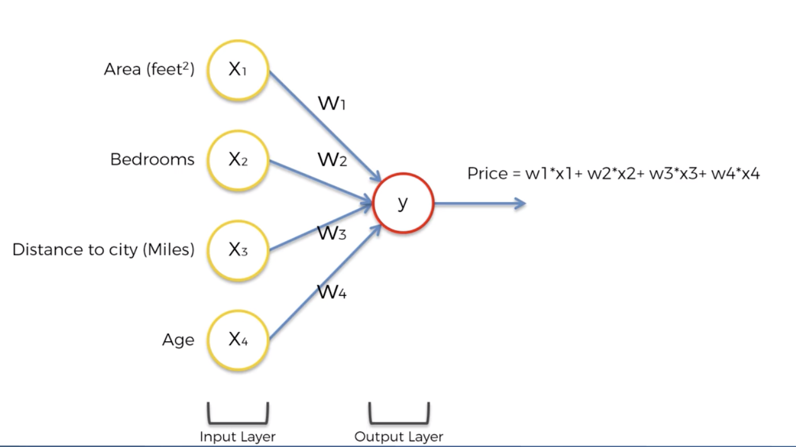
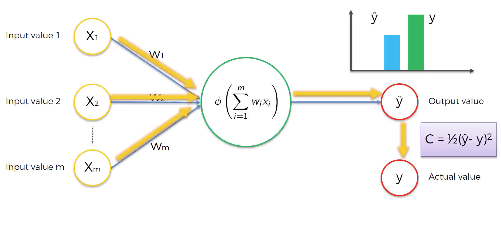
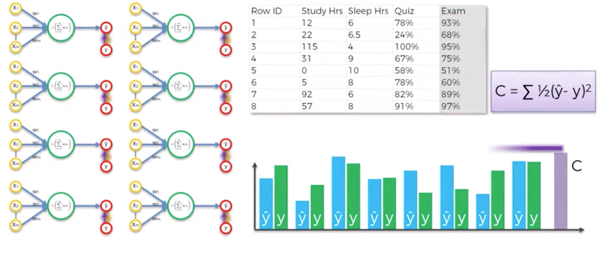
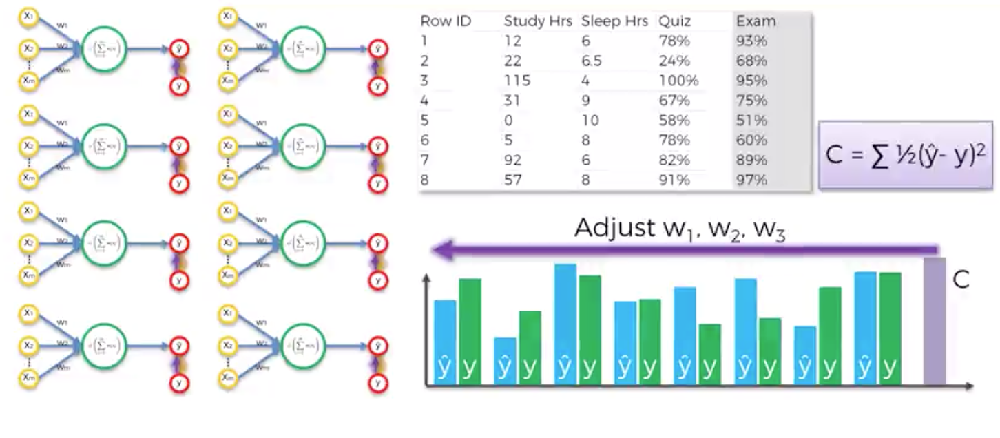
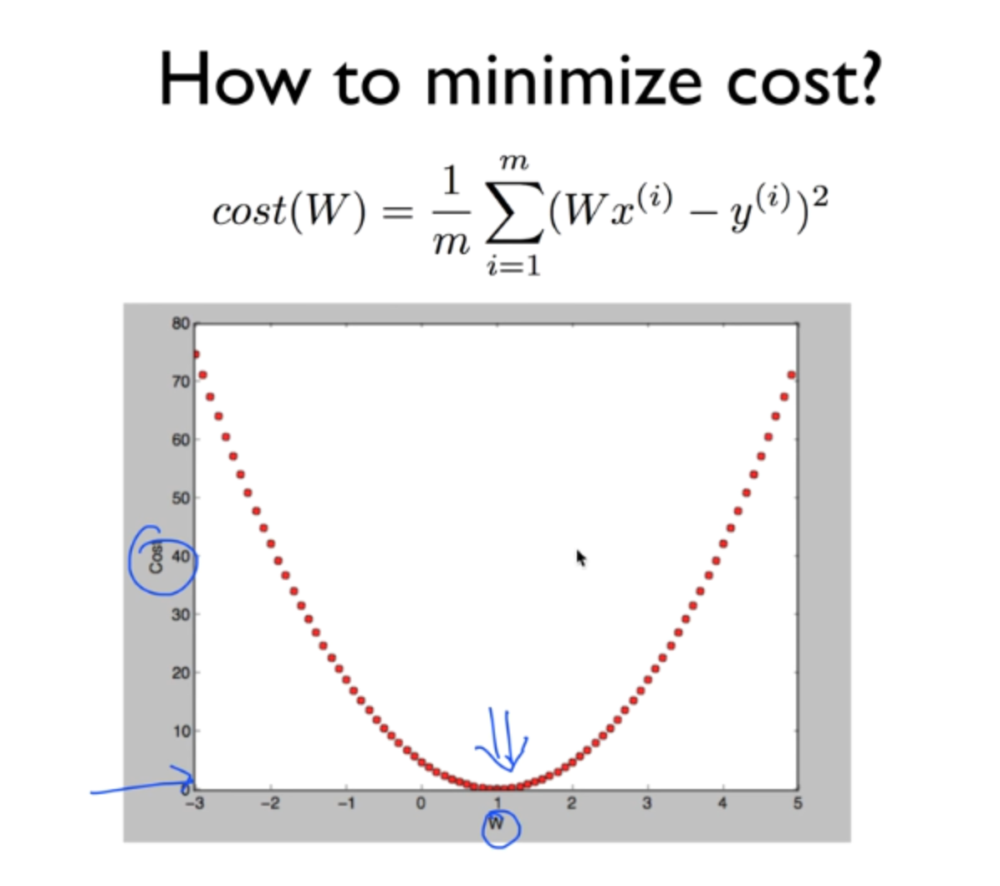

How do neural networks work/learn?

## 신경망은 어떻게 동작하는가?

다양한 정보를 바탕으로 부동산 가격을 예측하는 일을 해보도록 하자.

가장 일반적으로 할 수 있는 접근은, 각각의 데이터에 적절한 가중치를 적용한 값을 바탕으로 가격을 예측하는 것이다. 여기에는 여러가지 방식이 적용될 수 있다. Regression이 될 수도 있고, 대부분의 머신러닝 알고리즘이 여기에 해당 될 것이다. 즉, 히든레이어가 없어도 어떻게서든 적절한 output을 찾아내는 것은 가능할 것이다. 
하지만 신경망은 Hidden layer를 활용한다는 것이 다르다. 그리고 이는 예측하는데 있어서 조금더 유연함을 제공해준다.

위의 그림에서는 hidden layer들이 존재한다. 그리고 각각의 hidden layer들은 서로 다른 파라미터들을 input으로 받으면서, 각자 다른방식으로 추측을 한다. 그리고 이렇게 값을 내보낸 hidden layer들로 최종적으로 결과를 만들어 낸다. 결과적으로, 단 하나의 함수를 적용하는 것보다 다양한 input value와 다양한 가중치를 적용함으로써, deep learning은 학습하는데 있어 조금더 유연함을 가져갈 수 있다.

## 어떻게 신경망이 학습하는가?

위와 같은 뉴런(이제 퍼셉트론이라고 칭하겠다.)이 있다고 가정하자. activation function을 통해 특정 값이 나왔을 것이고, 우리는 이를 $$\hat{y}$$라고 부른다. 실제값인 $$y$$와는 차이가 있을 것이다. 여기에서 이 차이를 계산하는 함수를 `cost function`이라고 부른다. 물론 이 cost function에도 여러종류가 있다. 아무튼, 이 cost function에서 나오는 값이 작을 수록 정확한 값을 예측했다고 할 수 있을 것이다. cost function을 통해서 전달 받은 값은 다시 퍼셉트론으로 돌아간다. 그리고 이 값을 바탕으로 weight를 업데이트 하게 된다. 

위 그림에서 보이느 8개의 퍼셉트론은 하나의 같은 퍼셉트론이다. 첫 epoch에서 8개의 데이터로 학습을 한 뒤에 cost function으로 전체 error를 구해낸다.

그리고 그 값을 바탕으로 w1, w2, w3를 업데이트 해나가면서 cost를 점차 줄여나간다. 이 과정을 정해진 epoch동안 반복해 나가면서 cost를 줄여나가게 된다. 그리고 이 과정을 backpropagation (역전파)이라고 한다. 

[참고자료](https://stats.stackexchange.com/questions/154879/a-list-of-cost-functions-used-in-neural-networks-alongside-applications)

### Gradient Descent 

그렇다면 정확히 어떻게 weight가 조정되는 것일까?

weight값을 무작위로 마구잡이로 집어 넣어서 (brute force) 최소값을 찾아낸다고 가정해보자. 그렇게 한다면 위와 같은 형태가 될 것이다. 

$$ \frac{1}{m} \sum_{i=1}^{m}((\hat{y} - y))^2 $$

분명 어느지점에서는 cost가 최소화 될 것이고, 우리는 저 지점을 찾는 것을 목표로 한다. 그러나 신경망은 수많은 퍼셉트론을 가지고 있기 때문에, 이와 연결되는 weight도 엄청나게 많을 것이다. 따라서 이 모든 값들을 무작위로 때려 넣어서 맞춘다는 것은 사실상 불가능하다. 그래서 사용하는 것이 Gradient descent 다.

첫 weight로 위의 지점에서 cost를 구했다고 가정하자. 해당 지점에서 기울기를 구하고, 그 지점에서의 기울기가 양라면 (미분해서) 오른쪽은 오르막, 왼쪽은 내리막이라는 뜻이므로 왼쪽으로 간다. 반대로 기울기가 음이라면 오른쪽이 내리막, 왼쪽이 오르막이라는 뜻이므로 오른쪽으로 간다. 이 과정을 반복해서 점차 가장 낮은 곳을 찾아나가는 것이다.

이 과정에서, 움직이는 값이 너무 크다면, 영영 최소점을 찾지 못할 것이고, 반대로 너무 작다면 최소점을 찾는데 너무 오랜 시간이 걸릴 것이다.

### Stochastic Gradient Descent

위에서 본 예제에서는 cost function 이 convex한 모양을 가지고 있었기 때문에 가능했다. 최소점도 단 하나여서 찾기 쉽다.

만약 cost function 을 바꾸거나, 다차원의 형태를 띄고 있다면, 아마도 cost function의 모양은 저런 모양이 될 것이다. 이경우에는 최적의 최저점을 찾지 못하게 될 수도 있다. 그래서 사용하는 것이 Stocahstic Gradient desecent(이하 SGD)다. 

SGD는 모든 데이터를 바탕으로 weight를 조정하는 것이 아니라, 데이터를 나눠서 gradient desecent를 적용하는 것이다.

이렇게 함으로써 국소최저점에 빠지는 것을 방지할 수 있고, 더빠르게 연산해 낼 수 있다. 

요약하자면, batch형태로 하나의 데이터셋 전체로 Gradient Descent 하는 것이 아니고, mini-batch 형태로 데이터를 쪼개서 Gradient Descent하는 것이라 할 수 있다.

[참고1](http://iamtrask.github.io/2015/07/27/python-network-part2/)

[참고2](http://neuralnetworksanddeeplearning.com/chap2.html)

## 신경망이 작동하는 과정

1. 가중치를 0에 가까운 작은수로 랜덤하게 설정한다.
2. input layer 각각의 노드에 데이터를 집어 넣는다.
3. Foward Propagataion - 순전파: 각각의 퍼셉트론이 주어진 가중치에 따라서 activation여부를 결정한다. 이 과정은 output layer에서 결과가 나올때까지 지속된다.
4. 실제 결과와 신경망이 예측한 결과를 비교한다. 그리고 이 두값을 바탕으로 에러를 산출해낸다.
5. Back Progatation - 역전파: 3번의 과정을 반대로 진행한다. 4번에서 나온 에러값을 바탕으로 각각의 가중치가 얼마나 에러에 책임이 있는지를 계산한 후에, 각중치를 업데이트 한다. learning rate가 얾라나 가중치를 업데이트 할지 결정하게 된다.
6. 1번에서 5번과정을 각 observation마다 반복하거나 (Reinforcement Learning) batch크기만큼 반복 (Batch Learning)
7. 모든 training set에서 한번 거치는 이 과정을 epoch이라고 한다. epoch을 설정한 수치만큼 반복한다.
