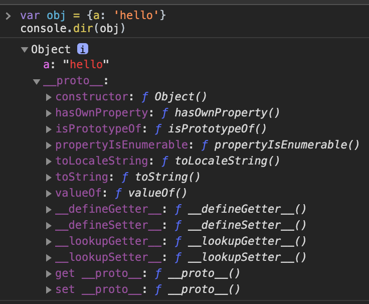
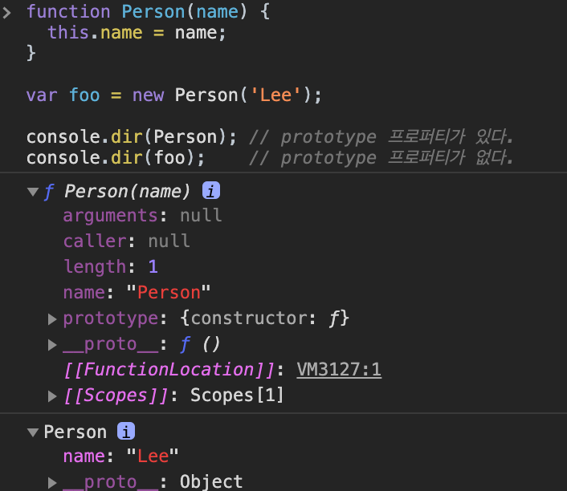
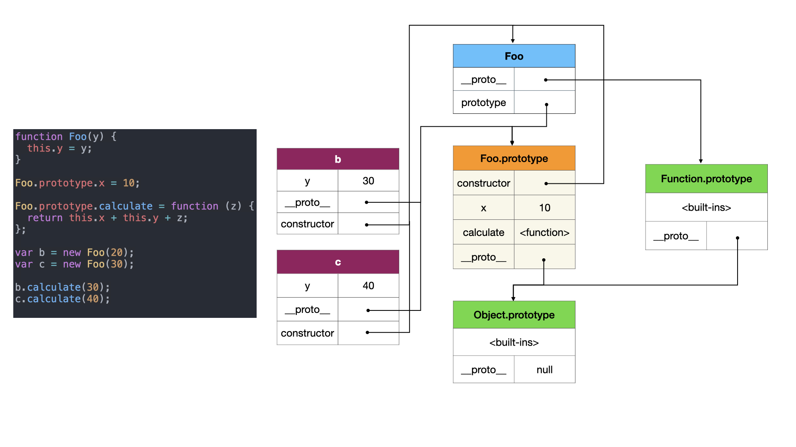

```toc
tight: true,
from-heading: 1
to-heading: 4
```

# 프로토타입

상속이라는 관점에서 봤을 때, 자바스크립트의 유일한 생성자는 객체 뿐이다. 모든 객체는 `[[prototype]]` 이라는 private 속성을 가지고 있는데, 이는 자신의 프로토타입이 되는 다른 객체를 가리킨다. 이렇게 자신의 프로토타입의 프로토타입의 프로토타입을 따라가다보면, 결국 null을 프로토타입으로 가지는 오브젝트에서 끝난다. null은 프로토타입이 더이상 없다고 정의되며 이는 프로토타입의 종점을 말한다.

```javascript
var obj = {a: 'hello'}
console.dir(obj)
```



## 속성 상속

객체의 어떠한 속성에 접근하려고 할 때, 그 객체 자체의 속성 뿐만 아니라 객체의 프로토타입, 그 프로토 타입의 프로토 타입 등등등 앞서 말한 프로토타입의 종단 까지 갈 때가지 그 속성을 탐색한다.

```javascript
let foo = function () {
  this.a = 1;
  this.b = 2;
}

let bar = new foo(); // {a:1, b:2}

foo.prototype.b = 3;
foo.prototype.c = 4;

// bar가 a 속성을 가지고 있기 때문에 1
console.log(bar.a);
// bar가 a 속성을 가지고 있기 때문에 2
console.log(bar.b);
// bar가 c의 속성을 가지고 있지 않다. 그래서 프로토타입을 체크한다.
// foo.[[prototype]] 이 c를 갖고 있는지 확인하자. 
// c가 있다. 
// 4
console.log(bar.c);
// 프로토타입을 뒤져도 d는 나오지 않는다.
console.log(bar.d);
```

## 메소드 상속

```javascript
var foo = {
  a: 2,
  b: function (c) {
    return this.a + 1
  }
}

// 3
// 여기서 this는 foo를 가리킨다
console.log(foo.b()) 

// bar는 프로토타입을 foo로 가지는 오브젝트다.
var bar = Object.create(foo)

bar.a = 4
// bar.b()를 호출 하면, this는 bar를 가리킨다.
// 따라서 foo의 함수 b를 상속 받으며,
// a는 foo.a가 아닌 bar에서 새로지정한 a를 보게된다.
// 5
console.log(bar.b())
```

## How to use

```javascript
function dummy(){}
console.dir( dummy.prototype );
```


여기에 속성을 추가해보자.

```javascript
function dummy(){}
dummy.prototype.foo = "bar";
console.dir( dummy.prototype );
```


foo가 `bar`값으로 추가된 것을 볼 수 있다.

```javascript
function dummy(){}
dummy.prototype.foo = 'bar'
var d = new dummy();
d.hello = "world"
console.log(d)
```


1. d 의 속성에 접근할 때, 브라우저는 우선 d가 그 속성을 가지고 있는지 확인한다.
2. 만약 d가 해당 속성을 가지고 있지 않다면, `d.__proto__` (`dummy.prototype`)이 그 속성을 가지고 있는지 확인한다.
3. 만약 `dummy.__proto__`가 그 속성을 가지고 있다면, `dummy.__proto__`가 갖고 있는 속성을 사용한다.
4. 만약 `dummy.__proto__`마저 그 속성을 가지고 있지 않으면, `dummy.__proto__.__proto__`가 가지고 있는지 확인한다. 기본적으로 여기서 함수의 prototype의 `__proto__`는 `window.Object.prototype`이다.
5. 그래서 이제 `dummy.__proto__.__proto__` (`dummy.prototype`의 `__proto__`) (`Object.prototype`)에서 그 속성을 찾는다.
6. 근데 이제 그 위의 `dummy.__proto__.__proto__.__proto__`를 찾으려고 하지만, 더이상은 없으므로 
7. undefined로 결론 짓는다.

위의 지독한 과정을 (....) 코드로 살펴보자.

```javascript
function dummy(){}
dummy.prototype.foo = "bar";
var d = new dummy();
d.prop = "some value";
console.log("d.prop:      " + d.prop);
console.log("d.foo:       " + d.foo);
console.log("dummy.prop:           " + dummy.prop);
console.log("dummy.foo:            " + dummy.foo);
console.log("dummy.prototype.prop: " + dummy.prototype.prop);
console.log("dummy.prototype.foo:  " + dummy.prototype.foo);
```

```
d.prop:      some value
d.foo:       bar
dummy.prop:           undefined
dummy.foo:            undefined
dummy.prototype.prop: undefined
dummy.prototype.foo:  bar
```

## 여러가지 방법으로 객체를 생성하고 프로토타입 체인 결과를 보자

### 문법 생성자

```javascript
var foo = {bar : 1};
// foo의 프로토타입은 Object.prototype

var arrayFoo = ['please' , 'go', 'home']
// arrayFoo의 프로토타입은 Array.prototype
// 그래서 map, index 등을 쓸 수 있다.

function functionFoo() {
  return 'fuck'
}
// Function.prototype을 상속받아서 
// call, bind 등으르 쓸 수 있다.
```

### 생성자를 이용

```javascript
function hello() {
  this.name = ''
  this.age = 0
}

hello.prototype = {
  setName: function(name) {
    this.name = name
  }
}

var h = new hello()
// h는 name과 age를 속성으로 갖는 객체다.
// 생성이 h.[[prototype]]은 Hello.prototype과 같은 값을 가진다.
```

### Object.create 활용

```javascript
var a = {a: 1}
// a --> Object.prototype --> null

var b = Object.create(a)
// b --> a --> Object.prototype --> null

var c = Object.create(b)
// c --> b --> a --> Object.prototype --> null
```

## [[prototype]] vs prototype

모든 객체는 자신의 프로토타입을 가리키는 `[[prototype]]`이라는 인터널 슬롯을 가지며, 상속을 위해 사용된다. 함수도 객체이기 때문에, `[[prototype]]`를 갖는다. 그런데 함수는 일반 객체와는 달리 `prototype` 프로토타입도 갖게 된다. 중요한 것은 `[[prototype]]`과 `prototype`은 다르다는 것이다.

```javascript
function Person(name) {
  this.name = name;
}

var foo = new Person('Lee');

console.dir(Person); // prototype 프로퍼티가 있다.
console.dir(foo);    // prototype 프로퍼티가 없다.

function P(name) {
  return name
}

var bar = P('Lee')
console.dir(bar)
```



### [[prototype]]

- 함수를 포함한 모든 객체가 가지고 있는 인터널 슬롯
- 객체 입장에서 봤을때, 자신의 부모역할을 하는 프로토타입 객체를 가리키며, 함수의 경우 `Function.prototype`을 가리킨다.
  
### prototype 프로퍼티

- 오직 함수만 가지고 있는 프로퍼티다.
- 함수 객체가 생성자로 이용될때, 이 함수를 통해 생성될 객체의 부모역할을 하는 객체를 가리킨다. 
- 위 예제에서 `new Person('Lee')`는 이함수를 통해 `foo`가 나왔다. 이 `foo`의 `__proto__`를 가리킨다.

### 차이비교

```javascript
function Person(name) {
  this.name = name
}

var foo = new Person('Kim')

console.log(Person.__proto__ === Function.prototype)

console.log(Person.prototype === foo.__proto__)
```

## Constructor

프로토타입 객체는 `constructor` 프로퍼티를 갖는다. 이 constructor 프로퍼티는 객체입장에서 자신을 생성한 객체를 가리킨다. 

```javascript
function Person(name) {
  this.name = name;
}

var foo = new Person('Lee');

// Person() 생성자 함수에 의해 생성된 객체를 생성한 객체는 Person() 생성자 함수이다.
console.log(Person.prototype.constructor === Person);

// foo 객체를 생성한 객체는 Person() 생성자 함수이다.
console.log(foo.constructor === Person);

// Person() 생성자 함수를 생성한 객체는 Function() 생성자 함수이다.
console.log(Person.constructor === Function);
```

## 정리!!!

- `[[Prototype]]`은 자바스크립트의 모든 객체가 가진 값이며,  `__proto__`로 접근할 수 있다. (혹은 `Object.getPrototypeOf(obj))`도 가능하다. 사실 똑같다.) 이것을 이용해 상속을 구현하며, 타고타고 올라가면 `Object.prototype`을 만나고 `Object.__proto__`는 null이다.
- `prototype`은 `new`로 새로운 object를 만들었을때 (생성자로 사용될때), 이 함수로 생성될 객체의 부모 역할을 할 객체를 가리킨다. (`XXX.prototype`)
- `XXX.prototype` 객체는 `constructor`를 갖는데, `constructor`는 자신의 입장에서 자신을 생성한 객체를 가리킨다. 따라서 `XXX`를 가리킨다.


Foo를 중심으로 설명해보자.

- Foo는 함수다. 따라서 이 함수의 프로토타입은 `Function.prototype`이다.
- `Foo`를 생성자 함수로 사용했을때, `prototype`프로퍼티를 갖게되며, `Foo.prototype`이 생긴다.
- `Foo.prototype`의 프로토타입은 `Object`이다. (함수가 아닌 새로운 객체이므로
- `Foo`를 생성자함수로, `b`와 `c`를 `new`를 이용하여 만들었다. `b`와 `c`의 프로토타입은 `Foo.prototype`이다.


```javascript
// 생성자 함수
function Foo(y) {
  // Object를 생성한 뒤에, y 프로퍼티에 y값을 갖게 된다.  
  this.y = y;
}

// 또한 'Foo.prototype'은 Foo의 prototype에 할당되며, 
// 이를 활용해서 프로퍼티나 메소드를 상속받거나 공유할 수 있으며, 
// 위에서 제시한 예시와 같이 활용할 수 있다.
Foo.prototype.x = 10;
 
// calculate 메소드를 상속받는다
Foo.prototype.calculate = function (z) {
  return this.x + this.y + z;
};
 
// Foo 패턴을 활용하여 b와 c 오브젝트를 생성한다.
var b = new Foo(20);
var c = new Foo(30);
 
// 상속받은 메소드를 호출한다.
b.calculate(30); // 60
c.calculate(40); // 80
 
// 한번 확인해보자.
console.log(
 
  b.__proto__ === Foo.prototype, // true
  c.__proto__ === Foo.prototype, // true
 
  // Foo.prototype은 constructor라는 새로운 프로퍼티를 만드는데,
  // 이는 함수 그 자체의 생성자를 참조하게 된다.
  // b, c 생성자는 Foo 자체임을 알 수 있다.
 
  b.constructor === Foo, // true
  c.constructor === Foo, // true
  Foo.prototype.constructor === Foo, // true
 
  b.calculate === b.__proto__.calculate, // true
  b.__proto__.calculate === Foo.prototype.calculate // true
 
);
```

