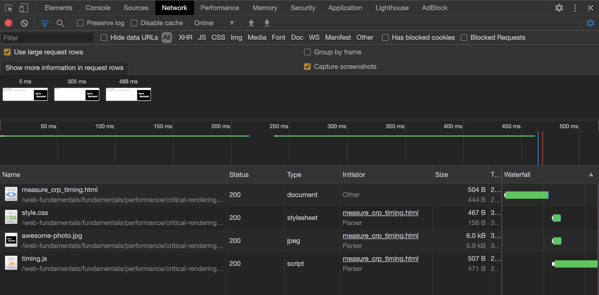
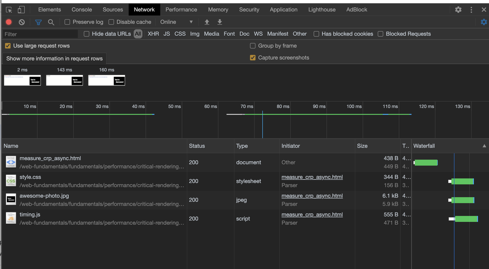

[Critical Rendering Path](https://developers.google.com/web/fundamentals/performance/critical-rendering-path?hl=ko)를 요약했습니다. 이글을 보는게 더 나아요 사실

```toc
tight: true,
from-heading: 2
to-heading: 3
```


성능 최적화를 위해서는 HTML, CSS, 자바스크립트를 바이트 단위로 수신 한 뒤 브라우저에서 렌더링된 픽셀로 변환하기 까지, 어떠한 일들이 있었는지 알아야 한다. 이러한 단계를 바로 `Critical Rendering Path`라고 한다.


## 객체 모델 생성

브랑루저가 페이지를 렌더링하기 위해서는 DOM과 CSSOM 트리를 생성해야 한다. 따라서 최대한 빠르게 이를 생성해서 넘겨야 한다.

먼저 바이트 코드로 넘어온 HTML과 CSS를 어떻게 처리하는지 알아야 한다.


1. 바이트 
2. 문자
3. 토큰
4. 노드
5. 객체모델

HTML은 DOM(Document Object Model)로, CSS는 CSSOM(CSS Object Model)로 변환된다. 이 둘은 독립적인 데이터 구조다.

이 DOM을 기준으로 브라우저는 이후 모든 페이지 처리에 이 DOM을 사용한다.

## 렌더링 트리 생성과 레이아웃 프린트

- DOM과 CSSDOM 이 만들어졌다면, 이 두 트리를 결합하여 렌더링 트리를 생성한다. 
- 이 렌더링 트리에는 페이지를 렌더링하는데 필요한 노드만 포함된다. 예를 들어서 `display:none`으로 처리된 것은 렌더링 처리에서 누락된다. 
- 레이아웃 단계에서는, 각 객체의 정확한 위치와 크기를 계산한다.
- 마지막으로 페인트 단계를 거치는데, 픽셀을 화면에 렌더링한다.

## 브라우저의 렌더링 단계 요약

1. HTML 을 처리해서 DOM 트리를 만든다
2. CSS 를 처리해서 CSSOM 트리를 만든다.
3. DOM과 CSSOM을 결합하여 렌더링 트리를 만든다
4. 렌더링 트리에서 레이아웃 처리를 통하여 각 객체의 위치와 크기를 계산한다
5. 마지막으로 개별노드를 페인트 한다.

주요 렌더링 경로를 최적화 하는 작업은 위 다섯가지의 단계를 최소화 하는 프로세스다.

## HTML과 CSS는 기본적으로 렌더링을 차단한다.

CSSOM이 생성되기 전까지, 브라우저는 처리되는 모든 컨텐츠를 렌더링하지 않는다. 따라서 가능한 간단하고 빠르게 제공해야 렌더링 차단을 최소화 할 수 있다. HTML도 마찬가지로, 렌더링을 차단하는 리소스다.

하지만 미디어 유형과 미디어 쿼리를 통해서 일부 리소스를 렌더링을 차단하지 않는 리소스로 선언할 수 있다.

```html
<!-- 기본적으로 렌더링을 차단한다. -->
<link href="style.css" rel="stylesheet">
<!-- 위의 선언과 같다. -->
<link href="style.css" rel="stylesheet" media="all">
<!-- 컨텐츠가 인쇄될 때만 적용된다. 따라서 렌더링이 차단되지 않는다.-->
<link href="print.css" rel="stylesheet" media="print">
<!-- 브라우저가 해당 조건을 만족하면 차단된다. -->
<link href="other.css" rel="stylesheet" media="(min-width: 40em)">
```

한 가지 중요한 것은, 위 미디어 쿼리가 있다고 하더라도 해당 리소스에 대해 초기 렌더링을 보류해야 하는지만 나타낸다. 어떤 경우든지, 브라우저는 CSS를 모두 다운받으며, 단지 초기 렌더링을 보류 해야하는지만을 나타낸다.


## 자바스크립트로 상호작용 추가

자바스크립트를 활용하면 페이지 대부분의 측면을 수정할 수 있다. DOM 요소를 추가하고 제거하거나, CSSOM 속성을 수정하는 등 거의 모든 측면에 관여할 수 있다.

이러한 점 때문에, 인라인 스크립트를 실행하면 DOM 생성이 차단되고, 이로 인해 초기 렌더링에도 지연이 발생하게 된다. 자바스크립트로는 DOM, CSSDOM 등에 관여할 수 있기 때문에 렌더링하는데 있어 지연이 발생할 수 있다.

따라서

- 문서의 스크립트 위치는 중요하다. 위치에 따라서 실행이 달라진다.
- 브라우저가 스크립트 태그를 만나면 스크립트가 종료될때까지 DOM 생성이 중단된다.
- 자바스크립트는 CSSOM이 준비될 때까지 일시 중단된다.

따라서 기본적으로, 자바스크립트의 실행은 파서를 차단한다. 그리고 만약 인라인 자바스크립트가 아닌, 스크립트 태그를 통해 포함된 자바스크립트가 있다면, 브라우저가 일시 중단하고, 디스크 / 캐시 / 원격 서버등에서 스크립트를 가져올 때 까지 기다리므로, 추가적인 지연이 더 발생하게 된다.

이를 방지 하기 위해서는 `async` 키워드를 추가하면 된다.

```html
<script src="app.js" async></script>
```

이를 추가하면, 스크립트가 사용가능 해질 때까지 기다리는 동안에도 DOM 생성을 계속해서 하게된다. 이경우 성능이 향상된다.


> 일반적인 `script`는 다운로드하고 실행될 때까지 HTML 파싱을 멈추지만, `async`는 다운로드와 파싱을 동시에 진행한다. `defer`의 경우에는, 마찬가지로 다운로드를 동시에 진행하지만, 스크립트 실행이 맨뒤로 밀리게 된다.

## 주요 렌더링 경로 측정

해당 렌더링 경로를 측정하는 좋은 방법은 `LightHouse`를 이용하는 것이다.


또는 [Navigation Timing API](https://developer.mozilla.org/ko/docs/Navigation_timing)를 활용하여 측정할 수도 있다.

```html
<!DOCTYPE html>
<html>
  <head>
    <title>Critical Path: Measure</title>
    <meta name="viewport" content="width=device-width,initial-scale=1">
    <link href="style.css" rel="stylesheet">
    <script>
      function measureCRP() {
        var t = window.performance.timing,
          interactive = t.domInteractive - t.domLoading,
          dcl = t.domContentLoadedEventStart - t.domLoading,
          complete = t.domComplete - t.domLoading;
        var stats = document.createElement('p');
        stats.textContent = 'interactive: ' + interactive + 'ms, ' +
            'dcl: ' + dcl + 'ms, complete: ' + complete + 'ms';
        document.body.appendChild(stats);
      }
    </script>
  </head>
  <body onload="measureCRP()">
    <p>Hello <span>web performance</span> students!</p>
    <div></div>
  </body>
</html>
```

```
interactive: 229ms, dcl: 230ms, complete: 956ms
```


- `domLoading`: 전체 프로세스의 시작 타임스탬프. 브라우저가 처음 수신한 HTML 문서 바이트의 파싱 시작.
- `domInteractive`: 브라우저가 파싱을 완료한 시점을 표시. 모든 HTML 및 DOM 생성 작업이 완료됨을 의미.
- `domContentLoaded`: DOM이 준비되고 자바스크립트 실행을 차단하는 스타일시트가 없는 시점을 표시. 즉, 이제 (잠재적으로) 렌더링 트리를 생성할 수 있음. 많은 자바스크립트 프레임워크가 자체 로직을 실행하기 전에 이 이벤트를 기린다. 따라서 브라우저는 EventStart 및 EventEnd 타임스탬프를 캡처하여, 이를 통해 이 실행이 얼마나 오래 걸렸는지 추적할 수 있다.
- `domComplete`: 이름이 의미하는 바와 같이, 모든 처리가 완료되고 페이지의 모든 리소스(이미지 등) 다운로드가 완료되었음을 의미.
- `loadEvent`: 각 페이지 로드의 최종 단계로, 브라우저가 추가 애플리케이션 로직을 트리거할 수 있는 `onload` 이벤트를 트리거함.

## 주요 렌더링 경로 성능 분석

[예제 페이지](https://googlesamples.github.io/web-fundamentals/fundamentals/performance/critical-rendering-path/basic_dom_nostyle.html)를 통해 분석을 시작해보자.


`DOMContentLoaded`가 호출되는데 약 300ms 정도가 소요되었다. 그리고 이는 파란색 수직선으로 체크 되었다. 이미지 로딩은 이에 영향을 받지 않았다. 주요 렌더링 경로에는 HTML, CSS, 자바스크립트만 포함된다. 

하지만 `load`이벤트는 이미지에서 차단되었다. `onload`는 따라서 모든 리소스가 다운로드 된 후에 호출된다는 것을 알 수 있다.

[이제 여기에 자바스크립트와 CSS를 추가해보자.](https://googlesamples.github.io/web-fundamentals/fundamentals/performance/critical-rendering-path/measure_crp_timing.html)

```html
<!DOCTYPE html>
<html>
  <head>
    <title>Critical Path: Measure Script</title>
    <meta name="viewport" content="width=device-width,initial-scale=1">
    <link href="style.css" rel="stylesheet">
  </head>
  <body onload="measureCRP()">
    <p>Hello <span>web performance</span> students!</p>
    <div></div>
    <script src="timing.js"></script>
  </body>
</html>
```



`DOMContentLoaded`가 거의 `onload`와 동시에 호출된 것을 알 수 있다. 일반적인 HTML과는 다르게, CSSOM을 생성하기 위해 CSS 파일도 가져와야 한다. 또한 파서 차단 자바스크립트가 포함되어 있어 CSS 파일이 다운로드 될때까지 차단되어 있는 것을 볼 수 있다.

[이번엔 `async` 키워드를 추가해보자.](https://googlesamples.github.io/web-fundamentals/fundamentals/performance/critical-rendering-path/measure_crp_async.html)



이번에는 HTML이 파싱된 이후에 `domContentLoaded`가 실행된 것을 볼 수 있다. 브라우저가 자바스크립트를 차단하지 않는다는 것을 알게 되었고, 다른 파서 차단 스크립트가 없으므로 CSSDOM 생성 또한 동시에 처리 가능하다.

만약 이 모든 코드를 인라인으로 때려박게 되면, 위의 예제와 비슷한 성능을 느낄 수 있다. HTML 페이지는 더 커지지만, 페이지 안에 모든 요소가 있으므로 외부 리소스가 올때까지 기다릴 필요가 없기 때문이다.

## 성능 분석

### 순수 HTML

```html
<!DOCTYPE html>
<html>
  <head>
    <meta name="viewport" content="width=device-width,initial-scale=1">
    <title>Critical Path: No Style</title>
  </head>
  <body>
    <p>Hello <span>web performance</span> students!</p>
    <div></div>
  </body>
</html>
```


### CSS 파일 추가

```html
<!DOCTYPE html>
<html>
  <head>
    <meta name="viewport" content="width=device-width,initial-scale=1">
    <link href="style.css" rel="stylesheet">
  </head>
  <body>
    <p>Hello <span>web performance</span> students!</p>
    <div></div>
  </body>
</html>
```


CSS를 가져오기 위해 한번의 왕복이 더 추가되었고, 그만큼 렌더링도 밀려난 것을 볼 수 있다.

### CSS + 자바스크립트 추가

```html
<!DOCTYPE html>
<html>
  <head>
    <meta name="viewport" content="width=device-width,initial-scale=1">
    <link href="style.css" rel="stylesheet">
  </head>
  <body>
    <p>Hello <span>web performance</span> students!</p>
    <div></div>
    <script src="app.js"></script>
  </body>
</html>
```


외부 자바스크립트 asset은 파서 차단 리소스 인 것을 명심하자. 자바스크립트 실행을 위해 작업을 차단하고 CSSDOM 이 생성되기 전까지 기다려야 한다.

한가지 눈여겨 봐야 할 점은, CSS와 자바스크립트 리소스 요청이 거의 동시에 이루어진다는 것이다. 두 리소스를 검색한 후 두 요청을 모두 동시에 실행 한다. 이는 CSS와 자바스크립트 전송을 동시에 할 수 있다는 것을 말한다.

### CSS + Async javascript

```html
<!DOCTYPE html>
<html>
  <head>
    <meta name="viewport" content="width=device-width,initial-scale=1">
    <link href="style.css" rel="stylesheet">
  </head>
  <body>
    <p>Hello <span>web performance</span> students!</p>
    <div></div>
    <script src="app.js" async></script>
  </body>
</html>
```


더이상 스크립트가 파서를 차단하지 않고, 주요 렌더링 경로에도 포함되지 않았다. 또한 주요 스크립트가 없어서 CSS가 `domContentLoaded`이벤트를 차단하지도 않고, 따라서 어플리케이션 로직이 빠르게 실행되었다는 것을 알 수 있다.

## 주요 렌더링 경로 최적화

최초에 렌더링을 빠르게 하려면 다음의 경우를 고려해야 한다.

- 주요 리소스 수: 페이지의 초기 렌더링을 차단하는 리소스의 수. 최대한 적어야 한다.
- 주요 경로 길이 (얼마나 많은 리소스가 엮여 있는가): 주요 리소스와 해당 바이트 크기간의 그래프를 나타낸다. 일부 리소스는 이전 리소스가 다운된 후에만 시작할 수 있으며, 리소스가 클수록 다운로드 하는데 걸리는 왕복 수가 많아진다.
- 주요 바이트 수 (리소스의 크기): 당연히 작아야 한다.

## 페이지 스피드 규칙 및 권장 사항

- 렌더링 차단 스크립트 및 CSS 를 최소화
- 자바스크립트 사용최적화
  - `async` 속성을 적극적으로 활용
  - 중요하지 않은 비필수 자바스크립트 실행 지연
  - 길게 실행되는 자바스크립트 회피
- CSS 사용 최적화
  - CSS는 문서 헤드에 넣기
  - `@import`의 사용을 피하기. 이는 경로에 대한 왕복이 추가된다.
  - 렌더링 차단 CSS를 인라인으로 처리