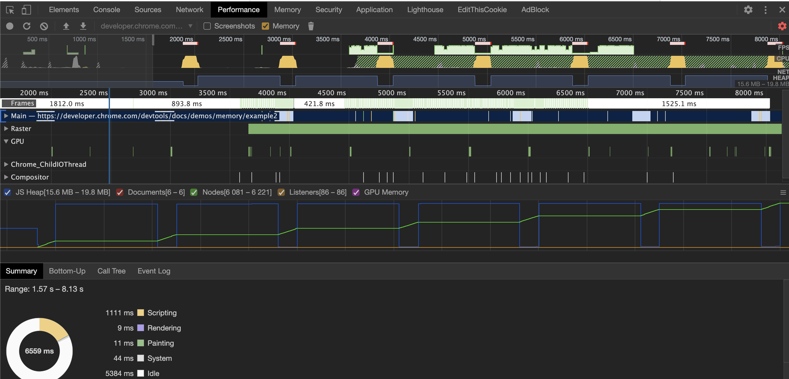
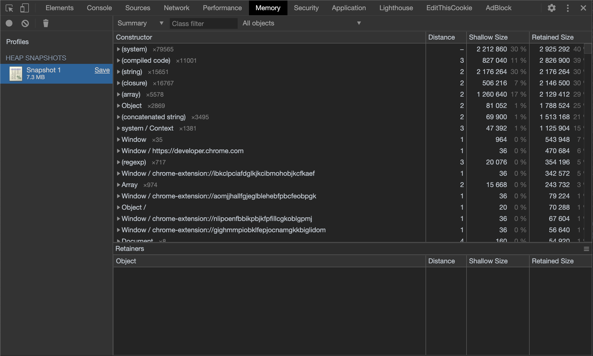
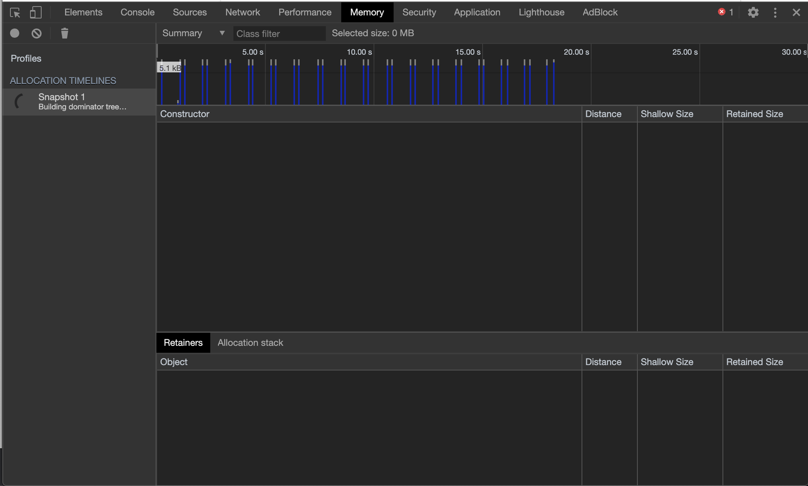
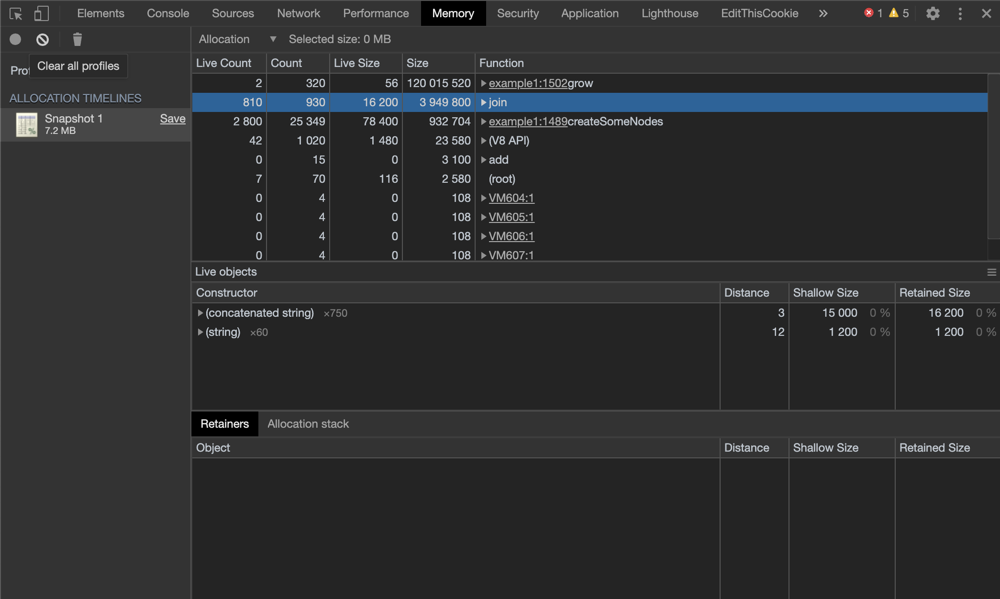

```toc
tight: true,
from-heading: 2
to-heading: 3
```

[4 Types of Memory Leaks in JavaScript and How to Get Rid Of Them](https://auth0.com/blog/four-types-of-leaks-in-your-javascript-code-and-how-to-get-rid-of-them/)을 번역한 글입니다.

이 아티클에서는 클라이언트 자바스크립트 코드에서 발생할 수 있는 가장 흔한 타입의 메모리 누수에 대해 알아볼 것이다. 그리고 크롬 개발 툴을 활용해 이를 찾아내는 방법도 공부해볼 것이다.

## Introduction

메모리 누수는 모든 개발자가 종종 마주하는 흔한 문제다. 메모리 관리가 잘 되고 있는 언어에서 조차 이러한 문제는 종종 발생한다. 메모리 누수는 어플리케이션 속도저하, 예기치 못한 종료, 느린 응답속도 등과 같이 많은 문제를 야기할 수 있다.

### 메모리 누수란 무엇인가?

메모리 누수는 어떤 이유에서든 지간에, 운영체제 또는 사용가능한 메모리 풀에서 반환되지 않으면서 동시에 어플리케이션에서 더이상 필요로 하지 않는 메모리로 정의 될 수 있다. 프로그래밍 언어는 메모리 관리를 각각 다른 방법으로 처리한다. 이런 방법들은 메모리 누수를 이르킬 확률을 감소시킨다. 그러나 어떠한 메모리가 돌아 오지 않는지는 시스템이 결정할 수 없는 문제다. 즉, [오직 개발자만이 메모리의 일부를 운영제체에 반환할 수 있는지 여부를 명확히 알 수 있다.](https://developer.mozilla.org/en-US/docs/Web/JavaScript/Memory_Management#Release_when_the_memory_is_not_needed_anymore) 어떤 프로그래밍 언어에서는  개발자들이 이 것을 하는데 도움을 주는 기능을 제공한다. 다른 언어에서는 개발자들이 메모리가 사용되지 않을 때를 완전히 명시하는 것을 기대하는 언어도 있다. 

### 자바스크립트의 메모리 관리

자바스크립트는 이른바 가비지 콜렉팅 언어(garbage collected languages)라고 불리운다. 가비지 콜렉팅 언어는 이전에 할당된 메모리 영역이 응용프로그램의 다른부분에서 여전히 '다시 참조될 (reached)' 수 있는지  주기적으로 확인하여 개발자가 메모리를 관리하는데 도움을 준다. 즉, 가비지 콜렉팅 언어는 메모리 관리 문제를 '필요한 메모리가 무엇인가?' 에서 '응용 프로그램의 다른부분에서 여전히 도달할 수 있는 메모리가 무엇인가?' 로 문제를 좁히는 것으로 볼 수 있다. 이러한 차이는 미묘하지만 중요하다. 앞으로 할당된 메모리가 필요할지는 개발자 만이 알 수 있지만서도, 더이상 닿을 수 없는 메모리는 알고리즘적으로 결정되어 OS에 다시 돌아오도록 표시할 수 있다.

> 가비지 콜렉팅 언어가 아닌 언어들은 보통 메모리 관리를 하는데 있어 다른 종류의 기술을 사용한다. 이를 명시적 관리하고 하는데, 개발자가 메모리가 필요하지 않을 때 컴파일러에 명시적으로 알려주거나, 참조카운트를 사용하여 참조되는 횟수가 0에 달하는지 체크하는 방식이다. 이러한 방식은 장단이 있다.

## 자바스크립트의 메모리 누수

가비지 컬렉팅 언어의 메모리 누수의 주된 원인은 '원치 않는 참조' (unwanted references)다. 이것이 무엇인지 알기 위해서는, 가비치 컬렉터가 어떻게 메모리가 여전히 유효한지를 결정하는 방법 이해 해야 한다.

### Mark-and-sweep

대부분의 가비지 컬렉팅 언어는 `mark-and-sweep`이라는 잘 알려진 알고리즘을 사용한다. 이 알고리즘은 아래와 같은 방식으로 동작한다.

1. 가비지 콜렉터가 `roots`의 목록을 만든다. `roots`는 보통 코드내에서 참조되고 있는 전역 변수를 의미한다. 자바스크립트의 경우, `window` 객체가 대표적인 전역 변수의 예로, `root`로 작동한다. `window` 객체는 항상 존재해야 하므로, 가비지 컬렉터는 `window`와 그 하위 자식들을 모두 항상 존재해야하는 것으로 인지한다. (가비지가 아니다.)
2. 모든 roots들은 active 한 것으로 (가비지가 아닌 것으로) 표시된다. 모든 자식들 또한 재귀적으로 동일하게 처리된다. `root`에서 접근 가능한 모든 것들은 가비지가 아닌 것으로 판단된다.
3. active로 표시되지 않은 것들은 모두 가비지가 될 수 있는 것으로 판단한다. 따라서 콜렉터는 이들을 메모리에서 해제시켜 OS로 돌려줄 수 있다.

최신 가비지 콜렉터들은 각각 다른 방법으로 알고리즘을 향상시켰지만, 핵심은 동일하다. 도달 가능한 메모리는 active로 표시하고, 나머지는 가비지로 간주한다.

원치 않는 참조는 개발자가 더이상 필요하지 않는 참조라는 것을 알고 있지만, 어떤 이유로든 active root에 들어가버리게 되면 해제 대상이 아니게 되어 버린다. 이러한 자바스크립트의 맥락에서, 원치않는 참조는 더이상 사용되지 않을 코드 어딘가에 있는 변수로서, 해제될 수 있는 메모리를 일컫는다. 일부는 이를 개발자의 실수라고 주장할 수도 있다.

띠라서 자바스크립트의 가장 흔한 메모리 누수에 대해 알 기 위해서는, 어떤 종류의 참조가 종종 잊혀지는지 확인을 해봐야 한다.

## 흔한 자바스크립트 메모리 누수 3가지 

### 1. 의도치 않은 전역 변수

자바스크립트의 목적 중 하나는 자바처럼 보이지만 초보자들이 사용할 수 있는 관대한 언어를 개발하는 것이다. 자바스크립트가 사용한 방법 중 하나는 선언되지 않은 변수를 처리하는 것이다. 즉 선언하지 않은 변수에 대한 참조는 글로벌 객체 내부에 새로운 변수를 생성하는 것이다. 브라우저의 경우 글로벌 객체는 `window`다. 아래 예제를 보자.

```javascript
function foo(arg) {
    bar = "this is a hidden global variable";
}
```

위 코드는 아래와 같다.

```javascript
function foo(arg) {
    window.bar = "this is an explicit global variable";
}
```

`bar`가 `foo`함수 범위 안에서만 변수에 대한 참조를 보유하도록 처리해두었는데, `var`를 까먹으면 예기치 않은 전역 변수를 생성하게 된다. 

이와 비슷한 또다른 실수는 바로 `this`다.

```javascript
function foo() {
    this.variable = "potential accidental global";
}

// Foo가 호출되면, this는 글로벌 객체인 윈도우를 가리키게 된다.
foo();
```

> 이러한 실수가 일어나는 것을 막기 위해서는 `use strict`를 자바스크립트 파일 맨 상단에 선언하면 된다. 이는 자바스크립트를 더 엄격한 모드에서 파싱하게 함으로써 이러한 실수를 방지한다.

#### 전역 객체에 대해서

우리가 예상치 못한 전역 변수에 대해서 이야기 하긴했지만, 사실 많은 코드에 명시적인 전역 변수가 흩어져 있는 것이 사실이다. 이는 정의상 메모리를 해제할 수가 없다. (null처리 또는 재할당 되지 않는 경우) 특히 방대한 양의 정보를 임시로 저장하고, 처리하는데 전역 변수를 쓴다면 이는 고려해봐야할 문제다. 만약 전역 변수에 큰 데이터가 들어가 있다면, 모든 작업이 끝난 이후에 null 처리 하거나 재할당 해주는 것이 필요하다. 전역 변수와 관련하여 메모리 소비량이 증가하는 한가지 일반적인 원인은 캐시다. 반복적으로 사용되는 저장데이터는 캐시로 처리한다. 이것이 효율적으로 작동하기 위해서는 캐시크기에 대한 상한선이 있어야 한다. 한도가 없는 캐시는 메모리 해제를 할 수가 없으므로 메모리 소비 크기를 늘리는 원인이 된다.

### 2. 잊혀진 타이머 또는 콜백

`setInterval`은 자바스크립트에서 종종 사용되곤 한다. 또 다른 라이브러리는 callback을 받거나 observer를 제공한다. 대부분의 라이브러리는 자신의 인스턴스가 더이상 메모리에서 참조되고 있지 않다면, 콜백 또한 그렇게 하도록 처리한다. 그러나 `setInterval`의 경우, 아래와 같은 코드를 자주 볼 수 있다.

```javascript
var someResource = getData();
setInterval(function() {
    var node = document.getElementById('Node');
    if(node) {
        // Do stuff with node and someResource.
        node.innerHTML = JSON.stringify(someResource));
    }
}, 1000);
```

이 예제는 타이머에서 일어날 수 있는 일, 즉 더이상 필요하지 않은 `node`나 데이터를 참조하는 타이머의 예시다. `node`로 선언된 객체는 향훙 ㅔ제거 될 수 있으므로, 인터벌 핸들러 내부의 전체블록을 불필요하게 만들 수 있다. 그러나 핸들러는, 인터벌이 여전히 활성화 되어 있기 때문에 메모리 해제를 할 수가 없다. 인터벌이 해제가 될 수 없다면, 그 dependency도 해제 될 수가 없다. 이 말인 즉슨, `someResource`는, 해제가 될 수 없다는 뜻이다.

Observer의 경우, 더 이상 필요하지 않은 경우 (또는 관련 객체에 접근하지 못하게 하려는 경우) 해당객체를 제거하기 위해 명시적으로 호출하는 것이 중요하다. 과거 특정 브라우저 (IE6)가 순환 참조를 잘 관리하지 못했기 때문에 이 부분은 특히 중요하다. (자세한 내용은 아래 참조) 오늘날 대부분의 브라우저는 observe 객체가 더이상 참조되지 않는다면, 리스너가 명시적으로 제거되지 않는다 하더라도 메모리를 해제 한다. 객체를 없애기전에 이러한 observer를 명시적으로 제거하는 것은 좋은 관례다.

```javascript
// 이 element는 onClick에서 참조됨
var element = document.getElementById('button');

function onClick(event) {
    element.innerHtml = 'text';
}

element.addEventListener('click', onClick);

element.removeEventListener('click', onClick);
element.parentNode.removeChild(element);

// 이제 `element`는 더이상 쓰이 지않는다.
// `element`와 `onClick`모두 스코프에서 사라져서 모두 해제 대상이 된다.
// 오래된 브라우저에서는 이러한 순환참조를 잘 해결하지 못했다.
```

#### object observer와 순환참조

Observer와 순환 참조는 자바스크립트 개발자의 골칫거리였다. 이는 인터넷 익스플로러 가비지 콜렉터의 버그 (혹은 디자인적인 결정) 때문이었다. 이전 버전의 인터넷 익스플로러는 DOM 노드와 자바스크립트 코스 다이의 순환 참조를 감지할 수 없었다. 이는 옵저버에서 일반적인 것으로, 위의 예제와 같이 일반적으로 관찰 가능한 것에 대한 참조를 유지한다. 즉 옵저버가 IE의 노드에 추가될때마다 누수가 발생한다는 것이다. 개발자들은 이 때 부터 노드나 옵저버 내부에 참조 무효화 핸들러를 명시적으로 명시적으로 선언하기 시작했다. 오늘날 모던 브라우저에서는 이러한 순환참조를 올바르게 감지하고처리할 수 있는 현대적인 가비지 컬렉팅 알고리즘을 사용한다. 다시 말해, 노드를 연결할 수 없게 만들기 전에 `removeEventListener`를 호출할 필요가 없다는 뜻이다.

jQuery와 같은 프레임워크나 라이브러리는 노드를 없애버리기전에 명시적으로 리스너를 제거한다. 이는 라이브러리에서 수행되며, 구버전 IE에서 발생할 수도 있는 브라우저의 메모리 누수가 발생 하지 않도록 구현해두었다.

### 3. DOM 외부에서의 참조

가끔 DOM 노드를 자료구조안에 저장하는 것이 유용할 때가 있다. 테이블의 여러 행을 빠르게 업데이트 하고 싶은 상황을 가정해 보자. DOM을 딕셔너리나 배열에 저장해서 참조해서 쓰는 방법이 있을 것이다. 그렇게 된다면, DOM 트리와 딕셔너리 안에 같은 DOM 참조가 두벌로 존재하게 될 것이다. 만약 나중에 이 두 행을 모두 제거해야할 경우, 두 참조 모두 제거를 해야 한다.

```javascript
// 
var elements = {
    button: document.getElementById('button'),
    image: document.getElementById('image'),
    text: document.getElementById('text')
};

function doStuff() {
    image.src = 'http://some.url/image';
    button.click();
    console.log(text.innerHTML);
}

function removeButton() {
    document.body.removeChild(document.getElementById('button'));

    // 이 시점에서도 여전히 elements에서 button의 참조를 가지고 있다.
    // 이 경우 button element는 여전히 메모리에 있으며, GC에 의해 해제 될 수 없다.
}
```

여기에 추가적으로 고려해야할 사항은 DOM 트리에서 내부 혹은 말단 노드에 대한 참조다. 자바스크립트 코드에서 테이블의 특정 셀(`<td/>`)에 대한 참조를 가지고 있다고 하자. 나중에 DOM에서 이 테이블을 제거하기로 했지만, 여전히 셀에 대한 참조를 가지고 있게 된다. 직관적으로 GC가 해당 셀을 제외한 나머지를 해제할 것으로 보지만, 현실은 그렇지 않다. 셀은 테이블의 자식노드고, 자식 노드는 부모 노드의 참조를 유지한다. 그래서 테이블의 셀에 대한 참조로 인해 테이블 전체가 메모리에 유지 된다. DOM의 요소에 대해 참조할 때는 이점을 유의해야 한다.

### 4. 클로저

(뭐야 세개라며)

자바스크립트에서 중요한 부분을 차지하는 것중 하나가 클로저다.  클로저는 상위 스코프의 변수에 접근 가능한 것을 말한다. Meteor 개발자들은 자바스크립트 런타임 구현으로 인해 메모리 누수가 가능한 [특정 사례](https://blog.meteor.com/an-interesting-kind-of-javascript-memory-leak-8b47d2e7f156?gi=c44666acc598)를 발견하였다.

```javascript
var theThing = null;

var replaceThing = function () {
  var originalThing = theThing;
  // 상위 스코프인 originalThing을 참조하는 스코프를 갖게됨
  // 동시에 theThing 도 참조하게됨.
  var unused = function () {
    if (originalThing)
      console.log("hi");
  };

  //
  theThing = {
    longStr: new Array(1000000).join('*'),
    someMethod: function () {
      console.log(someMessage);
    }
  };
};
setInterval(replaceThing, 1000);
```

`replaceThing`이 호출될 때마다, 큰 사이즈의 배열 `longStr`과 `someMethod` 클로저를 생성한다. 동시에 `unused` 변수는 `originalThing`을 참조하는 클로저를 가지게 된다. 중요한 것은,  `unused`와 같은 내부함수에서는 자신을 둘러싼 부모함수의 스코프를 공유한다는 것이다. (스코프 체이닝) `unused`내부 함수가 없다면, `replaceThing`은 매번 실행 될 때 마다 길이가 큰 문자열을 생성하긴 하겠지만, 최신 자바스크립트 엔진 (v8과 같은) 에서는 이전에 호출된 `originalThing`이 사용 되지 않았음을 파악하고, 이전 값을 해제하여 메모리 사용량을 유지 시킨다. 하지만 위 코드에서는 `unused`의 내부 함수로 인해 계속해서 `originalThing`을 참조하게 되고 `unused`가 사용되지 않더라도, 이 코드가 실행 될 때마다 메모리 사용량이 꾸준히 증가하는 것을 볼 수 있다. 따라서 GC가 작동하더라도 메모리 사용량은 크게 줄어들지 않게 된다. 본질적으로 클로저의 참조 목록이 생성되면 (`theThing`으로 부터 생겨난 `root`), 이 클로저 내부에는 큰사이즈 배열에 대한 간접적인 참쪼도 동반하게 되므로 메모리 누수가 발생된다.

## 가비지 컬렉터의 비직관적인 동작

비록 가비지 컬렉터는 편리하지만, 이는 트레이드 오프가 있다. 이중 하나는 '비결정적'(nondeterminism) 이라는 것이다. 다시말해, 가비지 컬렉터는 예측을 할 수가 없다. 메모리 수집이 언제 수행될지 확신 할 수가 없다. 이 말인 즉슨, 어떤 경우에는 프로그램이 실제 필요로 하는 것 보다 더 많은 메모리가 사용될 수도 있다는 것을 의미한다. 일부 민감한 어플리케이션에서는 또한 짧은 일시정지 현상이 보일 수도 있다. 비결정성은 수집이 언제 수행될 수 있는지를 모른다는 것을 의미하지만, 대부분의 경우 가비지 컬렉터는 일반적으로 메모리 할당이 이뤄지는 경우에만 메모리 수집을 진행한다. 만약 할당이 이뤄지지 않으면 대부분 가비지 컬렉터는 유휴 상태에 있게 된다. 다음과 같은 시나리오를 살펴보자.

1. 사이즈가 큰 데이터 할당을 여러번 한다.
2. 가비지 컬렉터에 의해 대부분 (또는 전부)이 더이상 접근 되지 않는다라고 표시된다. (더 이상 사용하지 않아서 null로 초기화 했다고 가정)
3. 더 이상의 데이터 할당을 수행하지 않는다.

이 시나리오에서 대부분의 가비지 컬렉터들은 더 이상 수집을 수행하지 않는다. 더 이상 접근 되지 않는 데이터 셋이 남아있어도, 수집이 일어나지 않는다. 이는 엄밀히 말해서 메모리 누수라고 볼수는 없지만, 일반적인 메모리 사용량 보다 더 많은 메모리를 사용하는 셈이다.

구글에서 제공하는 [다음 예제](https://developer.chrome.com/devtools/docs/demos/memory/example2)를 살펴보자.

## 크롬 메모리 프로파일링 툴 살펴보기

크롬은 자바스크립트 코드 메모리 사용을 프로파일링 할 수 있는 도구를 제공한다. 메모리와 관련된 도구로 Performance 메뉴와 Memeory 메뉴가 있다.

### Performance



이 메뉴는 코드에서 비정상적인 메모리 사용 패턴을 발견하는데 필수적으로 사용된다. 



앞으로 자주 봐야하는 메뉴다. Memory 메뉴에서 스냅샷을 찍을 수 있고, 자바스크립트 코드의 메모리 사용량을 볼 수도 있다. 또한 시간에 따라 메모리 할당을 기록할 수도 있다. `summary`와  `comparison`을 사용하면 된다.

## 크롬 개발자 도구를 활용해서 메모리 누수 찾기 예제

메모리 누수에는 크게 두가지 형태가 있다. 하나는 계속해서 메모리 사용량이 증가하는 것이고, 다른 하나는 단 한번만 메모리 사용량이 증가하는 형태다. 일반적으로 전자는 찾기 쉽다. 하지만 전자는 메모리가 늘어나면 브라우저가 느려지거나 스크립트 실행이 중단되어 성가시다. 후자의 유형인 주기적이지 않은 누수는 다른 메모리 할당에 비해 아주 쉽게 발견할 수 있따. 그러나 이러한 경우는 흔치 않아서, 잘 인지하지 못하고 넘어가는 경구가 많다. 하지만 주기적 메모리 누수는 버그이기 때문에 반드시 해결해야 한다.

### 주기적으로 메모리 누수가 증가하는 케이스

[크롬이 제공하는 예제](https://developer.chrome.com/devtools/docs/demos/memory/example1)를 살펴보자.

```javascript
var x = [];

function createSomeNodes() {
    var div,
        i = 100,
        frag = document.createDocumentFragment();
    for (;i > 0; i--) {
        div = document.createElement("div");
        div.appendChild(document.createTextNode(i + " - "+ new Date().toTimeString()));
        frag.appendChild(div);
    }
    document.getElementById("nodes").appendChild(frag);
}
function grow() {
    x.push(new Array(1000000).join('x'));
    createSomeNodes();
    setTimeout(grow,1000);
}
```

`grow`가 호출되면 `div`노드를 만들고, DOM에 추가시킨다. 또한 큰 배열을 할당하고, 이를 글로벌 변수에 참조시킨다. 이 코드는 위에서 언급한 크롬도구로 살펴볼 수 있다.

`Performance` 메뉴를 통해 쉽게 탐지할 수 있다. 


이 스크린샷에서 볼 수 있듯이, 메모리 누수가 있다는 것을 보여주는 요소가 두가지 있다. 초록선 (nodes)와 파란선 (JS Heap) 이다. 노드들이 꾸준히 증가하면서 감소하지 않는데, 이것이 가장 큰 징후다.

JS Heap 그래프도 역시 메모리 사용이 증가되고 있음을 보여준다. 하지만 가비지 컬렉터의 영향으로 알아채기가 쉽지 않다. 초기 메모리가 증가하다가, 한번 크게 감소하고, 다시 증가 하다 감소하는 형태가 반복되고 있다. 이 경우 핵심은 가비지 컬렉터에 의해 메모리 사용량이 감소할 때마다 이전보다 힙의 크기가 더 크게 유지되고 있다는 점이다. 다시 말해, GC가 많은 양의 메모리 수집에 성공하고 있지만, 그 중 어딘가에서 일부가 누수되고 있다는 뜻이다.

이제 메모리 누수가 있다는 것을 알았다. 다음으로, 어디에서 누수되는지 알아보자.

### 두 개의 스냅샷 찍기

어디에서 메모리 누수가 생기는지 찾기 위해, 크롬 개발자 도구의 Memory 메뉴를 사용할 것이다. 이번 단계를 수행하기 위해, 위 단계에서 크롬 예제 페이지를 새로고침하고, `Take Heap Snapshot`을 수행해보자. 그리고, 버튼을 누른 다음에 좀 기다린 후에 두번 쨰 스냅샷을 생성한다.


이제 비교할 수 있는 방법이 두가지 있다. `Summary`를 선택 한 다음, `Objects Allocated between Snapshot 1 and Snapshot`를 선택하거나, `Summary`대신 `Comparison`을 선택하면 된다.

여기에서는 쉽게 찾을 수 있다. 


`(string)`을 살펴보면, `xxxxxxxxx....` 새로운 객체 들이 할당되어 있지만, 해제 되지 않아 많은 메모리를 잡아먹고 있음을 알 수 있다. 


그리고 이 배열은 `window`객체의 `x` 변수로 참조되어 있다고 나온다. 이는 수집 되지 않은 루트 `(window)`에 큰 사이즈의 객체가 참조되어 있음을 알려주었다. 이렇게 메모리 누수와 그 위치를 발견했다.

꽤 기쁜 발견이지만, 이 예제는 간단한 축에 속한다. 이 예제 처럼 큰 할당은 일반적으로 볼 수 있는 경우는 아니다. 위 예제에서는 DOM 노드에서의 누수 문제도 포함하고 있다. 위 스냅샷에서는 노드들을 쉽게 찾을 수 있지만, 규모 가 큰 사이트에서는 복잡해서 찾기 쉽지 않을 것이다. 최신 버전 크롬은 이런 작업에 맞는 도구를 하나더 제공하는데, `Record Heap Allocations`다.

> 현재 최신버전 크롬에서는 `Allocation instrumentation on Timeline`으로 바뀌었습니다.

### Recording Heap allocations to find leaks



새로 고침 후에, create snapshot 대신 `Allocation instrumentation on Timeline` 으로 해보자. 기록이 진행되는 동안, 상단에 위 스크린샷 처럼 파란색 기둥 모양 그래프가 생기는 것을 볼 수 있다. 이것은 메모리 할당을 나타낸다. 매초마다 큰 할당이 이뤄지는 것을 볼 수 있다.

타임라인 일부를 선택하면, 해당 기간 동안에 수행되는 할당만 볼 수 있다. 해당영역을 선택하면, 3개의 constructor가 존재하는 것을 알 수 있다. 이 중 하나는 메모리 누수의 원인인 `(string)`이고 다른 하나는 DOM, 그리고 나머지는 `Text` (DOM 마지막에 존재하는 text)요소다. 

`HTMLDivElement` constructor를 선택하고, 하단의 `Allocation Stack`메뉴를 누르면, `grow` 에서 `createSomeNodes`로 참조되어 할당된 요소를 볼 수 있다. 이제 두 스냅샷을 비교하는 것으로 돌아가보면, 이 생성자가 할당은 하지만 삭제를 하지 않는다는 것, 즉 회수를 하지 않는다는 것을 볼 수 있다. 이는 메모리 누수의 징후이며, 이 객체가 어디에 할당되는지 알게 되었다. 이제 이 코드를 고치면 된다.

### 또다른 유용한 기능



`Summary`대신 `allocation`을 선택하면, 함수와 관련된 메모리 할당을 보여준다. 화면에서 `grow`와 `createSomeNodes`함수가 있는것이 보일 것이다. 해당 함수를 클릭하면 해당 함수와 관련된 객체 목록을 하단에서 볼 수 있다. 여기에서는 이미 메모리 누수의 원인으로 밝혀진 `(string)` `HTMLDivElement` `Text` 등이 있는 것을 볼 수 있다.

지금 까지 살펴본 도구를 조합하면 메모리 누수를 찾는데 도움을 받을 수 있다. 이제 이 도구를 가지고 놀아보자. 실제 운영중인 사이트를 프로파일링 해보자. (코드가 압축되거나 난독화 되지 않는 것이 도움이 될 것이다) 메모리 누수나 할당하는 양보다 더 많은 메모리를 차지하는 객체가 존재하는지 살펴보자.

## 내맘대로 요약

1. 자바스크립트는 가비지 컬렉트 언어다. 이 방식은, 할당한 메모리를 어플리케이션에서 여전히 사용중인지 검사해 메모리 관리에 대해서 개발자들이 덜 신경 쓰게 끔한다.
2. 자바스크립트에서의 메모리 누수 주요 원인은 '예상치 못한 참조' 다.
3. 이 방법에 사용되는 알고리즘은 `mark-and-sweep`으로, 활성화 상태인 루트가 참고하는 모든 존재들을 재귀적으로 찾아서 필요한 것으로 `mark`하고 나머지는 `sweep`하는 방식이다.
4. 메모리 누수의 일반적인 형태는 아래와 같다.
   1. 우발적으로 생긴 전역변수
   2. 잊혀진 타이머와 콜백
   3. DOM을 외부에서 참조
   4. 클로저
5. 가비지 컬렉터는 비결정성인 특징을 가지고 있다. 즉 언제 수집되는지 정확히 예측할 수 없다. 그러나 대부분의 경우메모리 할당이 이뤄지는 경우에만 수집을 진행한다.
6. 크롬의 Profile, Memory 툴로 잘 살펴보자.