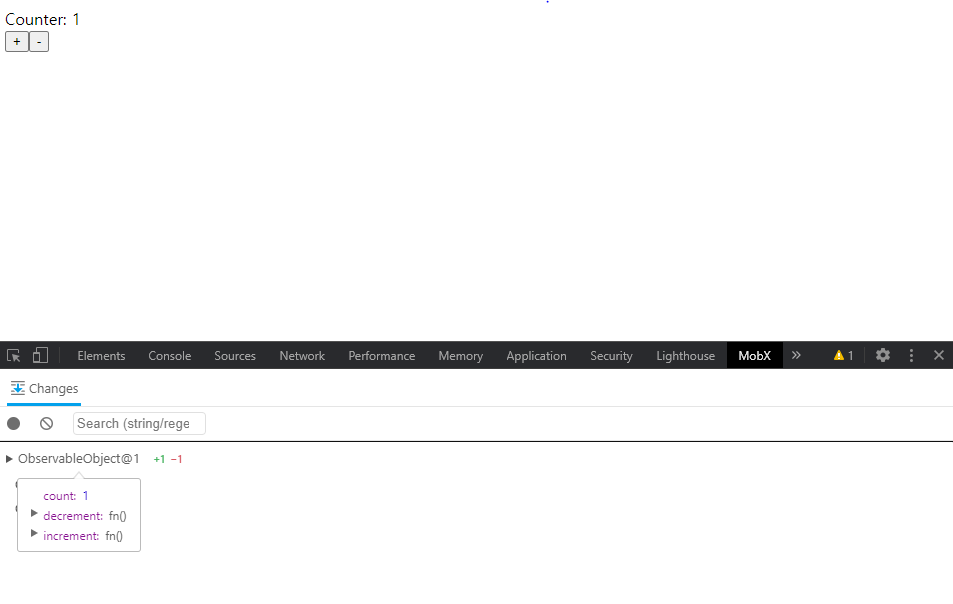

## MobX 실제로 적용해보기

```jsx
import React, { Component } from "react";

import { observable } from "mobx";
import { observer } from "mobx-react";

// @observer 데코레이터가 장착되어 있는 리액트 컴포넌트는 
// @observable로 되어 있는 모든 것들을 rendering 하는 와중에 사용한다.
@observer
class Counter extends Component {
  // @observable 은 @obsever컴포넌트에게 변화를 감시해야 하는 값을 알려준다.
  @observable count = 0;

  handleDec = () => {
    this.count--;
  };

  handleInc = () => {
    this.count++;
  };

  render() {
    return (
      <div>
        Counter: {this.count} <br />
        <button onClick={this.handleDec}>-</button>
        <button onClick={this.handleInc}>+</button>
      </div>
    );
  }
}

export default Counter;
```

https://codesandbox.io/embed/mobx-9z6dh?fontsize=14&hidenavigation=1&theme=dark


위 state를 상위 컴포넌트에서 props로 던지는 방식으로 바꿔보았다.

```jsx
import React, { Component } from "react";
import ReactDOM from "react-dom";

import { observable } from "mobx";
import { observer } from "mobx-react";

const appState = observable({
  count: 0
});

appState.increment = function () {
  this.count++;
};

appState.decrement = function () {
  this.count--;
};

@observer
class Counter extends Component {
  render() {
    return (
      <div>
        Counter: {this.props.store.count} <br />
        <button onClick={this.handleInc}>+</button>
        <button onClick={this.handleDsc}>-</button>
      </div>
    );
  }

  handleInc = () => {
    this.props.store.increment();
  };

  handleDsc = () => {
    this.props.store.decrement();
  };
}

const rootElement = document.getElementById("root");
ReactDOM.render(
  <React.StrictMode>
    <Counter store={appState} />
  </React.StrictMode>,
  rootElement
);
```



[mobx devtools](https://github.com/mobxjs/mobx-devtools)을 활용하면, state 값에 대한 디버그도 할 수 있다.

```jsx
import { observable, computed } from "mobx";
import React from "react";
import ReactDOM from "react-dom";
import { observer } from "mobx-react"; 

const t = new class Temperature {
  // 온도 단위와 온도를 추적
  @observable unit = "C";
  @observable temperatureCelsius = 25;

  @computed get temperatureKelvin() {
    console.log("calculating Kelvin");
    return this.temperatureCelsius * (9 / 5) + 32;
  }

  @computed get temperatureFahrenheit() {
    console.log("calculating Fahrenheit");
    return this.temperatureCelsius + 273.15;
  }

  // observable의 값이 바뀔 때마다, 자동으로 변경된 값을 리턴 (엑셀 처럼!)
  @computed get temperature() {
    console.log("calculating temperature");
    switch (this.unit) {
      case "K":
        return this.temperatureKelvin + "K";
      case "F":
        return this.temperatureFahrenheit + "F";
      case "C":
        return this.temperatureCelsius + "C";
      default:
        throw new Error("Unexpected unit.");
    }
  }
};

const App = observer(({ temperature }) => 
  <div>
    {temperature.temperature} <br/>
    <button onClick={() => temperature.unit = 'F'}>F</button>
    <button onClick={() => temperature.unit = 'K'}>K</button>
    <button onClick={() => temperature.unit = 'C'}>C</button>
  </div>
);

ReactDOM.render(<App temperature={t} />, document.getElementById("root"));
```

데코레이터를 사용하지 않고, 마찬가지로  `observable`만 사용해서 똑같이 구현할 수 있다.

```jsx
import { observable } from "mobx";
import React from "react";
import ReactDOM from "react-dom";
import { observer } from "mobx-react";

const t = observable({
  unit: "C",
  temperatureCelsius: 25,
  temperatureKelvin: function () {
    console.log("calculating Kelvin");
    return this.temperatureCelsius * (9 / 5) + 32;
  },
  temperatureFahrenheit: function () {
    console.log("calculating Fahrenheit");
    return this.temperatureCelsius + 273.15;
  },
  temperature: function () {
    console.log("calculating temperature");
    switch (this.unit) {
      case "K":
        return this.temperatureKelvin() + "K";
      case "F":
        return this.temperatureFahrenheit() + "F";
      case "C":
        return this.temperatureCelsius + "C";
      default:
        throw new Error("Unexpected unit.");
    }
  }
});

const App = observer(({ temperature }) => (
  <div>
    {temperature.temperature()} <br />
    <button onClick={() => (temperature.unit = "F")}>F</button>
    <button onClick={() => (temperature.unit = "K")}>K</button>
    <button onClick={() => (temperature.unit = "C")}>C</button>
  </div>
));

ReactDOM.render(<App temperature={t} />, document.getElementById("root"));
```

array도 observable이 가능하다. 다만, 이전 포스트에서 얘기 한 것처럼, 진짜 자바스크립트의 array와는 다른 측면이 있기 때문에 처리에 주의 해야 한다.

```jsx
import { observable, computed, action, asMap } from "mobx";
import React from "react";
import ReactDOM from "react-dom";
import { observer } from "mobx-react";

class Temperature {
  id = Math.random();
  // 온도 단위와 온도를 추적
  @observable unit = "C";
  @observable temperatureCelsius = 25;

  @computed get temperatureKelvin() {
    console.log("calculating Kelvin");
    return this.temperatureCelsius * (9 / 5) + 32;
  }

  @computed get temperatureFahrenheit() {
    console.log("calculating Fahrenheit");
    return this.temperatureCelsius + 273.15;
  }

  // observable의 값이 바뀔 때마다, 자동으로 변경된 값을 리턴 (엑셀 처럼!)
  @computed get temperature() {
    console.log("calculating temperature");
    switch (this.unit) {
      case "K":
        return this.temperatureKelvin + "K";
      case "F":
        return this.temperatureFahrenheit + "F";
      case "C":
        return this.temperatureCelsius + "C";
      default:
        throw new Error("Unexpected unit.");
    }
  }

  // action을 정의할 수 있다.
  @action
  setUnit(newUnit) {
    this.unit = newUnit;
  }

  @action
  setCelsius(degrees) {
    this.temperatureCelsius = degrees;
  }

  @action("update temperature and unit")
  setTemperatureAndUnit(degrees, unit) {
    this.setCelsius(degrees);
    this.setUnit(unit);
  }
}

// 일반적인 array도 가능하다.
// const temps = observable([]);
// temps.push(new Temperature());
// temps.push(new Temperature());
// temps.push(new Temperature());

// array 선언
const temps = observable.map({
  Amsterdam: new Temperature(),
  Rome: new Temperature(),
  Seoul: new Temperature()
});

console.log(temps.entries());

const App = observer(({ temperatures }) => (
  <div>
   {* 진짜 javascript array와는 다르기 때문에 처리에 유의해야 한다. *}
   {* 참고: https://mobx.js.org/refguide/map.html *}
    {[...temperatures.entries()].map(([city, t]) => (
      <div key={t.id}>
        <div>
          ({city}) =&gt; {t.temperature}
        </div>
        <button onClick={() => t.setUnit("F")}>F</button>
        <button onClick={() => t.setUnit("K")}>K</button>
        <button onClick={() => t.setUnit("C")}>C</button>
      </div>
    ))}
  </div>
));

ReactDOM.render(<App temperatures={temps} />, document.getElementById("root"));
```