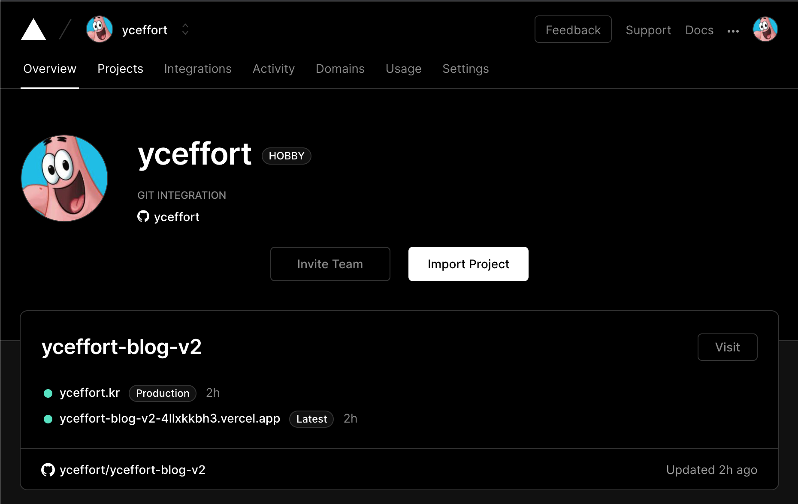
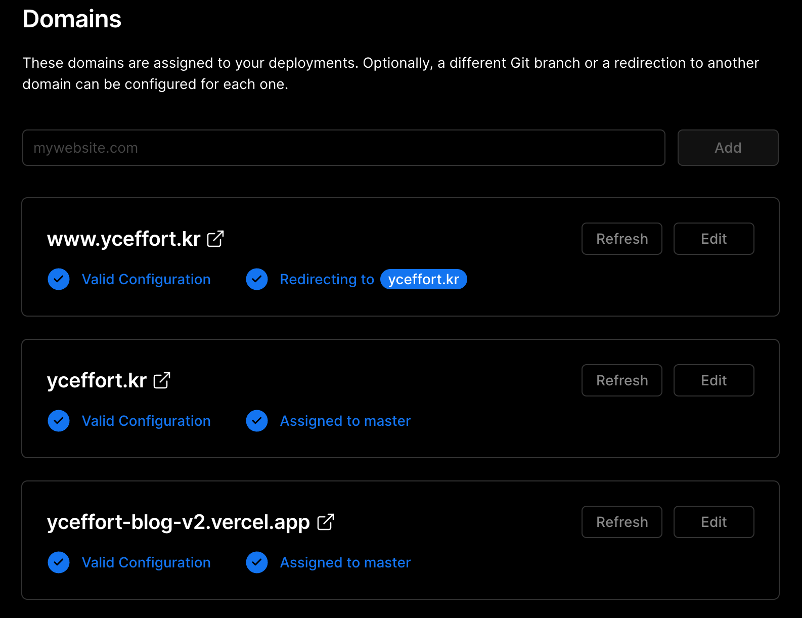
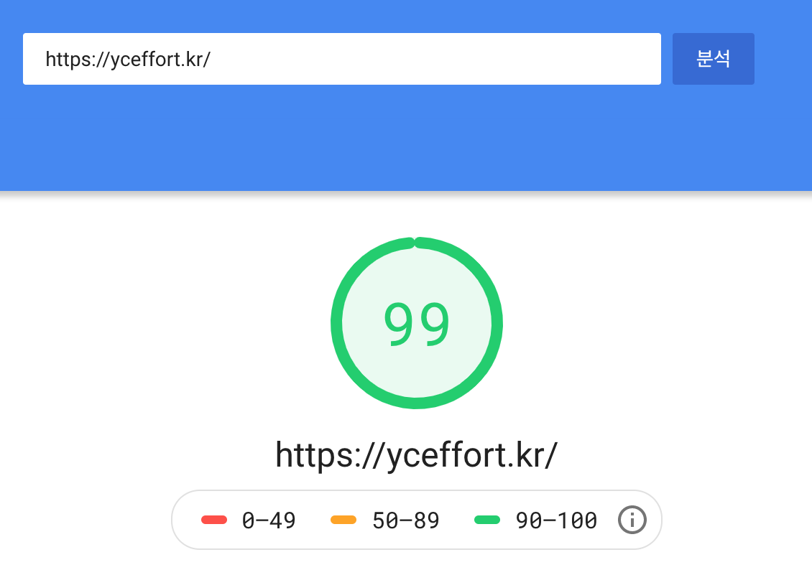
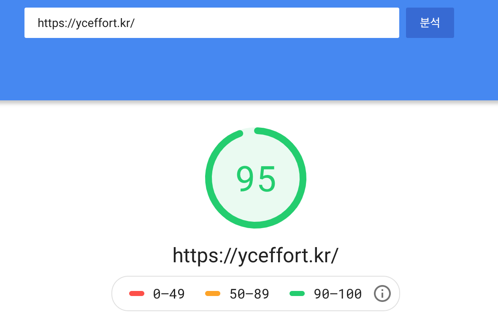
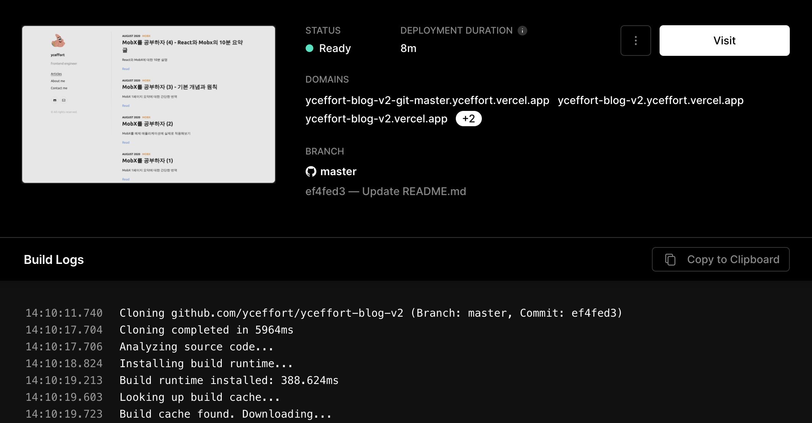

블로그를 업데이트 했다. 업데이트를 하게 되면서 배운 점과 개선해 나가야할 점들에 대해서 간단히 요약해 본다.

```toc
tight: true,
from-heading: 2
to-heading: 3
```

## 시작

원래는 https://developer-diary.netlify.app/ 이 블로그를 커스터마이징해서 쓰고 있었다. 고를 때만 해도 꽤 괜찮아서 잘 쓰고 있었는데, 걔속 사용하다 보니 몇가지가 걸렸다. 제목과 부제목 사이의 간격이라던가, Tech Topics 아이콘 수집, 그리고 사이드 바의 간격 등... 몇가지를 계속해서 커스터마이징 하다보니 땜질식의 처방이 되고 있었고, 더 이상 무엇을 더 이쁘게 만들어야 할지 모르겠다는 생각에 까지 이르게 되자, 결국에는 모든 것을 갈아 엎고 새로 만들자는 생각에 이르게 되었다. 

## 시작

### 1. 테마 선택

1. 최대한 깔끔해서 더 이상 손댈 것이 없을 것
2. 페이징을 지원할 것
3. SEO를 어느정도 지원할 것

그래서 선택한 블로그는 https://lumen-v2.netlify.app/ 다.

### 2. Github repository 이사

사실상 markdown 블로그 내용을 제외하고는 모든 것이 바뀌기 때문에, 기존 Repository를 archived 시키고, 새로운 Repository로 이동했다.

- 기존: https://github.com/yceffort/yceffort-blog
- 신규: https://github.com/yceffort/yceffort-blog-v2

### 3. FrontMatter 일괄 업데이트

frontmatter는 특정 페이지에만 쓰이는 변수를 최상단에 선언해 둔 것을 의미한다.

https://github.com/yceffort/yceffort-blog-v2/blob/master/content/posts/articles/2020/08/mobx-study-4.md

```yaml
---
title: MobX를 공부하자 (4) - React와 Mobx의 10분 요약 글
tags:
  - javascript, MobX
published: true
date: 2020-08-30 19:27:22
description: "React와 MobX에 대한 10분 설명"
category: MobX
template: post
---
```

위의 내용이 frontmatter를 의미한다. 기존에는 frontmatter가 몇개 쓰이는 것 없이 깔끔했는데, 이 테마에는 제법 쓰이는 것이 많았다. 아래는 frontmatter에 대한 변경사항이다.

- tags, category등은 기존의 tags를 기준으로 사용하게 두었다.
- published: true 는 draft: false 와 동일하게 동작하도록 수정했다.
- slug는 기존 주소와 호환성을 위해 `/:year/:month/:file-name` 을 유지하도록 했다. slug가 없을 경우 디렉토리 구조에 따라서 파일명을 이전과 같이 설정한다.

frontmatter 에디팅을 위해서 nodejs로 .md 파일을 모두 읽어서 사용했으며, `fs`외에는 별도의 라이브러리를 사용하지 않았습니다. 파일을 line by line 으로 읽어서 `---` 내부의 내용을 읽어 왔다. 

### 4. 이미지 경로 업데이트

과거 이미지들의 경우 이상하게 path설정을 해두거나, `static` 폴더에 두는 등 일관적이지 못한 문제가 있었는데, 이러한 문제를 수정했다. `` 로 되어 있는 모든 파일을 읽어와서, 적절한 경로로 이미지로 이동하고, path를 수정했다.

### 5. 기타 블로그 커스터 마이징

블로그의 내용 일부를 커스터마이징했다. (리트윗 기능 제거, 일부 string 변경 등)

### 6. github action으로 CI 단계 추가

CI단계를 추가해서 배포전에 기본적인 코드 검사를 할 수 있도록 했다. https://github.com/yceffort/yceffort-blog-v2/blob/master/.github/workflows/ci.yaml 기본적인 빌드 뿐만 아니라, 다음 포스팅에서 언급할 `eslint-config-yceffort`를 활용해서 `lint`와 `prettier`도 동시에 체크한다.

### 7. heroku에서 vercel로

과거 블로그 서빙을 위해서 heroku를 사용했다. 사이트가 점차 비대해지면서 무료 버전으로 감당이 안되기 시작했고, 이에 `production` 버전으로 업그레이드 해서 매달 25달러 씩 주고 유지했다. https://www.heroku.com/pricing

최근 vercel을 눈여겨보면서 (nextjs 덕분!) vercel로 갈아타기로 결심 했고, 이 기회에 [vercel](https://vercel.com/)로 이주했다.



#### 장점

- netlify처럼 CD 기능 지원이 뛰어나다. 매 PR 마다 배포를 자동으로 해줘서 ([이런 느낌](https://yceffort-blog-v2-4llxkkbh3.vercel.app/)) https://github.com/yceffort/yceffort-blog-v2/pull/27 실제 머지 전에 상태를 확인할 수 있다.
- 개인 유저는 무조건 공짜다. 팀 단위 프로젝트 관리를 위해서는 돈을 지불해야 하는데, 어차피 개인 블로그 이므로 해당이 없다.
- 인터페이스가 깔끔하다.
- 기능에 군더더기가 없다. (장점일 수도 단점일 수도. heroku는 DB 등 다양한 addons을 붙일 수 있다.)

무엇보다도 다크모드를 지원한다는 점(...?)과 인터페이스가 깔끔하다는 것이 마음에 들었다. 도메인 설정도 아래 그림처럼 깔끔하게 할 수 있었다.



## 결과

미니멀한 블로그를 만든 결과, 굉장히 만족 스러웠고, 당연하게도 google page speed insights 에서도 좋은 점수를 받을 수 있었다.

https://developers.google.com/speed/pagespeed/insights/?hl=ko&url=yceffort.kr





그리고 모바일에서 사용성이 굉장히 좋아졌다. 검색 등 이것저것 기능이 붙어있어서 좀 어지러운 감이 있었는데, 이전보다 훨씬 깔끔해졌다.

## 아쉬웠던 점

### 굉장히 느린 빌드 타임 

빌드가 굉장히 느려졌다.



기본적으로 블로그 글이 많은 것도 있지만, 빌드 하면서 gatsby에서 이것저것 수행하는 것이 많아졌다. `mathjax`지원을 위한 처리, 이미지 preview 생성 등 기본적으로 마크다운을 html로 바꾸는 과정에서 처리하는 작업 외에도 거치는 작업이 너무 많아졌다. 또한 추가/수정한 글만 생성하는 것이 아니라, 모든 글을 새로 다시 만들기 때문에 굉장히 느려질 수 밖에 없다. 빌드가 느려졌다는 것은 곧 dev로 개발하는 것도 엄청나게 느려졌다는 것을 의미하며, 내 맥북 에어에서 dev로 개발하기 위해서는 10분 넘게 빌드를 돌려야 한다. (ㅠㅠ) 이는 visual studio codespace를 사용하는 계기가 되기도 했다.

이를 해결할 수 있는 방법이 몇가지 떠오르긴 하지만, 다시 이직하게 되다면 그 때 처리하도록 하겠다. (....)

### Prettier 미적용

markdown에 pretter를 적용하고 싶었는데, mathjax 를 위해 사용한 문법 `$$...$$` , 즉 `$`를 모두 `\$`로 바꾸는, 이스케이프 처리해버리는 문제가 발생했다. 당연히 mathjax가 죄다 박살나 버렸고, 얼른 revert했다.

### mathjax error 에러

```
14:11:12.944  	error CHTML - Unknown character: U+BE14 in MathJax_Main,MathJax_Size1,MathJax_AMS
14:11:12.945  	error CHTML - Unknown character: U+B85D in MathJax_Main,MathJax_Size1,MathJax_AMS
14:11:12.946  	error CHTML - Unknown character: U+B2F9 in MathJax_Main,MathJax_Size1,MathJax_AMS
14:11:12.947  	error CHTML - Unknown character: U+C791 in MathJax_Main,MathJax_Size1,MathJax_AMS
14:11:12.948  	error CHTML - Unknown character: U+C5C5 in MathJax_Main,MathJax_Size1,MathJax_AMS
14:11:12.948  	error CHTML - Unknown character: U+C99D in MathJax_Main,MathJax_Size1,MathJax_AMS
```

`$$...$$`로 대변되는 mathjax syntax안에 내가 한글을 넣어놨나보다. 이 한글을 찾아내서 모두 없애야 빌드 타임에 비명을 지르지 않을텐데, 귀찮아서 아직 수정하지 못하고 있다. (ㅠㅠ)

### 리다이렉트 누락

내 글을 블로그에서 검색하면, https://www.yceffort.kr 로 대부분이 검색이 되는데, https://yceffort.kr만 설정해두고, https://www.yceffort.kr를 https://yceffort.kr로 리다이렉트 해주는 처리를 누락해서 2주간 구글 검색 실적이 박살났다. (...) 다행히 2주뒤에 복구 해두었지만, 박살난 실적이 되돌아 오려면 꽤 오랜 시간이 걸릴 것 같다.

### yceffort.github.io

몇몇 블로그나 위키에 yceffort.github.io 로 걸린 포스팅이 보이는데, 이 주소는 현재 동작하고 있지 않다 ㅠㅠ 따라서 yceffort.github.io 블로그를 다시 살려서 현재 동작하는 웹페이지로 리다이렉트 시키는 작업을 검토 중이다.

## 결론

일주일에 걸쳐 블로그 이사작업을 마쳤고, 심각한 버그 없이 대부분의 작업을 완료 했다. 아직 몇몇 작업들이 남아있고 이들을 [이슈업](https://github.com/yceffort/yceffort-blog-v2/issues)해서 차근차근 관리하도록 하겠다. 그리고 앞으로 이런식의 대형 작업은 더 이상 없었으면 좋겠다................