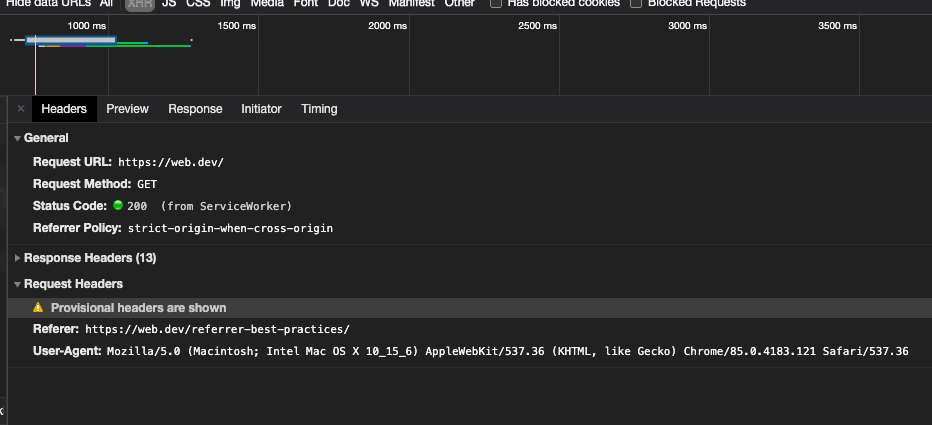

```toc
tight: true,
from-heading: 2
to-heading: 3
```

## same-site와 same-origin의 차이

### Origin

https://yceffort.kr:443

- `origin`: 은 `scheme` (`protocol`로도 알려진)와 `host name`, 그리고 `port`의 조합을 의미한다. 예를 들어 https://yceffort.kr:443/2020/07/docker-study-2/ 의 origin은 https://yceffort.kr:443 이다.
- `scheme`: `https://`
- `host name`: `yceffort.kr`
- `port`: 443

https://yceffort.kr:443 를 기준으로 비교했을 때,

| Origin                       | 비교결과       | 이유                                                   |
| ---------------------------- | -------------- | ------------------------------------------------------ |
| https://fake.kr:443          | `cross-origin` | 도메인이 다르다.                                       |
| https://www.yceffort.kr:443  | `cross-origin` | 서브도메인이 다르다.                                   |
| https://blog.yceffort.kr:443 | `cross-origin` | 서브도메인이 다르다.                                   |
| http://yceffort.kr:443       | `cross-origin` | scheme이 다르다.                                       |
| http://yceffort.kr:80        | `cross-origin` | port가 다르다.                                         |
| https://yceffort.kr:443      | `same-origin`  | 완전히 같다.                                           |
| https://yceffort.kr          | `same-origin`  | 포트가 없지만, https의 기본포트 443이 있다고 간주한다. |

### Site

탑 레벨 도메인 (TLD), 즉 `.com`과 `.org`등은 [Root Zone Database](https://www.iana.org/domains/root/db)에 등록되어 있다. 내 블로그 주소를 기준으로, `site`는 TLD와 domain의 조합이다. 따라서 내 블로그의 `site`는 `yceffort.kr`이다.

그러나, `.co.kr`이나 `.github.io`와 같은 주소도 더러 있는 것을 볼 수 있다. 이들의 TLD는 `.kr` `.io`인데, 단순히 TLD만으로 이들의 도메인을 결정할 수 있는 방법이 없다. 그래서 `eTLD` (effective Top Level Domain) 리스트가 만들어졌다. [eTLD](https://publicsuffix.org/list/)

예를 들어, 내 구 블로그 주소인 https://yceffort.github.io 를 기준으로 살펴보자.

- `TLD`: `.io`
- `eTLD`: `.github.io`
- `eTLD+1`: `yceffort.github.io` (site)

https://yceffort.kr:443 를 기준으로 비교했을 때,

| Origin                       | 비교결과     | 이유                            |
| ---------------------------- | ------------ | ------------------------------- |
| https://fake.kr:443          | `cross-site` | 도메인이 다르다.                |
| https://blog.yceffort.kr:443 | `same-site`  | 서브도메인이 다르지만 상관없다. |
| http://yceffort.kr:443       | `same-site`  | scheme이 다르지만 상관없다.     |
| https://yceffort.kr:80       | `same-site`  | port가 다르지만 상관없다.       |
| https://yceffort.kr:443      | `same-site`  | 완전히 같다.                    |
| https://yceffort.kr          | `same-site`  | port가 없지만 상관없다.         |

위에서 보다시피 `same-site`는 scheme를 무시하고 있지만, http의 취약점을 방어하기 위해 조금 더 엄격한 방식으로 구별하는 방식이 있다. 이를 [schemeful same-site](https://github.com/sbingler/schemeful-same-site/)라고 한다. 이 경우 http://yceffort.kr과 https://yceffort.kr 는 스키마가 다르므로 다른 사이트로 취급한다.

| Origin                       | 비교결과              | 이유                            |
| ---------------------------- | --------------------- | ------------------------------- |
| https://fake.kr:443          | `cross-site`          | 도메인이 다르다.                |
| https://blog.yceffort.kr:443 | `schemeful-same-site` | 서브도메인이 다르지만 상관없다. |
| http://yceffort.kr:443       | `cross-site`          | scheme이 다르다.                |
| https://yceffort.kr:80       | `schemeful-same-site` | port가 다르지만 상관없다.       |
| https://yceffort.kr:443      | `same-site`           | 완전히 같다.                    |
| https://yceffort.kr          | `schemeful-same-site` | port가 없지만 상관없다.         |

## Referer와 Referrer-Policy 101

> 맨 처음 포스팅을 할 때 이상하다고 느낀 것은 Referer와 Referrer-policy에서 Referrer의 스펠링이 다른 것이었다. (틀리다고 계속 에러메시지가 떴다.) 알고보니 오타가 고대로 스펙이 되버린 것이었다.

> The misspelling of referrer originated in the original proposal by computer scientist Phillip Hallam-Baker to incorporate the field into the HTTP specification.[4] The misspelling was set in stone by the time of its incorporation into the Request for Comments standards document RFC 1945; document co-author Roy Fielding has remarked that neither "referrer" nor the misspelling "referer" were recognized by the standard Unix spell checker of the period.[5] "Referer" has since become a widely used spelling in the industry when discussing HTTP referrers; usage of the misspelling is not universal, though, as the correct spelling "referrer" is used in some web specifications such as the Document Object Model.

https://en.wikipedia.org/wiki/HTTP_referer

http 요청은 옵셔널 헤더인 [Referer](https://developer.mozilla.org/en-US/docs/Web/HTTP/Headers/Referer)를 가지고 있을 수 있다. 이 정보는 이 요청이 만들어진 origin 또는 웹페이지 URL을 가리킨다. [Referrer-Policy](https://developer.mozilla.org/en-US/docs/Web/HTTP/Headers/Referrer-Policy)헤더는 요청과 함께 얼마나 많은 레퍼럴 정보를 포함해야 하는지 알려준다.

아래 예제를 보자.


`Referer` 헤더에 해당 정보를 요청한 사이트의 전체 주소가 담겨져 있다.

`Referer` 헤더는 다양한 형태의 요청에 존재할 수 있는데, 예를 들어

- 사용자가 링크를 클릭하는 네비게이션 링크
- 브라우저가 이미지, iframe, script 등 페이지에 필요한 리소스를 요청하는 subresource 요청

가 있다. 네비게이션과 `iframe`의 경우, 자바스크립트의 `document.referrer`를 이용해서도 동일한 정보에 접근할 수 있다.

`Referer`는 꽤나 유용한 정보가 될 수 있다. 옐르 들어, `site-two.example`의 사용자중 50%는 `social-network.example`에서 왔다는 것을 파악할 수 있다.

그러나, query와 path를 포함한 전체 주소를 `Referer`를 통해서 다른 origin에 보내는 것은, 보안 상에서 문제가 될 수 있다. 아래의 예를 살펴보자.


1번과 5번 예제에서 볼 수 있다시피 이 사이트에 온 사람이 누구인지 식별할 수도 있게 되어 버린다. 6번의 경우에는 극단적이지만 끔찍한 예제이다. 💀

따라서, 사이트의 요청에 사용할 수 있는 `referer` 데이터를 제한하기 위해서 사용하는 것이 `Referrer-Policy`이다.

## 어떠한 것들이 가능하고, 차이는 무엇일까?

가능한 정책은 총 8가지다. 정책에 따라서, `Referer`의 데이터는

- 데이터가 없다. (`Referer` 헤더가 없을 경우)
- `origin`만 존재하는 경우: https://yceffort.kr
- URL 전체: https://yceffort.kr/2020/07/docker-study-2/

일부 정책의 경우 context에 따라서 다르게 작동하도록 동작 되어있다. (cross-origin, same-origin request, security) 이는 사이트 내에서 Referer를 유지하면서, 동시에 다른 origin에서는 정보를 제한하는데 있어서 유용하다.

|                                   | No Data        | Origin Only                                | Full URL                   |
| --------------------------------- | -------------- | ------------------------------------------ | -------------------------- |
| `no-referrer`                     | ✔              |                                            |                            |
| `origin`                          |                | ✔                                          |                            |
| `unsafe-url`                      |                |                                            | ✔                          |
| `strict-origin`                   | HTTPS → HTTP   | HTTPS → HTTPS, HTTP → HTTP                 |                            |
| `no-referrer-when-downgrade`      | HTTPS → HTTP   |                                            | HTTPS → HTTPS, HTTP → HTTP |
| `origin-when-cross-origin`        |                | `cross-origin`                             | `same-origin`              |
| `same-origin`                     | `cross-origin` |                                            | `same-origin`              |
| `strict-origin-when-cross-origin` | HTTPS → HTTP   | `cross-origin`, HTTPS → HTTPS, HTTP → HTTP |                            |

실제 예제 까지 보고 싶다면 [여기](https://developer.mozilla.org/en-US/docs/Web/HTTP/Headers/Referrer-Policy#Examples)를 참고

- scheme를 보는 모든 정책 (`strict-origin` `no-referrer-when-downgrade` `strict-origin-when-cross-origin`)의 경우에, HTTP가 실제로 더 보안에 취약함에도 불구하고, HTTP origin에서 다른 HTTP origin으로 가는 것을 HTTPS origin에서 다른 HTTPS origin으로 가는 것과 동일하게 취급한다. (= HTTP와 HTTPS에 대해 차이를 두고 있지 않다.) 이러한 정책의 경우 중요한 것은, 보안 다운그레이드가 발생하는지 여부, 즉 암호화된 원본에서 암호화되지 않은 원본으로 데이터를 노출할 수 있는지 여부이다. HTTP에서 HTTP는 암호화가 없어서 다운그레이드 되지 않는다. 다만 HTTPS에서 HTTP는 다운그레이드가 나타난다. (암호화가 된 것에서 암호화가 안된 것으로 가므로)

- 요청이 `same-origin`이라면, 이 뜻은 scheme (HTTS, HTTP)가 같다느 ㄴ뜻이다. 따라서 보안에서 다운그레이드가 이루어지지 않는다.

## 브라우저별 표준

만약 `referrer-policy`가 설정되어 있지 않다면, 브라우저 기본 정책이 적용된다.

| 브라우저 | 기본 정책                                                                               |
| -------- | --------------------------------------------------------------------------------------- |
| Chrome   | 85 버전부터 `no-referrer-when-downgrade`에서 `strict-origin-when-cross-origin`으로 변경 |
| Firefox  | `no-referrer-when-downgrade`, 시크릿 모드에서는 `strict-origin-when-cross-origin`       |
| Edge     | `no-referrer-when-downgrade`                                                            |
| Safari   | `strict-origin-when-cross-origin`와 비슷하게 동작                                       |

## referrer policy 설정하는 올바른 방법

사이트에 referrer policy를 설정하는 방법은 여러가지가 있다.

- http header
- [HTML](https://developer.mozilla.org/en-US/docs/Web/HTTP/Headers/Referrer-Policy#Integration_with_HTML)
- [Javascript](https://javascript.info/fetch-api#referrer-referrerpolicy)

페이지마다, 요청마다 다른 정책을 쓸 수 있다는 것을 의미한다. HTTP header와 meta 엘리먼트는 모두 페이지 레벨에서 동작한다. 유효 정책을 정하는 순위는 아래와 같다.

- element 레벨
- page 레벨
- 브라우저 기본값

### 예제

```html
<meta name="referrer" content="strict-origin-when-cross-origin" />

```

이 경우 이미지는 `no-referrer-when-downgrade` 정책으로 가게 된다.

### referrer policy를 보는 법

브라우저의 네트워크 탭을 보면 된다.



## 어떤 정책이 좋을까?

요약: 명시적으로 보안이 강화된 `strict-origin-when-cross-origin`를 사용하는 것이 좋다.

### 왜 명시적으로 써야 할까?

referrer policy가 제공되지 않는다면, 브라우저 기본 정책이 사용된다. 사실, 많은 웹사이트 들이 이러한 정책을 브라우저 기본값에 의존하는데 이는 좋지 않다. 그 이유는

- 브라우저 모드 (시크릿모드 같이)에 따라서 `no-referrer-when-downgrade`이거나 `strict-origin-when-cross-origin`일 수 있는데, 이는 웹사이트에서 일관된 동작을 하지 못하도록 막는다.
- 브라우저의 기본값인 `strict-origin-when-cross-origin`는 cross-origin 요청에 대해서 referrer를 trimming하는 기능으르 가지고 있다. (파이어폭스, 사파리의 경우에만 그렇다. [여기]([Referrer trimming](https://github.com/privacycg/proposals/issues/13))를 참조) 명시적으로 정책을 선언해서 이러한 행위를 막을 수 있다.

### 왜 `strict-origin-when-cross-origin`인가?

- 안전하다: 웹사이트가 https 일 경우, https 가 아닌 요청에 대해서 웹사이트 주소를 노출하고 싶지 않을 것이다. 만약 누구라도 네트워크에서 이런 정보를 본다면, 유저의 정보가 [중간자 공격](https://ko.wikipedia.org/wiki/%EC%A4%91%EA%B0%84%EC%9E%90_%EA%B3%B5%EA%B2%A9) 의 위험에 노출되게 한다. `no-referrer-when-downgrade` `strict-origin-when-cross-origin` `no-referrer` `strict-origin`로 막을 수 있다.
- 개인정보 보안: cross-origin 요청의 경우, `no-referrer-when-downgrade`는 모든 주소를 노출시킨다. `strict-origin-when-cross-origin`와 `strict-origin`은 `origin`만 공유하고, `no-referrer`의 경우에는 아무정보도 안나타나게 된다.
- 용이하다: `no-referrer`와 `strict-origin`은 절대로 전체 URL을 공유하지 않는다. 근데 문제는 `same-orgin`일 때도 공유를 안한다는 것. 이를 피하기 위해서는 `strict-origin-when-cross-origin`를 쓰면 된다.

따라서 모든 경우에 있어서 `strict-origin-when-cross-origin`가 가장 최선의 선택이라고 볼 수 있다.

```html
<meta name="referrer" content="strict-origin-when-cross-origin" />
```

혹은 서버사이드에서

```javascript
const helmet = require('helmet')
app.use(helmet.referrerPolicy({ policy: 'strict-origin-when-cross-origin' }))
```

### 만약 예외가 필요하다면

별도로 element 나 요청별로 예외를 두는 것이 좋다. 그럼에도, `unsafe-url` 같은 건 안쓰는게 좋다.

```html
<meta name="referrer" content="strict-origin-when-cross-origin" />

```

```javascript
fetch(url, { referrerPolicy: 'no-referrer-when-downgrade' })
```

> element 별로 정책을 주는 것도 모든 브라우저에서 되는 것은 아니다. [참고](https://caniuse.com/?search=referrerpolicy)

## 외부에서 오는 요청에 referrer를 활용하는 법

### Cross Ste Request Forgery (CSRF) 보호

CSRF 방어를 위해서 referrer를 쓰는 것은 몇가지 허점이 있다.

- `no-referrer`나 request를 도용하는 경우 아무런 데이터를 볼 수 없을 수 있다. 요청의 헤더에 대한 제어를 하고 있지 못한다면, 요청에 안전한 헤더가 온다는 보장이 없다.
- `Referer` (`document.referer`) 에는 원하는 것 (단순히 cross-origin만 알고 싶었는데..) 보다 더 많은 양의 데이터가 들어 있을 수 있다.

CSRF 방어를 위해서는 [CSRF Token](https://cheatsheetseries.owasp.org/cheatsheets/Cross-Site_Request_Forgery_Prevention_Cheat_Sheet.html#token-based-mitigation)을 사용하는 것을 추천한다.

### 로깅

`Referer`에는 개인정보가 담겨 있을 수 있으므로, 다루는데 신중해야 한다. `Referer`를 사용하는 대신에, [Origin](https://developer.mozilla.org/en-US/docs/Web/HTTP/Headers/Origin)이나 [Sec-Fetch-Site](https://developer.mozilla.org/en-US/docs/Web/HTTP/Headers/Sec-Fetch-Site)를 써보는 것도 좋다.

> `sec-fetch-site`는 지원이 제한적이므로, `origin`을 쓰는게 낫다.

### 결제

결제 사업자는 보안 체크를 위해, 들어오는 요청에 대해서 `Referer`를 확인할 수도 있다. 예를 들어

- 유저가 online-shop.example/cart/checkout 에서 결제 버튼을 누른다.
- online-shop.example 가 결제를 위해 payment-provider.example로 리다이렉트 시킨다.
- payment-provider.example가 `Referer`를 확인하여 허가된 사이트로 부터 온 요청인지 확인한다. 그렇지 않다면, 결제 요청을 거부한다.

#### 결제 플로우에서 보안 체크

결제사업자가 `Referer`를 체크하는 것은 기본적인 방어 체계가 될 수 있다. 그러나 반드시, 또 다른 방어체계를 마련해 두어야 한다.

`Referer`만으로는 모든 것을 막기에 완벽하지 않다. 만약 결제 사이트에서 `no-referrer`를 설정해 두었다면, 해당 정보를 확인할 수 없다. 그러나, 결제 제공 사업자로서, 일단 `Referer`를 본다면 해당 정보가 있는지 없는지 정도 수준의 기본적인 체크는 할수가 있다.

- `Referer`가 언제나 있을 거라고 기대하지마라. 설령 존재한다 하더라도, 이는 아주 기초적인 점검 항목중 하나인 `origin`만 살펴볼 수 있다. `Referer` 허용 값을 작성할때, origin만 있도록 하는 것이 중요하다. 즉, `online-shop.example/cart/checkout`가 아닌 `online-shop.example`여야 한다는 것이다. 이는 결제 사이트에 따라서 정책이 다르게 설계 될 수 있으므로 (=꼭 FULL URL이 온다는 보장은 없으므로) 반드시 origin만 확인해야 한다.
- 만약 `Referer`가 없거나, 기본적인 점검이 통과했을 경우, 아래의 추가적인 항목으로 검사를 시도해야 한다.

#### 더 안전한 방법

한 가지 신뢰할 수 있는 검증 방법은 요청자가 요청한 매개변수를 고유한 키와 함께 해시하여 보내도록 하는 것이다. 결제 제공자로서 이 해시 값을 검사할 수 있고 이 값이 일치하는 요청에 대해서만 받으면 된다.
