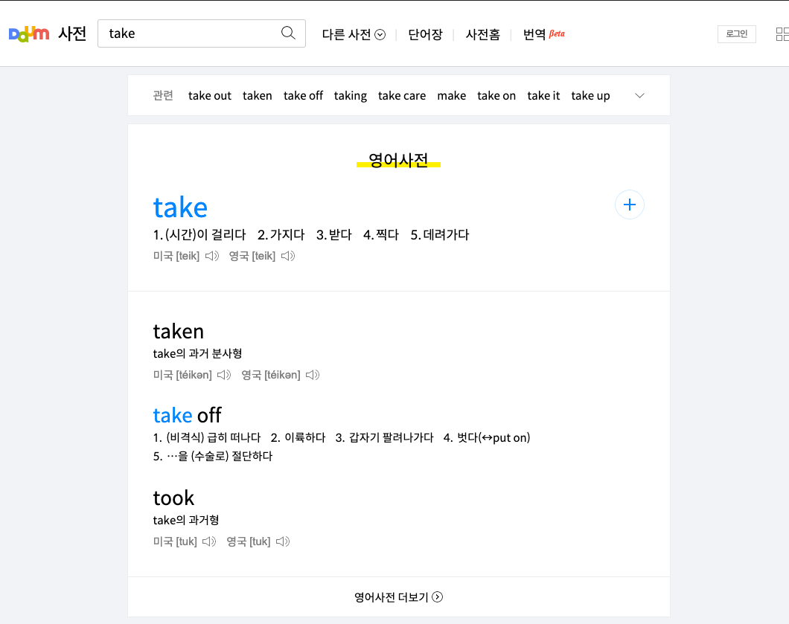

## 1. 검색

먼저 다음 사전에서 검색을 해보자.

https://dic.daum.net/search.do?q=take

주소는 굉장히 명확하다. `q={word}` 형식으로 내가 원하는 단어를 검색할 수 있다.



다음 사전에서는 가장 검색어와 일치하는 단어, 그리고 최적의 결과를 맨 위에 보여준다. 따라서 가장 최상단에 있는 결과를 가져오면 될 것이다.

## 2. HTML 구조 살펴보기

```html
<div class="card_word" data-tiara-layer="word eng">
  <div class="wrap_tit">
    <h4 class="tit_word">영어사전</h4>
  </div>

  <div class="search_box" data-tiara-layer="box">
    <strong class="screen_out">주요 검색어</strong>
    <div class="cleanword_type kuek_type">
      <div class="search_cleanword">
        <strong class="tit_cleansch" data-tiara-id="ekw000165573">
          <a
            href="/word/view.do?wordid=ekw000165573"
            class="txt_cleansch"
            data-tiara-action-name="표제어 클릭"
            ><span class="txt_emph1">take</span></a
          >
        </strong>

        <a
          href="#none"
          name="goDaumLogin"
          data-dic="en"
          data-wordid="ekw000165573"
          data-wordbooktype="endic"
          class="btn_wordbook btn_save"
          ><span class="img_comm">단어장 저장</span></a
        >
        <a
          href="#none"
          name="addedToWordbook"
          data-wordid="ekw000165573"
          data-wordbookid=""
          data-wordbooktype="endic"
          class="btn_wordbook btn_save_on"
          style="display:none"
          ><span class="img_comm">완료</span></a
        >
      </div>
      <ul class="list_search">
        <li>
          <span class="num_search">1.</span
          ><span class="txt_search"
            >(<daum:word id="kew000044406">시간</daum:word>)<daum:word
              id="kew000057612"
              >이</daum:word
            >
            <daum:word id="kew000003279">걸리다</daum:word></span
          >
        </li>
        <li>
          <span class="num_search">2.</span
          ><span class="txt_search"
            ><daum:word id="kew000000776">가지다</daum:word></span
          >
        </li>
        <li>
          <span class="num_search">3.</span
          ><span class="txt_search"
            ><daum:word id="kew000029093">받다</daum:word></span
          >
        </li>
        <li>
          <span class="num_search">4.</span
          ><span class="txt_search"
            ><daum:word id="kew000069541">찍다</daum:word></span
          >
        </li>
        <li>
          <span class="num_search">5.</span
          ><span class="txt_search"
            ><daum:word id="kew000018535">데려가다</daum:word></span
          >
        </li>
      </ul>
      <div class="wrap_listen">
        <span class="desc_listen">
          미국 <span class="txt_pronounce">[teik]</span>
          <a
            href="http://t1.daumcdn.net/language/4F711B870374920252"
            data-audio=""
            data-url="http://t1.daumcdn.net/language/4F711B870374920252"
            data-count="2"
            data-toggle-class="btn_voice_on"
            class="btn_voice btn_listen"
          >
            <span class="img_comm ico_voice">듣기</span>
          </a>
        </span>
        <span class="desc_listen">
          영국 <span class="txt_pronounce">[teik]</span>
          <a
            href="http://t1.daumcdn.net/language/4F7141E60648140282"
            data-audio=""
            data-url="http://t1.daumcdn.net/language/4F7141E60648140282"
            data-count="2"
            data-toggle-class="btn_voice_on"
            class="btn_voice btn_listen"
          >
            <span class="img_comm ico_voice">듣기</span>
          </a>
        </span>
      </div>
    </div>
  </div>

  <div name="searchWords" class="search_box" data-initamount="3">
    <div name="searchItem" class="search_type kuek_type">
      <div class="search_word">
        <strong
          class="tit_searchword"
          data-tiara-id="ekw000165614_eku001479556"
        >
          <a
            href="/word/view.do?wordid=ekw000165614&amp;supid=eku001479556"
            class="txt_searchword"
            data-tiara-action-name="표제어 클릭"
            >taken</a
          >
        </strong>
      </div>
      <ul class="list_search">
        <li>
          <span class="txt_search"
            ><daum:word id="ekw000165573">take</daum:word
            ><daum:word id="kew000057346">의</daum:word>
            <daum:word id="kew000006957">과거</daum:word>
            <daum:word id="kew000034167">분사형</daum:word></span
          >
        </li>
      </ul>
      <div class="wrap_listen">
        <span class="desc_listen">
          미국
          <span class="txt_pronounce">[téik<daum:pron>ə</daum:pron>n]</span>
          <a
            href="http://t1.daumcdn.net/language/4F711B880479C501F3"
            data-audio=""
            data-url="http://t1.daumcdn.net/language/4F711B880479C501F3"
            data-count="2"
            data-toggle-class="btn_voice_on"
            class="btn_voice btn_listen"
          >
            <span class="img_comm ico_voice">듣기</span>
          </a>
        </span>
        <span class="desc_listen">
          영국
          <span class="txt_pronounce">[téik<daum:pron>ə</daum:pron>n]</span>
          <a
            href="http://t1.daumcdn.net/language/4F7141E70515EB0038"
            data-audio=""
            data-url="http://t1.daumcdn.net/language/4F7141E70515EB0038"
            data-count="2"
            data-toggle-class="btn_voice_on"
            class="btn_voice btn_listen"
          >
            <span class="img_comm ico_voice">듣기</span>
          </a>
        </span>
      </div>
    </div>
    <div name="searchItem" class="search_type kuek_type">
      <div class="search_word">
        <strong
          class="tit_searchword"
          data-tiara-id="ekw000165591_eku010011868"
        >
          <a
            href="/word/view.do?wordid=ekw000165591&amp;supid=eku010011868"
            class="txt_searchword"
            data-tiara-action-name="표제어 클릭"
            ><span class="txt_emph1">take</span> off</a
          >
        </strong>
      </div>
      <ul class="list_search">
        <li>
          <span class="num_search">1. </span
          ><span class="txt_search"
            >(<daum:word id="kew000034917">비</daum:word
            ><daum:word id="kew000003671">격식</daum:word>)
            <daum:word id="kew000011090">급히</daum:word>
            <daum:word id="kew000021323">떠나다</daum:word></span
          >
        </li>
        <li>
          <span class="num_search">2. </span
          ><span class="txt_search"
            ><daum:word id="kew000093332">이륙하다</daum:word></span
          >
        </li>
        <li>
          <span class="num_search">3. </span
          ><span class="txt_search"
            ><daum:word id="kew000001818">갑자기</daum:word>
            <daum:word id="kkw000275349">팔려</daum:word
            ><daum:word id="kew000012825">나가다</daum:word></span
          >
        </li>
        <li>
          <span class="num_search">4. </span
          ><span class="txt_search"
            ><daum:word id="kew000031414">벗다</daum:word>(↔<daum:word
              id="ekw000134200"
              >put</daum:word
            >
            <daum:word id="ekw000117498">on</daum:word>)</span
          >
        </li>
        <li>
          <span class="num_search">5. </span
          ><span class="txt_search"
            >…<daum:word id="kew000057049">을</daum:word> (<daum:word
              id="kew000042862"
              >수술</daum:word
            ><daum:word id="kew000021977">로</daum:word>)
            <daum:word id="kew000093979">절단하다</daum:word></span
          >
        </li>
      </ul>
      <div class="wrap_listen"></div>
    </div>
    <div name="searchItem" class="search_type kuek_type">
      <div class="search_word">
        <strong
          class="tit_searchword"
          data-tiara-id="ekw000170800_eku001525840"
        >
          <a
            href="/word/view.do?wordid=ekw000170800&amp;supid=eku001525840"
            class="txt_searchword"
            data-tiara-action-name="표제어 클릭"
            >took</a
          >
        </strong>
      </div>
      <ul class="list_search">
        <li>
          <span class="txt_search"
            ><daum:word id="ekw000165573">take</daum:word
            ><daum:word id="kew000057346">의</daum:word>
            <daum:word id="kkw000022005">과거형</daum:word></span
          >
        </li>
      </ul>
      <div class="wrap_listen">
        <span class="desc_listen">
          미국 <span class="txt_pronounce">[tuk]</span>
          <a
            href="http://t1.daumcdn.net/language/4F711C810256680213"
            data-audio=""
            data-url="http://t1.daumcdn.net/language/4F711C810256680213"
            data-count="2"
            data-toggle-class="btn_voice_on"
            class="btn_voice btn_listen"
          >
            <span class="img_comm ico_voice">듣기</span>
          </a>
        </span>
        <span class="desc_listen">
          영국 <span class="txt_pronounce">[tuk]</span>
          <a
            href="http://t1.daumcdn.net/language/4F7142E302241302BD"
            data-audio=""
            data-url="http://t1.daumcdn.net/language/4F7142E302241302BD"
            data-count="2"
            data-toggle-class="btn_voice_on"
            class="btn_voice btn_listen"
          >
            <span class="img_comm ico_voice">듣기</span>
          </a>
        </span>
      </div>
    </div>
  </div>
  <div class="search_link">
    <a
      href="/search.do?q=take&amp;dic=eng&amp;search_first=Y"
      class="link_dicmore"
      >영어사전 더보기<span class="img_comm ico_dicmore"></span
    ></a>
  </div>
</div>
```

여기에서 내가 필요한 영역은 `.class=search_box`다.

```html
<div class="search_box" data-tiara-layer="box">
  <strong class="screen_out">주요 검색어</strong>
  <div class="cleanword_type kuek_type">
    <div class="search_cleanword">
      <strong class="tit_cleansch" data-tiara-id="ekw000165573">
        <a
          href="/word/view.do?wordid=ekw000165573"
          class="txt_cleansch"
          data-tiara-action-name="표제어 클릭"
          ><span class="txt_emph1">take</span></a
        >
      </strong>

      <a
        href="#none"
        name="goDaumLogin"
        data-dic="en"
        data-wordid="ekw000165573"
        data-wordbooktype="endic"
        class="btn_wordbook btn_save"
        ><span class="img_comm">단어장 저장</span></a
      >
      <a
        href="#none"
        name="addedToWordbook"
        data-wordid="ekw000165573"
        data-wordbookid=""
        data-wordbooktype="endic"
        class="btn_wordbook btn_save_on"
        style="display:none"
        ><span class="img_comm">완료</span></a
      >
    </div>
    <ul class="list_search">
      <li>
        <span class="num_search">1.</span
        ><span class="txt_search"
          >(<daum:word id="kew000044406">시간</daum:word>)<daum:word
            id="kew000057612"
            >이</daum:word
          >
          <daum:word id="kew000003279">걸리다</daum:word></span
        >
      </li>
      <li>
        <span class="num_search">2.</span
        ><span class="txt_search"
          ><daum:word id="kew000000776">가지다</daum:word></span
        >
      </li>
      <li>
        <span class="num_search">3.</span
        ><span class="txt_search"
          ><daum:word id="kew000029093">받다</daum:word></span
        >
      </li>
      <li>
        <span class="num_search">4.</span
        ><span class="txt_search"
          ><daum:word id="kew000069541">찍다</daum:word></span
        >
      </li>
      <li>
        <span class="num_search">5.</span
        ><span class="txt_search"
          ><daum:word id="kew000018535">데려가다</daum:word></span
        >
      </li>
    </ul>
    <div class="wrap_listen">
      <span class="desc_listen">
        미국 <span class="txt_pronounce">[teik]</span>
        <a
          href="http://t1.daumcdn.net/language/4F711B870374920252"
          data-audio=""
          data-url="http://t1.daumcdn.net/language/4F711B870374920252"
          data-count="2"
          data-toggle-class="btn_voice_on"
          class="btn_voice btn_listen"
        >
          <span class="img_comm ico_voice">듣기</span>
        </a>
      </span>
      <span class="desc_listen">
        영국 <span class="txt_pronounce">[teik]</span>
        <a
          href="http://t1.daumcdn.net/language/4F7141E60648140282"
          data-audio=""
          data-url="http://t1.daumcdn.net/language/4F7141E60648140282"
          data-count="2"
          data-toggle-class="btn_voice_on"
          class="btn_voice btn_listen"
        >
          <span class="img_comm ico_voice">듣기</span>
        </a>
      </span>
    </div>
  </div>
</div>
```

그리고 더 깊게 내려가서, 여기에서 결과 값은 `ul` 태그에 `li` 안에 있다.

```html
<ul class="list_search">
  <li>
    <span class="num_search">1.</span
    ><span class="txt_search"
      >(<daum:word id="kew000044406">시간</daum:word>)<daum:word
        id="kew000057612"
        >이</daum:word
      >
      <daum:word id="kew000003279">걸리다</daum:word></span
    >
  </li>
  <li>
    <span class="num_search">2.</span
    ><span class="txt_search"
      ><daum:word id="kew000000776">가지다</daum:word></span
    >
  </li>
  <li>
    <span class="num_search">3.</span
    ><span class="txt_search"
      ><daum:word id="kew000029093">받다</daum:word></span
    >
  </li>
  <li>
    <span class="num_search">4.</span
    ><span class="txt_search"
      ><daum:word id="kew000069541">찍다</daum:word></span
    >
  </li>
  <li>
    <span class="num_search">5.</span
    ><span class="txt_search"
      ><daum:word id="kew000018535">데려가다</daum:word></span
    >
  </li>
</ul>
```

`<li>` 내부에 있는 것들이 하나 하나 단어 뜻을 의미하고 있음을 알 수 있다.

## 3. 파싱하기

어차피 크롬에서 쓸 거라 별도의 `fetch` 라이브러리는 설치하지 않았다.

```javascript
fetch(`https://dic.daum.net/search.do?q=${word}`).then((response) => {
  if (response.status === 200) {
    // text로 읽어온다
    response.text().then((text) => {
      const parser = new DOMParser()
      // DOMParser로 변환
      const daumDocument = parser.parseFromString(text, 'text/html')
      // searchbox 읽어오기
      const searchResults = daumDocument.querySelector('.search_box')

      // searchResults가 있다면 검색 결과가 있다는 뜻
      if (searchResults) {
        // li 태그를 일괄로 읽어온다.
        const searchLi = searchResults.getElementsByTagName('li')

        // getElementsByTagName 인 Iterable 하지 않아서
        // spread operator로 iterable하게 만들어준다.
        const results = [...searchLi].map((li) =>
          // numbering을 제외한 순수 검색 결과는 text_Search 안에 있다.
          [...li.getElementsByClassName('txt_search')]
            //  <daum:word /> 류의 모든 태그를 제거
            .map((txt) => txt.innerHTML.replace(/(<([^>]+)>)/gi, ''))
            .join(''),
        )

        return results
      }
    })
  }
})
```

## 4. 결과

`window`로 검색했을 경우

> ["창문", "창", "윈도", "창구"]

[실제 검색 결과](https://dic.daum.net/search.do?q=window)


