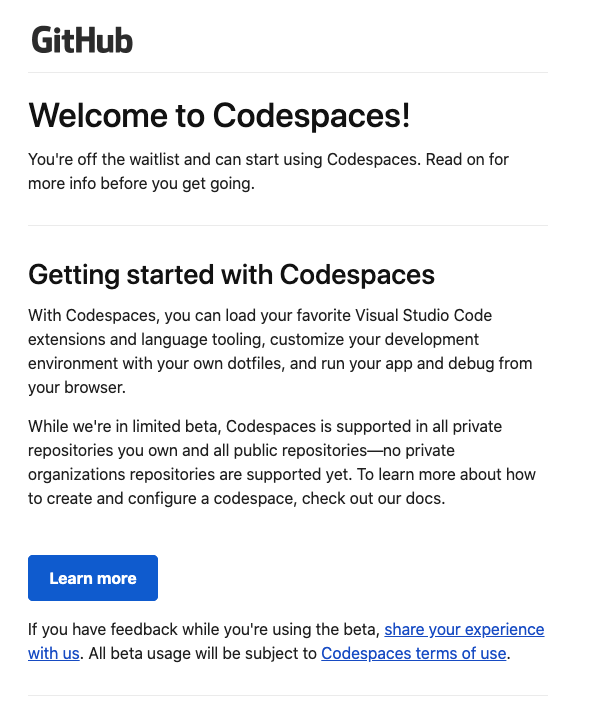
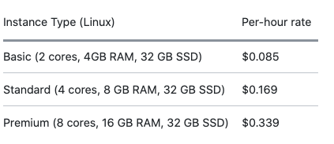
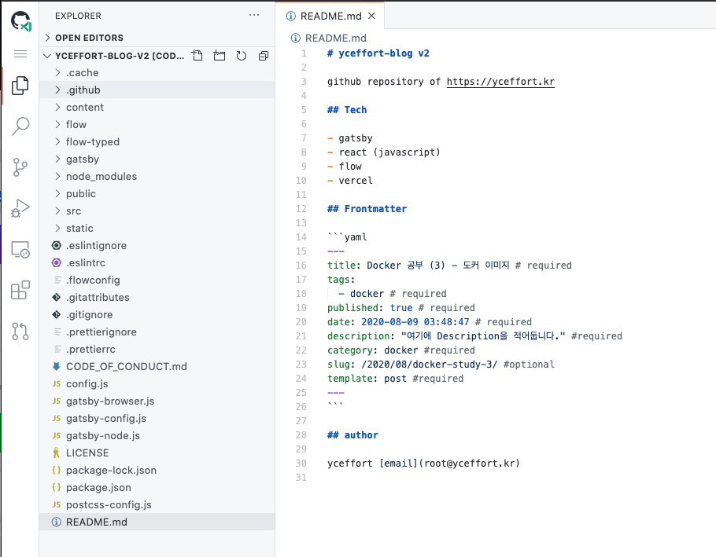
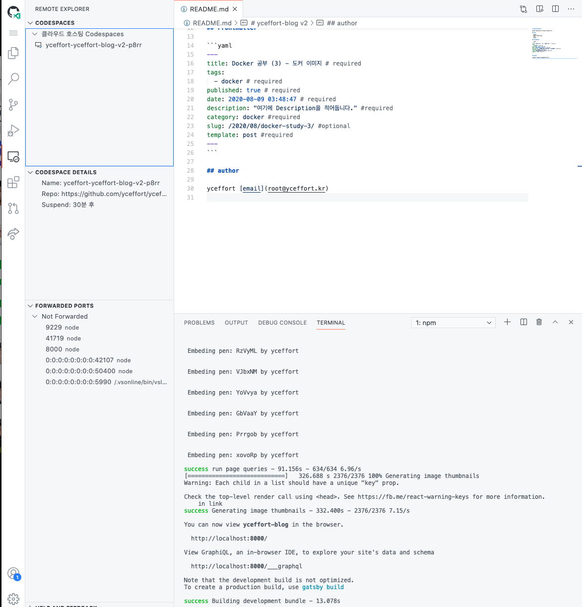
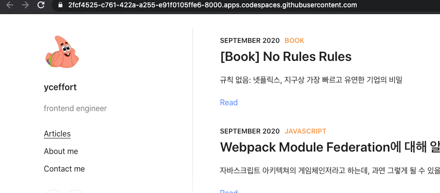

몇 년 전 만 하더라도, C9이 지금의 프로게임단이 아닌 (...) 온라인 코드 에디터로 유명하던 때가 있었다.

리눅스나 맥북을 기반으로 개발을 할 환경이 되지 않았던 시절, ASUS의 오래된 윈도우 노트북을 들고 다니면서 개발을 공부했을 때 주로 사용하던 것이 C9 이었다. 그 때는 기억으로는 무료에 특별하게 제한이 없어서 굉장히 유용하게 썼던 기억이 난다. (없었던 건 아니고 조심해서 썼던 거 같기도)

시간이 흘러 여전히 집에는 윈도우 컴밖에 없었고, 맥북은 무거워 오랫만에 C9을 찾았다. C9는 온대간대 없이 AWS에 인수되어 있었고, 이용료도 받고 있었다. (당연히 AWS Free Tier는 진작에 다썼고) 그래서 C9 대신 선택한 것이 VS Codespace (처음에는 VS Code Online인가 그랬다)였다. Azure에 내 개인정보를 팔아넘긴 덕분에 고맙게도 맥북에어에서 개발을 할 수 있게 많은 도움이 되었다. (흑흑)

그러던 어느날 VS Codespace가 github codespace로 이전될 예정이라 베타 신청을 받는다는 팝업이 떴다! 신청하고 한달만에! 드디어! 베타에 당첨이 되어! 쓰게 되었다!

지겨운! 도큐먼트는! 보지 않으련다! 대충 몇 가지로 요약해보자

- 이번 베타 기간에는 최대 두 개의 codespace를 개설할 수 있다. 따라서 쓰고 난뒤엔 지워야 한다.
- 당연하게도 VSCode와 연동해서 쓸 수 있다! [참고](https://docs.github.com/en/github/developing-online-with-codespaces/connecting-to-your-codespace-from-visual-studio-code)
- 프로젝트의 Codespace에 기본 설정을 적용해 둘 수 있다. [참고](https://docs.github.com/en/github/developing-online-with-codespaces/configuring-codespaces-for-your-project)
- 가격은 기존 VS Codespace의 미국 동부기준 가격과 동일하다. 성능별로 차이가 있으며, 아래를 참고하세용. (베타 기간엔 베이직만 존재하는 듯?)

가격은 나름 괜찮은 거 같다. 프리미엄이면 맥북 프로 최신형에 가까운 성능을 누릴 수 있다. 3시간 개발하면 1달러. 하루에 8시간, 20일 개발하면... 55달러다.

이제 Github에서 clone하는 영역에 이렇게 codespaces를 볼 수 있다.

포트 포워딩도 제공해서, dev환경을 실행하면 실제로 들어가서 볼 수도 있다.

이제 맥북에어를 혹사시킬 필요도, 회사 맥북을 무겁게 들고 다니지 않아도 되는 시대가 왔다. 이제 코딩도 나 대신 로봇이 하는 시대만 오면 종말이 완성될 것 같다.

감사합니다 github 열심히 개발할게용
